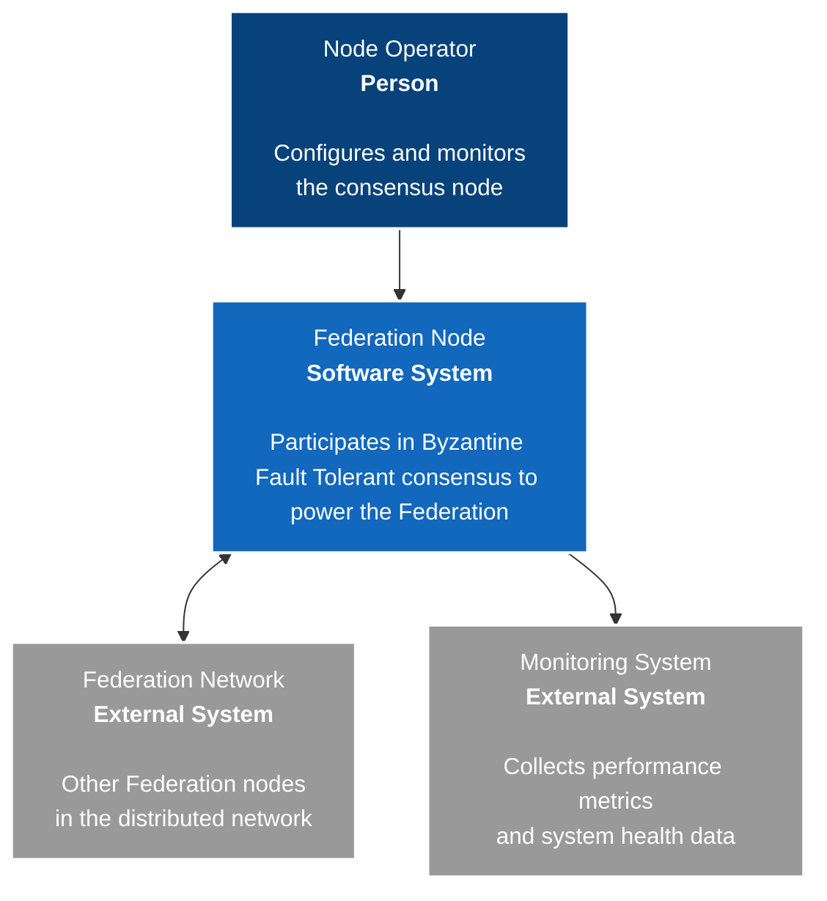

```mermaid
graph TD
    User[Node Operator<br/><b>Person</b><br/><br/>Configures and monitors<br/>the consensus node]
    
    Node[Federation Node<br/><b>Software System</b><br/><br/>Participates in Byzantine Fault Tolerant consensus to power the Federation]
    
    ValidatorNetwork[Federation Network<br/><b>External System</b><br/><br/>Other Federation nodes<br/>in the distributed network]
    
    MonitoringSystem[Monitoring System<br/><b>External System</b><br/><br/>Collects performance metrics<br/>and system health data]
    
    User --> Node
    Node <--> ValidatorNetwork
    Node --> MonitoringSystem
    
    classDef person fill:#08427b,stroke:#fff,stroke-width:2px,color:#fff
    classDef system fill:#1168bd,stroke:#fff,stroke-width:2px,color:#fff
    classDef external fill:#999,stroke:#fff,stroke-width:2px,color:#fff
    
    class User person
    class Node system
    class ValidatorNetwork,MonitoringSystem external
```