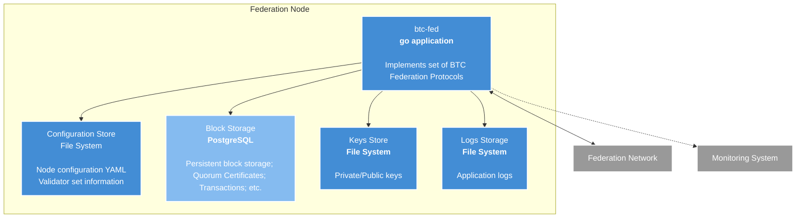

```mermaid
graph TD
    FederationNetwork[Federation Network]
    MonitoringSystem[Monitoring System]
    
    subgraph FederationNode [Federation Node]
        NodeApp[btc-fed<br/><b>go application</b><br/><br/>Implements set of BTC Federation Protocols]
        
        ConfigStore[Configuration Store<br/>File System<br/><br/>Node configuration YAML<br/>Validator set information]
        
        BlockStorage[Block Storage<br/><b>PostgreSQL</b><br/><br/>Persistent block storage; Quorum Certificates; Transactions; etc.]
        
        KeysStore[Keys Store<br/><b>File System</b><br/><br/>Private/Public keys]
        
        LogsStore[Logs Storage<br/><b>File System</b><br/><br/>Application logs]
    end
    
    NodeApp <--> FederationNetwork
    NodeApp -.-> MonitoringSystem
    NodeApp --> ConfigStore
    NodeApp --> BlockStorage
    NodeApp --> KeysStore
    NodeApp --> LogsStore
    
    classDef person fill:#08427b,stroke:#fff,stroke-width:2px,color:#fff
    classDef container fill:#438dd5,stroke:#fff,stroke-width:2px,color:#fff
    classDef database fill:#85bbf0,stroke:#fff,stroke-width:2px,color:#fff
    classDef external fill:#999,stroke:#fff,stroke-width:2px,color:#fff
    
    class User person
    class NodeApp container
    class BlockStorage database
    class ConfigStore,KeysStore,LogsStore container
    class FederationNetwork,MonitoringSystem external
```