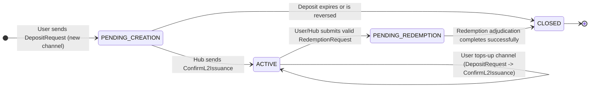

# Federation Channels Registry

_v1.0, 2025-07-04_

## 1. Overview

This document specifies the internal data structures and state machine that the Federation uses to manage the lifecycle of vTCP settlement channels. The Federation's primary role is to act as an impartial and auditable accountant for funds moving between the Bitcoin L1 network and the vTCP L2 network. This registry is the core component for fulfilling that duty.

The system is designed around two core principles:
1.  **Robust Accounting**: Every operation that affects a channel's state (deposits, redemptions) is logged immutably.
2.  **Minimal Data Custody**: The Federation only stores data essential for accounting and dispute resolution, avoiding sensitive user information like vTCP addresses (`vID`), which are the Hub's responsibility.

## 2. Core Data Structures

The Federation's state is centered around a main `ChannelsRegistry`, which is a collection of `Channel` objects.

### 2.1. `ChannelsRegistry`

This is the top-level data structure, a simple map from a channel's unique identifier to its stateful object.

```typescript
// A map of all channels known to the Federation.
// Key: channel_id (uint64)
// Value: Channel object
type ChannelsRegistry = Map<number, Channel>;
```

### 2.2. `Channel` Struct

This is the core object representing a single settlement channel. It contains its lifecycle status, a log of major operations, and pointers to the latest state for efficient processing.

```protobuf
// Internal Federation record for a single channel's lifecycle.
message Channel {
    // The globally unique and immutable identifier for the channel, assigned by the Federation.
    uint64 channel_id = 1;

    // The current state of the channel according to the Federation's state machine.
    ChannelStatus status = 2;

    // The identifier of the Hub managing the other side of the channel.
    uint64 hub_id = 3;

    // A copy of the most recent, fully validated reconciliation state for this channel.
    // This field is used for efficient validation of new operations. The authoritative
    // record is stored within the operations_log.
    ChannelReconciliation latest_reconciliation = 4;

    // A log of all major lifecycle operations (deposits, redemptions) performed on this channel.
    repeated Operation operations_log = 5;

    // Timestamp of the channel's creation in the Federation's registry.
    int64 created_at = 6;

    // Timestamp of the last update to this channel record.
    int64 updated_at = 7;
}
```

### 2.3. `ChannelStatus` Enum

This enum defines the possible states a channel can be in from the Federation's perspective.

```protobuf
enum ChannelStatus {
    // The initial deposit has been requested, but L1 funds are not yet confirmed
    // and L2 issuance is not complete. The channel is not yet active.
    PENDING_CREATION = 0;

    // The channel is fully active and can be used for L2 transactions.
    // It can accept new deposits (top-ups).
    ACTIVE = 1;

    // A redemption request has been submitted and is undergoing the challenge period.
    // The channel is locked; no further operations (like new deposits) are permitted.
    PENDING_REDEMPTION = 2;

    // The channel has been successfully liquidated via the redemption protocol
    // or was cancelled before creation. This is a terminal state.
    CLOSED = 3;
}
```

### 2.4. `Operation` Struct

This struct provides the auditable "operations log," tracking each deposit and redemption associated with a channel. The authoritative state (`ChannelReconciliation`) resulting from an operation is stored here.

```protobuf
// An entry in the channel's operations log.
message Operation {
    // A unique identifier for the operation.
    // For Deposits: this is the `deposit_id`.
    // For Redemptions: this is the `primary_identifier` from the RedemptionAttempt.
    string operation_id = 1;

    // The type of the operation.
    OperationType type = 2;

    // The status of this specific operation.
    OperationStatus status = 3;

    // The timestamp when the operation was initiated.
    int64 initiated_at = 4;

    // The timestamp when the operation reached a terminal state (Completed or Failed).
    int64 completed_at = 5;

    // A summary of the operation's details, including the resulting state.
    oneof details {
        DepositDetails deposit = 6;
        RedemptionDetails redemption = 7;
    }
}

enum OperationType {
    DEPOSIT = 0;
    REDEMPTION = 1;
}

enum OperationStatus {
    PENDING = 0;
    COMPLETED = 1;
    FAILED = 2;
}

message DepositDetails {
    uint64 amount_satoshis = 1;
    // The co-signed reconciliation that was finalized by this deposit.
    // This is populated when the operation status becomes COMPLETED.
    ChannelReconciliation post_operation_reconciliation = 2;
}

message RedemptionDetails {
    // The final adjudicated reconciliation state that was used for liquidation.
    // This is populated when the operation status becomes COMPLETED.
    ChannelReconciliation final_reconciliation = 1;
    string l1_destination_address = 2;
}
```

## 3. Channel State Machine

The `ChannelStatus` enum defines the states. The following diagram and descriptions outline the transitions between them, driven by the events in the deposit and redemption protocols.



### 3.1. State Transitions Explained

1.  **`[*] -> PENDING_CREATION`**
    *   **Trigger**: The Federation receives a `RequestDeposit` gRPC call for a *new* channel (i.e., `channel_id_to_top_up` is omitted).
    *   **Action**: The Federation validates the request, generates a new `channel_id`, creates a `Channel` object in the registry with `status = PENDING_CREATION`, and adds the first entry to the `operations_log`.

2.  **`PENDING_CREATION -> ACTIVE`**
    *   **Trigger**: The Federation receives a `ConfirmL2Issuance` gRPC call for the initial deposit.
    *   **Action**: The Federation validates the submitted `ChannelReconciliation`. If valid, it extracts the L2 public keys for the Hub and User from this initial reconciliation and stores them as `hub_l2_pubkey` and `user_l2_pubkey` in the `Channel` record. It then updates the channel's `status` to `ACTIVE`, updates `latest_reconciliation`, and marks the corresponding deposit `Operation` in the log as `COMPLETED`. These stored keys become the authoritative source for verifying all future requests for this channel.

3.  **`PENDING_CREATION -> CLOSED`**
    *   **Trigger**: The user's deposit expires before L1 funds are sent, or a `RequestDepositReversal` is initiated and successfully completes because the Hub never issued the L2 funds.
    *   **Action**: The Federation marks the channel `status` as `CLOSED`. The initial deposit `Operation` is marked `FAILED`. This is a terminal state; the `channel_id` is never reused.

4.  **`ACTIVE -> ACTIVE` (Channel Top-Up)**
    *   **Trigger**: A full deposit flow (`RequestDeposit` with an existing `channel_id` -> `ConfirmL2Issuance`) completes for an active channel.
    *   **Action**: The channel's `status` remains `ACTIVE`. The Federation creates a new `DEPOSIT` operation in the `operations_log`, updates it to `COMPLETED` upon confirmation, and updates the `latest_reconciliation` with the new one from the `ConfirmL2Issuance` call.

5.  **`ACTIVE -> PENDING_REDEMPTION`**
    *   **Trigger**: The Federation receives a valid `SubmitRedemption` gRPC call for the channel.
    *   **Action**: The Federation validates the request and initiates the internal `RedemptionAttempt` flow. It sets the channel's `status` to `PENDING_REDEMPTION` and adds a `REDEMPTION` operation to the log with `status = PENDING`. While in this state, further operations (like new deposits) for this channel are rejected.

6.  **`PENDING_REDEMPTION -> CLOSED`**
    *   **Trigger**: The redemption challenge period ends (or is accelerated), and the Federation successfully adjudicates and broadcasts the L1 settlement transaction.
    *   **Action**: The Federation sets the channel `status` to `CLOSED` and updates the corresponding redemption `Operation` to `COMPLETED`. This is a terminal state. If the initial redemption request was successfully contested with a newer state, the liquidation still proceeds based on that newer state, leading to this same `CLOSED` state. A valid redemption attempt always results in channel closure.
