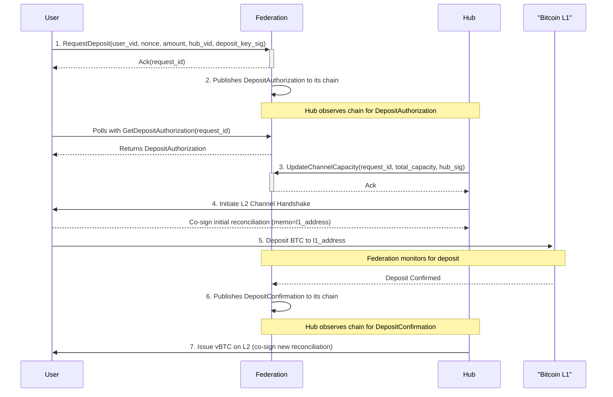

# BTC ⟷ vTCP Custody Protocol - Deposit Flow

_v0.1, 2025-06-30_

## 1. Overview

This document provides a detailed technical specification for the **Issuance Process (Flow 1)** of the [BTC ⟷ vTCP Custody Protocol](/architecture/btc-federation/protocols/BTC%20<->%20vTCP%20Custody%20Protocol.md).

For a higher-level, human-oriented explanation of the protocol, please see the main [BTC <-> vTCP Custody Protocol document](/architecture/btc-federation/protocols/BTC%20<->%20vTCP%20Custody%20Protocol.md).

### 1.1. Visual Flow



### 1.2. Prerequisites

This protocol uses a hybrid identity model. It relies on the [vTCP Network Addressing Scheme](/architecture/btc-federation/protocols/wip_addressing.md) for stable addressing and L2 routing, but allows users the flexibility to use ephemeral keys for L1 deposits.

- **Entity Registry**: The Federation maintains an authoritative Entity Registry containing `vID`s and network endpoints for all registered entities.
- **Hub Registration**: A Hub must have a registered `vID` and associated public keys in the Federation's Entity Registry.
- **User Registration**: A User must have a registered `vID` so that Hubs can discover their network endpoint (`ip:port`) to initiate L2 channel creation. However, the user is not required to use a pre-registered L1 key for the deposit itself.
- **User Deposit Key**: The user's L1 public key for a specific deposit is provided ephemerally and proven via the signature on the `DepositRequest`. This allows users to manage their L1 funds from multiple wallets/keys without pre-registering each one.

## 2. Message Structure Definitions

**Note on `uint256`**: The `uint256` type is used throughout this document for illustrative purposes to represent 256-bit unsigned integers, which are required for compatibility with the vTCP protocol. Since Protocol Buffers do not have a native `uint256` type, implementations should serialize these values as `bytes` (e.g., as a 32-byte big-endian array) or as a `string`.

```protobuf
// Defines the state of a settlement line between two parties.
message ChannelReconciliation {
    // The unique identifier for the channel.
    uint64 channel_id = 1;

    // The sequence number of this state. Must be monotonically increasing.
    // The initial, zero-balance state has a sequence number of 0.
    // This is used to detect and prevent replay attacks.
    uint64 sequence_number = 2;

    // User's / Hub's max positive balance in the channel (in satoshis for vBTC).
    uint256 max_positive_balance = 3;

    // User's / Hub's max negative balance in the channel (in satoshis for vBTC).
    uint256 max_negative_balance = 4;

    // User's / Hub's current balance in the channel (in satoshis for vBTC).
    uint256 balance = 5;

    // Signature A (e.g., ECDSA for vBTC) from the user.
    bytes user_signature = 6;

    // Signature B (e.g., ECDSA for vBTC) from the hub.
    bytes hub_signature = 7;

    // An optional memo field for attaching metadata.
    // For the initial reconciliation (seq=0), the Hub MUST set this
    // to the L1 deposit address to create an on-chain link.
    string memo = 8;
}
```

```protobuf
// The initial request from a user to initiate a BTC deposit.
message DepositRequest {
    // The registered vTCP identifier (`vID`) of the user making the request.
    // This is used by the Hub to find the user's network endpoint for L2 communication.
    string user_vid = 1;

    // A client-generated nonce to ensure the uniqueness of the request for this vID.
    uint64 nonce = 2;

    // The amount of BTC the user intends to deposit, in satoshis.
    uint64 amount_satoshis = 3;

    // The `vID` of the preferred Hub.
    string preferred_hub_vid = 4;

    // A signature of the fields above (1-4) with the private key corresponding
    // to the L1 public key from which the deposit will be made.
    // This signature proves ownership of the deposit key for this transaction.
    bytes user_deposit_key_signature = 5;
}
```

```protobuf
// The authorization published by the Federation, making the deposit details public.
message DepositAuthorization {
    // The unique identifier for this deposit, computed as BLAKE2b-256(user_vid || nonce).
    string request_id = 1;

    // The `vID` of the user making the deposit. The Hub uses this to open an L2 channel.
    string user_vid = 2;

    // The user's public key for this specific deposit, derived from the
    // `user_deposit_key_signature` in the DepositRequest.
    bytes user_deposit_pubkey = 3;

    // The amount of BTC to be deposited, in satoshis.
    uint64 amount_satoshis = 4;

    // The unique L1 multisig address generated by the Federation for this deposit.
    string deposit_address_l1 = 5;

    // The timestamp after which this authorization expires.
    int64 expiry_timestamp = 6;

    // The Federation's signature over the fields above (1-6).
    bytes federation_signature = 7;
}
```

```protobuf
// The final confirmation published by the Federation after the L1 deposit is secure.
message DepositConfirmation {
    // The unique identifier for the deposit being confirmed, matching the `request_id`.
    string request_id = 1;

    // The L1 transaction ID of the user's deposit.
    string l1_transaction_id = 2;

    // The Federation's signature over the fields above (1-2).
    bytes federation_signature = 3;
}
```

```protobuf
// A generic acknowledgment response used for RPC calls.
message Ack {
    // The identifier of the request being acknowledged (e.g., `request_id`).
    string request_id = 1;
    // Indicates if the operation was accepted.
    bool success = 2;
    // An optional message for errors or additional info.
    string message = 3;
}
```

```protobuf
// A wrapper message for a Hub to submit proof that a user abandoned a deposit.
message SubmitAbandonmentProofRequest {
    // The unique computed identifier for the request being abandoned.
    string request_id = 1;
    // The co-signed, zero-balance reconciliation proving the L2 channel was created.
    ChannelReconciliation reconciliation = 2;
}
```

```protobuf
// A request from a user to poll for the status of their deposit authorization.
message GetDepositAuthorizationRequest {
    // The unique computed identifier for the deposit.
    string request_id = 1;
}
```

```protobuf
// A request from a Hub to inform the Federation of the final channel capacity.
message UpdateChannelCapacityRequest {
    // The unique computed identifier for the deposit.
    string request_id = 1;

    // The total capacity allocated by the Hub for its side of the channel
    // (deposit amount + extra liquidity), in satoshis.
    uint256 total_hub_capacity = 2;

    // The Hub's signature of the fields above (1-2) for verification.
    bytes hub_signature = 3;
}
```

## 3. gRPC Service Definitions

```protobuf
// Service run by the Federation to manage the deposit lifecycle.
service FederationService {
    // Called by the User to initiate a new deposit.
    // Returns an Ack with the computed `request_id` for confirmation.
    rpc RequestDeposit(DepositRequest) returns (Ack);

    // Called by the User to poll for deposit authorization details using the computed ID.
    rpc GetDepositAuthorization(GetDepositAuthorizationRequest) returns (DepositAuthorization);

    // Called by the Hub to report the final channel capacity after receiving DepositAuthorization.
    rpc UpdateChannelCapacity(UpdateChannelCapacityRequest) returns (Ack);

    // Called by the Hub to prove a user abandoned the flow after L2 channel creation.
    rpc SubmitAbandonmentProof(SubmitAbandonmentProofRequest) returns (Ack);
}
```

```protobuf
// Service run by the Hub.
service HubService {
    // Note: The Hub is primarily driven by events from the Federation chain.
    // It receives DepositAuthorization and DepositConfirmation data from its own
    // trusted Federation node. This RPC may be used by the Federation's monitoring
    // service as a fallback or alternative to the Hub monitoring the chain directly.

    // Called by the Federation to confirm the L1 deposit and instruct the Hub to issue L2 tokens.
    rpc ConfirmDeposit(DepositConfirmation) returns (Ack);
}
```

## 4. Sequence of Actions

This section describes the step-by-step process for a successful BTC issuance.

### 4.1. Computed Identifier: `request_id`

The `request_id` is a globally unique identifier for the deposit operation. It is not generated by the Federation but is instead deterministically computed by all parties as follows:
`request_id = BLAKE2b-256(user_vid || nonce)`
- `user_vid`: The user's registered and stable vTCP identifier.
- `nonce`: A unique number provided by the user in the `DepositRequest`.

This approach ensures that the user can always recreate the `request_id` for polling, preventing stuck transactions, while tying the request to their stable network identity.

### 4.2. Actors

- **User**: The end-user initiating the deposit. Runs a vTCP Node with a registered `vID`.
- **Hub**: The liquidity provider. Runs a vTCP Hub with a registered `vID`.
- **Federation**: The central entity managing the protocol and the Entity Registry.

### 4.3. Successful Issuance Flow

**1. User Requests Deposit & Federation Validates**
- **Action**: The User constructs and sends a `DepositRequest`, signed with their ephemeral L1 deposit key.
- **gRPC Call**: `FederationService.RequestDeposit(request)`
- **Federation Validation**: Upon receipt, the Federation performs the following checks:
  - **1. vID Existence**: Verifies that the `user_vid` exists in the Entity Registry.
  - **2. Signature Verification**: Verifies the `user_deposit_key_signature` to prove ownership of the deposit key and derive the `user_deposit_pubkey`.
  - **3. Nonce Uniqueness**: Checks if the `nonce` has already been used for this `user_vid`. If so, the request is **rejected** to prevent replay attacks.
  - **4. Hub Availability**: Checks if the `preferred_hub_vid` is active and has capacity.
- **Response**:
  - On success, the Federation computes the `request_id` and returns a successful `Ack`.
  - On failure, it returns a failed `Ack` with an appropriate error message.

**2. Federation Publishes Authorization & User/Hub Polls**
- **Action (Federation)**: Following successful validation, the Federation generates the L1 multisig address, constructs a `DepositAuthorization` message, and publishes it as an event on the Federation chain.
- **Action (User & Hub)**:
  - The **User's node** polls the Federation using its computed `request_id`.
  - The **Hub's node** observes the Federation chain for the `DepositAuthorization` event. The Hub uses the `user_vid` from this event to look up the user's network endpoint in the Entity Registry.
- **gRPC Call (User)**: `FederationService.GetDepositAuthorization(GetDepositAuthorizationRequest{request_id: "..."})`

**3. Hub Reports Channel Capacity to Federation**
- **Action**: After observing the `DepositAuthorization`, the Hub determines the final channel configuration, including any extra liquidity it will provide. It then reports this back to the Federation.
- **gRPC Call (Hub)**: `FederationService.UpdateChannelCapacity(UpdateChannelCapacityRequest)`
- **Federation Action**: The Federation validates the Hub's signature and updates its registry with the final `total_hub_capacity` for the channel, ensuring an accurate record of the channel's total value.

**4. Hub and User Establish L2 Channel**
- **Action**: With authorization confirmed, the Hub and User establish an L2 Settlement Line.
- **Key Step**: They co-sign an initial `ChannelReconciliation` message (`sequence_number = 0`) that defines the channel's credit limits and embeds the `deposit_address_l1` in the `memo` field, creating an immutable link between the L1 and L2 states.

**5. User Deposits BTC on L1**
- **Action**: With the L2 channel active, the User broadcasts a Bitcoin transaction, sending the agreed-upon `amount_satoshis` to the `deposit_address_l1`.
- **Implicit Signal**: This on-chain L1 transaction is the signal for the Federation to proceed.

**6. Federation Confirms and Publishes Confirmation**
- **Action**: The Federation's L1 monitor detects the deposit. After waiting for sufficient block confirmations, it constructs and publishes a `DepositConfirmation` event on the Federation chain.
- **Hub Action**: The Hub's node observes this `DepositConfirmation` event.

**7. Hub Issues vTCP Tokens**
- **Action**: Upon receiving final confirmation, the Hub issues the vTCP tokens to the User on the L2 Settlement Line by co-signing a new `ChannelReconciliation` with the updated balances.

## 5. Failure Handling

### 5.1. Case 1: L2 Channel Fails (Step 4)
- **Scenario**: The User and Hub, despite having authorization, fail to establish an L2 channel.
- **Outcome**: The `expiry_timestamp` in the `DepositAuthorization` will eventually pass. No funds have moved. The flow is abandoned with no penalty.

### 5.2. Case 2: User Abandons Deposit (Step 5)
- **Scenario**: The L2 channel is created, but the User never makes the L1 deposit.
- **Outcome**: The Hub is holding an open, unused channel. To reclaim resources and log the event, the Hub can submit the co-signed, zero-balance `ChannelReconciliation` to the Federation.
- **gRPC Call**: `FederationService.SubmitAbandonmentProof(reconciliation)`
- **Federation Action**: The Federation verifies the proof and logs the abandonment, which may impact the User's reputation score.

### 5.3. Case 3: Hub Fails to Issue Tokens (Step 7)
- **Scenario**: The User deposits BTC on L1, the Federation confirms it, but the Hub fails to issue the L2 tokens.
- **Outcome**: The User has proof of a completed L1 deposit (the transaction hash) and a co-signed channel state. The User can initiate a dispute with the Federation through a separate, non-cooperative redemption flow, using the L1 transaction hash and the `request_id` as evidence.
