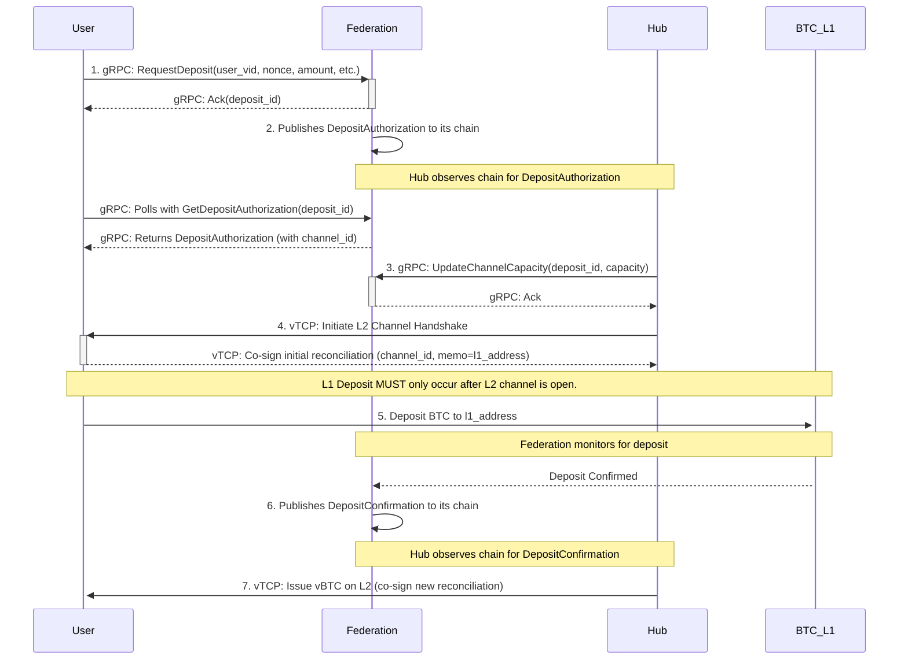

# BTC ⟷ vTCP Custody Protocol - Deposit Flow

_v0.1, 2025-06-30_

# todo
 - в поточній реалізації не можна поповнити з біржі, бо не ясно який публчіний ключ використати
 -  потрібно розписати структуру каналів на стороні федерації
 - розписати про те як едерація ідентифікує юзера на етапі виводу коштів (як переконуєтсья, що юзер має право власності над каналом)
 - повонення каналау повнно бути реалізовно іншим проткоолом. там користувач вказує channel id але не вказує destiantion address, і тоді хаб йому поповнить вже існуючу адресу (по своєму каналу)
 - менша і більша)

У абекса була схожа ситуація. Ми тоді так хендлили це:

Якщо сума менша ніж була заявлена, ми кидали у холд цю транзакцію і комунікували з юзером, або чекали запиту від нього, щоб отримати адресу для повернення і руками повертали кошти

Якщо була сума менше порогової (дуже мала), то просто реджект і ніякого повернення

Якщо сума була більшою ніж заявлена, то ми процесили цей депозит із початковою сумою, а надлишок кидали на холд і далі все так само як у поверненні з першого прикладу

Якщо надлишок був менше порогового, то депозит процесили, а з надлишком нічого не робили.Е

При поверненні комісія завжди на клієнті.

Автоматичного повернення не було, бо у більшості випадків поповнення були з бірж і ми фізично не знали, куди повертати

## 1. Overview

This document provides a detailed technical specification for the **Issuance Process (Flow 1)** of the [BTC ⟷ vTCP Custody Protocol](/architecture/btc-federation/protocols/BTC%20<->%20vTCP%20Custody%20Protocol.md).

For a higher-level, human-oriented explanation of the protocol, please see the main [BTC <-> vTCP Custody Protocol document](/architecture/btc-federation/protocols/BTC%20<->%20vTCP%20Custody%20Protocol.md).

### 1.1. Visual Flow



### 1.2. Prerequisites

This protocol uses a hybrid identity model. It relies on the [vTCP Network Addressing Scheme](/architecture/btc-federation/protocols/wip_addressing.md) for network routing, but allows users the flexibility to use ephemeral keys for L1 deposits.

- **Entity Registry**: The Federation maintains an authoritative Entity Registry containing `vID`s and network endpoints for all registered entities.
- **Hub Registration**: A Hub must have a registered `vID` and associated public keys in the Federation's Entity Registry.
- **User Registration**: A User must have a registered `vID` so that Hubs can discover their network endpoint (`ip:port`) to initiate L2 channel creation.
- **User Deposit Key**: The user's L1 public key for a specific deposit is provided ephemerally and proven via the signature on the `DepositRequest`.

## 2. Message Structure Definitions

**Note on Protocol Versioning**: All messages include a `protocol_version` field. This allows for future protocol upgrades and ensures all parties can verify compatibility.

**Note on `uint256`**: The `uint256` type is used throughout this document for illustrative purposes. Implementations should serialize these values as `bytes` or `string`.

```protobuf
// Defines the state of a settlement line between two parties.
message ChannelReconciliation {
    // The version of the protocol, e.g., "0.1".
    string protocol_version = 1;
    // The globally unique and immutable identifier for the channel, assigned by the Federation.
    uint64 channel_id = 2;
    // The sequence number of this state. Must be monotonically increasing.
    uint64 sequence_number = 3;
    // User's / Hub's max positive balance in the channel.
    uint256 max_positive_balance = 4;
    // User's / Hub's max negative balance in the channel.
    uint256 max_negative_balance = 5;
    // User's / Hub's current balance in the channel.
    uint256 balance = 6;
    // Signature A from the user.
    bytes user_signature = 7;
    // Signature B from the hub.
    bytes hub_signature = 8;
    // An optional memo field for attaching metadata.
    string memo = 9;
}
```

```protobuf
// The initial request from a user to initiate a BTC deposit.
message DepositRequest {
    // The version of the protocol, e.g., "0.1".
    string protocol_version = 1;
    // The registered vTCP identifier (`vID`) of the user making the request.
    string user_vid = 2;
    // A client-generated nonce to ensure the uniqueness of the request for this vID.
    uint64 nonce = 3;
    // The amount of BTC the user intends to deposit, in satoshis.
    uint64 amount_satoshis = 4;
    // The `vID` of the preferred Hub.
    string preferred_hub_vid = 5;
    // A signature of the fields above (2-5) with the private key corresponding
    // to the L1 public key from which the deposit will be made.
    bytes user_deposit_key_signature = 6;
}
```

```protobuf
// The authorization published by the Federation, making the deposit details public.
message DepositAuthorization {
    // The version of the protocol, e.g., "0.1".
    string protocol_version = 1;
    // The unique identifier for this deposit, computed as BLAKE2b-256(user_vid || nonce).
    string deposit_id = 2;
    // The globally unique and immutable identifier for the channel, assigned by the Federation.
    uint64 channel_id = 3;
    // The `vID` of the user making the deposit.
    string user_vid = 4;
    // The user's public key for this specific deposit.
    bytes user_deposit_pubkey = 5;
    // The amount of BTC to be deposited, in satoshis.
    uint64 amount_satoshis = 6;
    // The unique L1 multisig address generated by the Federation for this deposit.
    string deposit_address_l1 = 7;
    // The timestamp after which this authorization expires.
    int64 expiry_timestamp = 8;
    // The Federation's signature over the fields above (2-8).
    bytes federation_signature = 9;
}
```

```protobuf
// The final confirmation published by the Federation after the L1 deposit is secure.
message DepositConfirmation {
    // The version of the protocol, e.g., "0.1".
    string protocol_version = 1;
    // The unique identifier for the deposit being confirmed.
    string deposit_id = 2;
    // The L1 transaction ID of the user's deposit.
    string l1_transaction_id = 3;
    // The Federation's signature over the fields above (2-3).
    bytes federation_signature = 4;
}
```

```protobuf
// A generic acknowledgment response used for RPC calls.
message Ack {
    // The version of the protocol, e.g., "0.1".
    string protocol_version = 1;
    // The identifier of the request being acknowledged.
    string deposit_id = 2;
    // Indicates if the operation was accepted.
    bool success = 3;
    // An optional message for errors or additional info.
    string message = 4;
}
```

```protobuf
// A request from a user to poll for the status of their deposit authorization.
message GetDepositAuthorizationRequest {
    // The version of the protocol, e.g., "0.1".
    string protocol_version = 1;
    // The unique computed identifier for the deposit.
    string deposit_id = 2;
}
```

```protobuf
// A request from a Hub to inform the Federation of the final channel capacity.
message UpdateChannelCapacityRequest {
    todo: add request_id 
    todo: передавати вхідний і вихідний boundaries і канал
    todo: передавати баланс (хаб резервує кошти вже на цьому етапі)

    // The version of the protocol, e.g., "0.1".
    string protocol_version = 1;
    // The unique computed identifier for the deposit.
    string deposit_id = 2;
    // The total capacity allocated by the Hub for its side of the channel.
    uint256 total_hub_capacity = 3;
    // The Hub's signature of the fields above (2-3).
    bytes hub_signature = 4;
}
```

## 3. gRPC Service Definitions

```protobuf
// Service run by the Federation to manage the deposit lifecycle.
service FederationService {
    // Called by the User to initiate a new deposit.
    rpc RequestDeposit(DepositRequest) returns (Ack);

    // Called by the User to poll for deposit authorization details.
    rpc GetDepositAuthorization(GetDepositAuthorizationRequest) returns (DepositAuthorization);

    // Called by the Hub to report the final channel capacity.
    rpc UpdateChannelCapacity(UpdateChannelCapacityRequest) returns (Ack);
}
```

## 4. Sequence of Actions

### 4.1. Computed Identifier: `deposit_id`

The `deposit_id` is a globally unique identifier for the deposit operation, computed by all parties as:
`deposit_id = BLAKE2b-256(user_vid || nonce)`
This allows the user to reliably poll for the `DepositAuthorization` even if the initial `Ack` is lost.

todo: add more details about the `deposit_id` why this field is needed

### 4.2. Successful Issuance Flow

**1. User Requests Deposit**
- **Action**: The User sends a `DepositRequest` to the Federation.
- **gRPC Call**: `FederationService.RequestDeposit(request)`
- **Federation Validation**: The Federation validates the user's `vID`, the signature, and the nonce.
- **Response**: The Federation returns a successful `Ack` containing the computed `deposit_id`.

**2. Federation Authorizes Deposit and Creates Channel ID**
- **Action**: Following validation, the Federation:
  1.  **Generates a new, globally unique `channel_id` for the settlement line.**
  2.  Constructs a `DepositAuthorization` message containing this `channel_id`.
  3.  Publishes the `DepositAuthorization` as an event on the Federation chain.
- **Polling**: The User and Hub can now poll the Federation for this authorization.
- **gRPC Call (User/Hub)**: `FederationService.GetDepositAuthorization(GetDepositAuthorizationRequest{deposit_id: "..."})`

**3. Hub Reports Channel Capacity**
- **Action**: The Hub reports its allocated channel capacity to the Federation.
- **gRPC Call (Hub)**: `FederationService.UpdateChannelCapacity(...)`

**4. Hub and User Establish L2 Channel**
- **Action**: With authorization confirmed, the Hub and User establish an L2 Settlement Line.
- **Key Step**: They co-sign an initial `ChannelReconciliation` (`sequence_number = 0`). This reconciliation **must** include the permanent `channel_id` received from the Federation. **This step must be completed before the user sends any funds.**

**5. User Deposits BTC on L1**
- **Action**: **Only after the L2 channel is successfully established and co-signed**, the User broadcasts a Bitcoin transaction, sending the agreed-upon `amount_satoshis` to the `deposit_address_l1`.
- **Implicit Signal**: This on-chain L1 transaction is the signal for the Federation to proceed.

**6. Federation Confirms Deposit**
- **Action**: The Federation's L1 monitor detects the deposit and publishes a `DepositConfirmation` to its chain.

**7. Hub Issues vTCP Tokens**
- **Action**: Upon observing the confirmation, the Hub issues the vTCP tokens by co-signing a new `ChannelReconciliation` with the updated balances.

## 5. Failure Handling

### 5.1. Case 1: L2 Channel Fails (Step 4)
- **Scenario**: The User and Hub, despite having authorization, fail to establish an L2 channel.
- **Outcome**: The `expiry_timestamp` in the `DepositAuthorization` will eventually pass. No funds have moved. The flow is abandoned with no penalty.

### 5.2. Case 2: User Abandons Deposit (Step 5)
- **Scenario**: The L2 channel is created, but the User never makes the L1 deposit.
- **Outcome**: The Hub is holding an open, unused channel. To reclaim resources and log the event, the Hub can submit the co-signed, zero-balance `ChannelReconciliation` to the Federation.
- **gRPC Call**: `FederationService.SubmitAbandonmentProof(reconciliation)`
- **Federation Action**: The Federation verifies the proof and logs the abandonment, which may impact the User's reputation score.

### 5.3. Case 3: Hub Fails to Issue Tokens (Step 7)
- **Scenario**: The User deposits BTC on L1, the Federation confirms it, but the Hub fails to issue the L2 tokens.
- **Outcome**: The User has proof of a completed L1 deposit (the transaction hash) and a co-signed channel state. The User can initiate a dispute with the Federation through a separate, non-cooperative redemption flow, using the L1 transaction hash and the `deposit_id` as evidence.

## 5. Failure Handling

### 5.1. Case 1: L2 Channel Fails (Step 4)
- **Scenario**: The User and Hub, despite having authorization, fail to establish an L2 channel.
- **Outcome**: The `expiry_timestamp` in the `DepositAuthorization` will eventually pass. No funds have moved. The flow is abandoned with no penalty.

### 5.2. Case 2: User Abandons Deposit (Step 5)
- **Scenario**: The L2 channel is created, but the User never makes the L1 deposit.
- **Outcome**: The Hub is holding an open, unused channel. To reclaim resources and log the event, the Hub can submit the co-signed, zero-balance `ChannelReconciliation` to the Federation.
- **gRPC Call**: `FederationService.SubmitAbandonmentProof(reconciliation)`
- **Federation Action**: The Federation verifies the proof and logs the abandonment, which may impact the User's reputation score.

### 5.3. Case 3: Hub Fails to Issue Tokens (Step 7)
- **Scenario**: The User deposits BTC on L1, the Federation confirms it, but the Hub fails to issue the L2 tokens.
- **Outcome**: The User has proof of a completed L1 deposit (the transaction hash) and a co-signed channel state. The User can initiate a dispute with the Federation through a separate, non-cooperative redemption flow, using the L1 transaction hash and the `deposit_id` as evidence.
