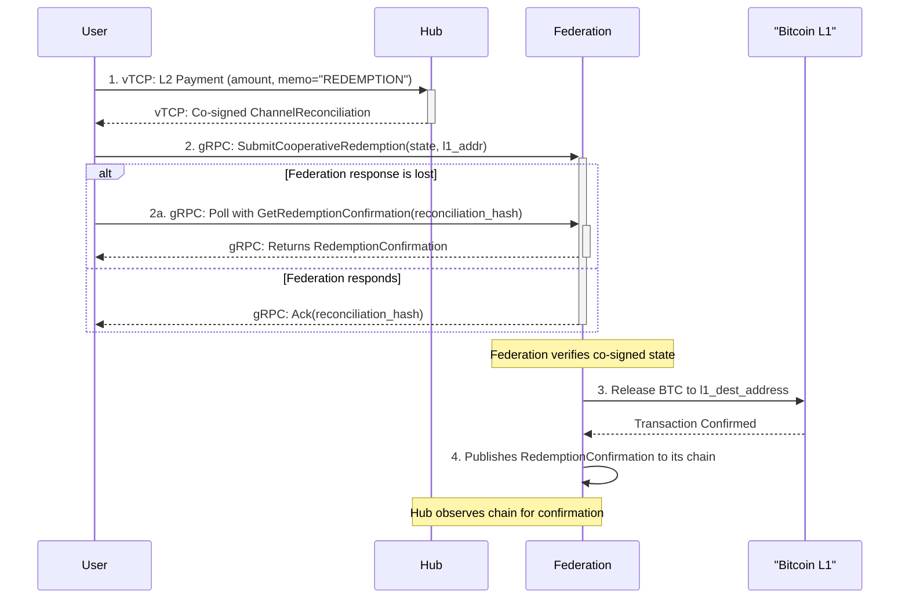
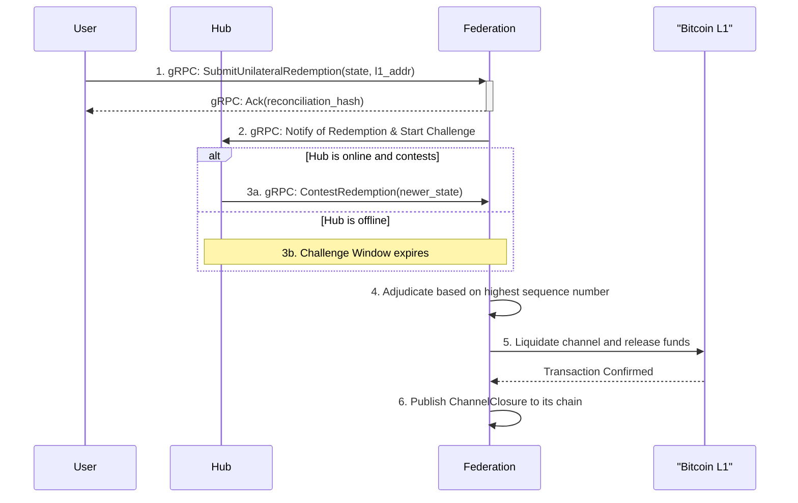

# BTC ⟷ vTCP Custody Protocol - Redemption Flow

_v0.1, 2025-07-01_

## 1. Overview

This document provides a detailed technical specification for the **Redemption Process (Flow 2 & 3)** of the [BTC ⟷ vTCP Custody Protocol](/architecture/btc-federation/protocols/BTC%20<->%20vTCP%20Custody%20Protocol.md), both cooperative and non-cooperative redemption scenarios.

For a higher-level, human-oriented explanation of the protocol, please see the main [BTC <-> vTCP Custody Protocol document](/architecture/btc-federation/protocols/BTC%20<->%20vTCP%20Custody%20Protocol.md).

## 2. Computed Identifier: `reconciliation_hash`

For a cooperative redemption, the `reconciliation_hash` is a globally unique identifier for the operation. It is not generated by the [Federation](/architecture/common/entities/btc_federation.md), but is instead deterministically computed by all parties by calculating the `reconciliation_hash` of the `post_redemption_state`.

The canonical hashing algorithm is defined in the [Settlement Channel Reconciliation entity document](/architecture/common/entities/vtcp_channel_reconciliation.md#canonical-hash-reconciliation_hash) and ensures both parties compute an identical hash.

This approach treats the entire co-signed state as the atomic artifact for the request, providing the strongest guarantee of uniqueness and data integrity. It ensures that the user can always recreate the `reconciliation_hash` to poll for the status of their redemption.

For **non-cooperative redemptions**, the `reconciliation_hash` is omitted.

## 3. Message Structure Definitions

**Note on Protocol Versioning**: All messages include a `protocol_version` field. This allows for future protocol upgrades and ensures all parties can verify compatibility.


```protobuf
// A request from a User for a cooperative redemption, proven by a co-signed state.
message CooperativeRedemptionRequest {
    // The version of the protocol, e.g., 1, by default.
    uint16 protocol_version = 1;

    // The co-signed channel state reflecting the balance *after* the redemption amount
    // has been paid to the Hub on L2. The Hub's signature on this state is their consent.
    ChannelReconciliation post_redemption_state = 2; // See architecture/common/entities/vtcp_channel_reconciliation.md
    
    // The destination L1 Bitcoin address where the funds should be sent.
    string l1_destination_address = 3;
}
```

```protobuf
// A request from a user to poll for the status of their redemption.
message GetRedemptionConfirmationRequest {
    // The version of the protocol, e.g., 1, by default.
    uint16 protocol_version = 1;

    // The unique computed identifier for the redemption.
    string reconciliation_hash = 2;

    // The sequence number of the last known state.
    uint64 last_known_sequence_number = 3;
}

// The response to a GetRedemptionConfirmationRequest, which can indicate either
// a successful redemption or a challenge with a newer state.
message GetRedemptionConfirmationResponse {
    // The version of the protocol, e.g., 1, by default.
    uint16 protocol_version = 1;

    // The status of the redemption request.
    enum Status {
        // The redemption is still being processed.
        PENDING = 0;
        // The redemption has been completed successfully.
        COMPLETED = 1;
        // A newer state has been submitted by the counterparty.
        CHALLENGED = 2;
        // The redemption request was rejected.
        REJECTED = 3;
    }
    Status status = 2;

    oneof result {
        // Present when status is COMPLETED.
        RedemptionConfirmation confirmation = 3;
        
        // Present when status is CHALLENGED.
        ChallengeInfo challenge = 4;
        
        // Present when status is REJECTED.
        string error_message = 5;
    }
}

// Information about a challenge to the redemption request.
message ChallengeInfo {
    // The hash of the newer reconciliation submitted by the counterparty.
    string new_reconciliation_hash = 1;
    
    // The sequence number of the newer state.
    uint64 new_sequence_number = 2;
    
    // The remaining time in the challenge window (in seconds).
    uint64 challenge_window_remaining = 3;
}
```

```protobuf
// A unilateral request from a User to force-close a channel.
message UnilateralRedemptionRequest {
    // The version of the protocol, e.g., 1, by default.
    uint16 protocol_version = 1;

    // The most recent co-signed channel state known to the user.
    ChannelReconciliation last_known_state = 2;
    // The destination L1 Bitcoin address for the user's funds.
    string l1_destination_address = 3;
}
```

```protobuf
// A request from a Hub to contest a non-cooperative redemption attempt.
message ContestRedemptionRequest {
    // The version of the protocol, e.g., 1, by default.
    uint16 protocol_version = 1;

    // The unique identifier of the non-cooperative request being contested.
    string reconciliation_hash = 2;
    // A co-signed channel state with a sequence number strictly greater than
    // the one submitted by the user.
    ChannelReconciliation newer_state = 3;
}
```

```protobuf
// The final confirmation published by the Federation after a redemption is complete.
message RedemptionConfirmation {
    // The version of the protocol, e.g., 1, by default.
    uint16 protocol_version = 1;

    // The unique identifier for the redemption request.
    string reconciliation_hash = 2;
    // The L1 transaction ID of the redemption payout.
    string l1_transaction_id = 3;
    // The Federation's signature over the fields above (2-3).
    bytes federation_signature = 4;
}
```

```protobuf
// A generic acknowledgment response used for RPC calls.
message Ack {
    // The version of the protocol, e.g., 1, by default.
    uint16 protocol_version = 1;

    // The identifier of the request being acknowledged.
    string reconciliation_hash = 2;
    // Indicates if the operation was accepted.
    bool success = 3;
    // An optional message for errors or additional info.
    string message = 4;
}
```

## 4. gRPC Service Definitions

```protobuf
// Service run by the Federation to manage the redemption lifecycle.
service FederationService {
    // Called by the User to initiate a cooperative redemption.
    rpc SubmitCooperativeRedemption(CooperativeRedemptionRequest) returns (Ack);

    // Called by the User to poll for the final status of a cooperative redemption.
    rpc GetRedemptionConfirmation(GetRedemptionConfirmationRequest) returns (GetRedemptionConfirmationResponse);

    // Called by the User to initiate a non-cooperative, forced redemption.
    rpc SubmitUnilateralRedemption(UnilateralRedemptionRequest) returns (Ack);

    // Called by the Hub to contest a non-cooperative redemption by providing a newer state.
    rpc ContestRedemption(ContestRedemptionRequest) returns (Ack);
}
```

## 5. Cooperative Redemption Flow (Streamlined)

This optimized flow leverages a standard L2 payment to signify intent and obtain the Hub's consent.

### 5.1. Visual Flow



### 5.2. Sequence of Actions

**1. User "Burns" vBTC via L2 Payment to Hub**
- **Action**: The User initiates the redemption by sending a standard vTCP (L2) payment to the Hub for the amount they wish to redeem.
- **Key Step**: The Hub accepts the payment and co-signs a new `ChannelReconciliation`. The Hub's signature on this new state is their cryptographic consent to the redemption.

**2. User Submits Proof to Federation**
- **Action**: The User computes the deterministic `reconciliation_hash` by calculating the `reconciliation_hash` of the `post_redemption_state` as per the canonical algorithm. They then submit the `CooperativeRedemptionRequest` to the Federation.
- **gRPC Call**: `FederationService.SubmitCooperativeRedemption(request)`
- **Federation Validation**:
  - Verifies the signatures on the `post_redemption_state`.
  - Verifies the `sequence_number` is strictly greater than the last known state.
- **Response**: The Federation returns a successful `Ack`. If this response is lost, the User can proceed to the polling step using their computed `reconciliation_hash`.

**3. Federation Releases L1 Funds & User Polls**
- **Action (Federation)**: Upon successful verification, the Federation's custody system broadcasts the L1 transaction.
- **Action (User)**: The User's node can now poll the Federation to check the status of the redemption.
- **gRPC Call (User)**: `FederationService.GetRedemptionConfirmation(GetRedemptionConfirmationRequest{reconciliation_hash: "..."})`

**4. Federation Publishes Confirmation**
- **Action**: After the L1 transaction receives sufficient confirmations, the Federation makes the `RedemptionConfirmation` available via the polling endpoint and publishes it to its chain.
- **Hub Action**: The Hub observes the chain to see the final settlement of the L2 payment it received.

## 6. Non-Cooperative Redemption Flow

This flow remains the user's safety net against an unresponsive or malicious Hub.

### 6.1. Visual Flow



### 6.2. Sequence of Actions

**1. User Submits Unilateral Request**
- **Action**: The User submits a `UnilateralRedemptionRequest` to the Federation.
- **gRPC Call**: `FederationService.SubmitUnilateralRedemption(request)`
- **Response**: The Federation generates a `reconciliation_hash` for this arbitrated flow and returns a successful `Ack`.

**2. Federation Initiates Challenge Window**
- **Action**: The Federation starts the **Non-Cooperative Challenge Window** (e.g., 72 hours) and notifies the Hub.

**3. Hub's Response (or Lack Thereof)**
- **Action**: The Hub either does nothing or contests with a `ContestRedemptionRequest` containing a newer state.
- **gRPC Call (Hub)**: `FederationService.ContestRedemption(request)`

**4. Federation Adjudicates & Liquidates**
- **Action**: The Federation adjudicates based on the highest valid sequence number, liquidates the entire channel balance, and sends the funds to the appropriate parties on L1.

## 7. Failure Handling

### 7.1. Case 1: Invalid State in Cooperative Redemption
- **Scenario**: A User submits a `CooperativeRedemptionRequest` with an invalid signature or an old sequence number.
- **Outcome**: The Federation's validation will fail. It rejects the request. If the user polls, they will receive an error.

### 7.2. Case 2: User Submits Outdated State in Non-Cooperative Flow
- **Scenario**: A User initiates a non-cooperative redemption with an old state, and the Hub successfully contests it.
- **Outcome**: The Federation will adjudicate in favor of the Hub. The channel will be liquidated based on the newer state.

### 7.3. Case 3: Federation L1 Transaction Fails
- **Scenario**: The Federation's L1 redemption transaction fails to broadcast or confirm.
- **Outcome**: The Federation's internal system is responsible for retrying. The `RedemptionConfirmation` will not be made available until the L1 transaction is secure. A polling user would continue to receive a "pending" status.
