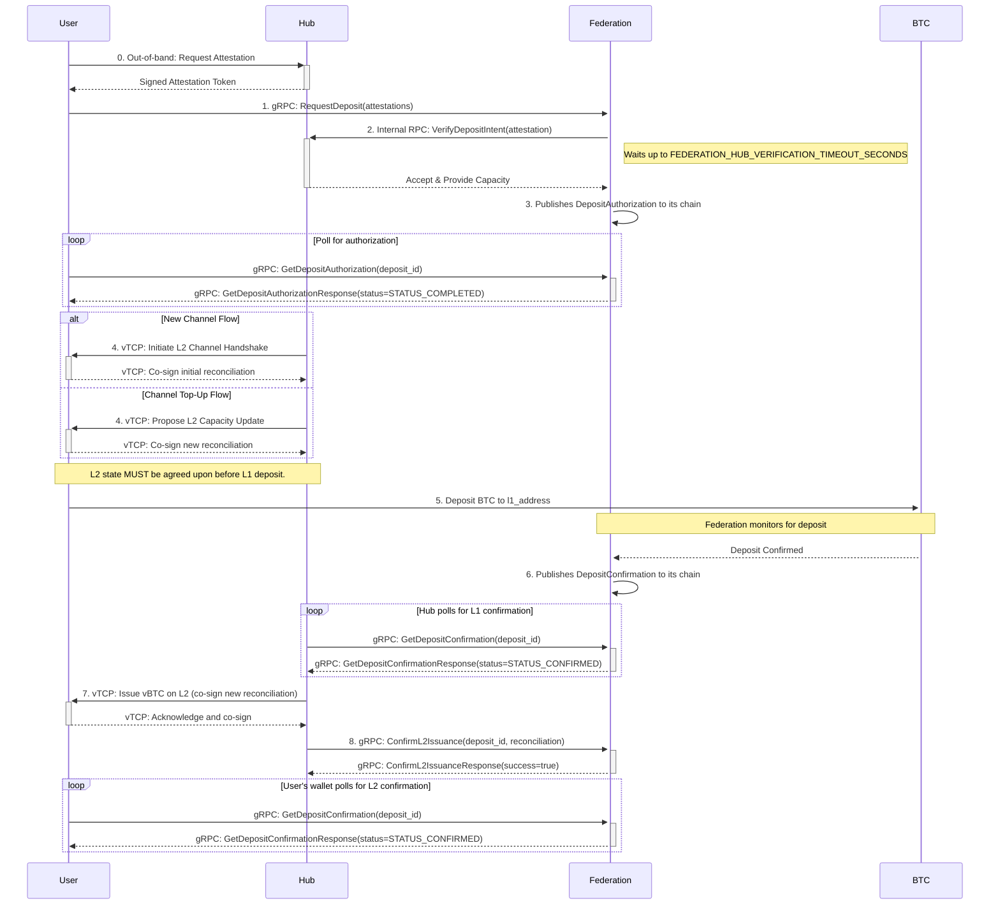
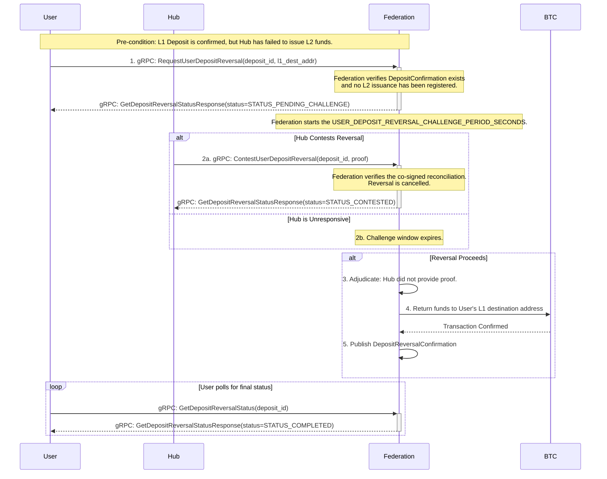
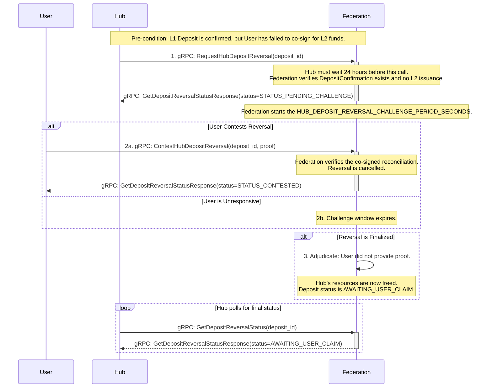
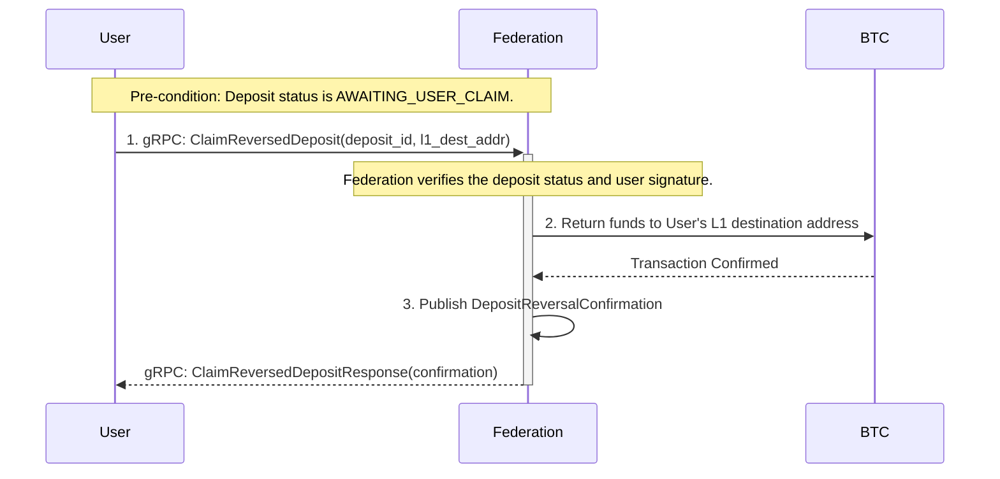

# BTC ⟷ vTCP Custody Protocol - Deposit Flow

_v0.4, 2025-07-07_

## Summary of Changes in v0.4
This version introduces several refinements to enhance security and resolve inconsistencies:
- **Timing Attack Mitigation**: The protocol is hardened against timing attacks that could leak information about Hub availability. The internal state of Hub verification is no longer exposed to the user during polling.
- **Protocol Inconsistency Resolutions**:
  - The conceptual `SubmitAbandonmentProof` RPC call has been formally defined as `ReportChannelAbandonment`.
  - The ambiguous `UpdateChannelCapacity` RPC call has been removed from the public API to clarify it is for internal use only.
  - Conflicting specifications for `uint256` serialization have been unified.
  - The ambiguous `bytes contest_proof` field has been replaced with a type-safe `oneof` structure.
- **Enhanced Security for L2 Issuance**: The documentation now strongly recommends that both the Hub and the User call `ConfirmL2Issuance` to prevent potential reversal fraud.
- **Protocol Gap Closure**: A policy for handling unclaimed funds from mismatched deposits has been introduced to prevent indefinite liability for the Federation.

# todo
- add a verification mechanism for the federation to prevent a hub from creating more channel obligations than its actual L1 stake.

## 1. Overview

This document provides a detailed technical specification for the **Issuance Process (Flow 1)** of the [BTC ⟷ vTCP Custody Protocol](/architecture/btc-federation/protocols/BTC%20<->%20vTCP%20Custody%20Protocol.md). This process covers both the creation of new channels and the topping-up of existing ones.

All channel lifecycle events and state transitions within the Federation are managed by the [Federation Channels Registry](/architecture/common/entities/federation_channels_registry.md). This document describes the protocol that triggers those state changes.

For a higher-level, human-oriented explanation of the protocol, please see the main [BTC <-> vTCP Custody Protocol document](/architecture/btc-federation/protocols/BTC%20<->%20vTCP%20Custody%20Protocol.md).

For detailed security analysis and attack vectors related to this protocol, see the [Security Analysis and Attack Vectors document](/architecture/btc-federation/protocols/protocol_btc<>vtcp_custody_attacks.md).

### 1.1. Prerequisites

This protocol uses a hybrid identity model. It allows users the flexibility to use ephemeral keys for L1 deposits and does not require them to maintain a persistent, registered identity with the Federation.

- **Hub Registry**: The Federation maintains an authoritative Hub Registry. Addressing is handled by mapping the hash of a Hub's public key to a unique and stable Hub Identifier (`HubID`). Each `HubID` is associated with a single network endpoint (`ip:port`) and a set of one or more public keys. This structure allows a single Hub entity to be addressed via any of its registered keys, providing operational flexibility.
- **Hub Registration**: A Hub must register its public key(s) and network endpoint with the Federation to be discoverable. The Federation assigns a unique `HubID` upon initial registration.
- **User Identifier (`vID`)**: The user provides a `vID`, which is an identifier meaningful to the Hub. The Federation treats this as an opaque string and is not required to register or validate it.
- **User Deposit Key**: The user's L1 public key for a specific deposit is provided ephemerally and proven via the signature on the `DepositRequest`.

### 1.2. New Channels vs. Top-Ups

The deposit protocol distinguishes between two primary operations:
1.  **New Channel Creation**: A user deposits BTC to create a new L2 settlement line with a Hub. This involves generating a new, unique `channel_id`. For this flow, the user must first obtain a signed, single-use **Hub Attestation** from each Hub they wish to potentially connect with.
2.  **Channel Top-Up**: A user adds more liquidity to an already existing L2 settlement line. This reuses an existing `channel_id`. This flow does not require a Hub Attestation.

The `DepositRequest` message allows the user to specify which action they intend to perform. The subsequent protocol flow varies slightly depending on the choice, particularly regarding the establishment of the L2 channel.

## 2. Protocol Constants

This section defines key constants used throughout the deposit protocol. Implementations should use these values to ensure compatibility.

| Constant           | Default Value | Description                                                                                        |
| --------------------------------------------- | :-----------: | -------------------------------------------------------------------------------------------------- |
| `version` |       1       | The version number of this protocol, included in all messages to ensure compatibility between parties. |
| `USER_DEPOSIT_REVERSAL_CHALLENGE_PERIOD_SECONDS` |    259200    | The duration (in seconds) of the challenge window for a user-initiated deposit reversal (defaulting to 72 hours). |
| `HUB_DEPOSIT_REVERSAL_WAIT_PERIOD_SECONDS` |    86400    | The duration (in seconds) a Hub must wait before initiating a reversal for an unresponsive user (defaulting to 24 hours). |
| `HUB_DEPOSIT_REVERSAL_CHALLENGE_PERIOD_SECONDS` |    259200    | The duration (in seconds) of the challenge window for a hub-initiated deposit reversal (defaulting to 72 hours). |
| `FEDERATION_HUB_VERIFICATION_TIMEOUT_SECONDS` |     120      | The duration (in seconds) the Federation will wait for a single Hub to respond to a `VerifyDepositIntent` call. |
| `DEPOSIT_AUTH_BASE_EXPIRY_SECONDS` |     1200     | The base duration (in seconds) for a deposit authorization's expiry, providing a 20-minute window for Federation-side processing. |
| `DEPOSIT_AUTH_PER_HUB_EXPIRY_SECONDS` |      120     | The additional time (in seconds) added to the expiry for each Hub in the user's request, allowing 2 minutes per Hub. |
| `MAX_HUBS_PER_REQUEST` |       5       | The maximum number of Hubs that can be specified in a single `DepositRequest` to prevent authorization expiry manipulation and DoS attacks. |

## 3. Computed Identifier: `deposit_id`

The `deposit_id` is a globally unique identifier for the deposit operation, computed by all parties as:
`deposit_id = BLAKE2b-256(target_vid || nonce)`
This allows the user to reliably poll for the `DepositAuthorization` even if the initial RPC response is lost. The ID is deterministic and can be re-computed by the user, making the `RequestDeposit` operation idempotent from the user's perspective. If a user sends a request but the connection drops before receiving a response, they can safely poll the `GetDepositAuthorization` endpoint using the same computed `deposit_id` to retrieve the result without risking a duplicate deposit request.

## 4. Signature Generation

To ensure message authenticity and integrity, this protocol uses cryptographic signatures. All signatures are generated over a deterministic, canonical representation of the message data.

### 4.1. Canonical Message Representation

Before signing, the relevant message fields are serialized into a single, unambiguous byte string. The general process is as follows:

1.  **Field Order**: Fields are included in the exact order they are specified for signing.
2.  **Integer Types** (`uint16`, `uint64`): Serialized as fixed-size, big-endian unsigned integers. `uint16` is 2 bytes, and `uint64` is 8 bytes.
3.  **String Types** (`string`): Serialized as length-prefixed UTF-8 byte arrays. The length is a 32-bit unsigned integer in big-endian format.
4.  **Bytes Types** (`bytes`): Serialized as length-prefixed byte arrays. The length is a 32-bit unsigned integer in big-endian format.
5.  **Repeated Fields**: Elements are serialized individually according to their type and then concatenated into a single byte string.
6.  **`uint256` Type**: Serialized as a 32-byte, big-endian unsigned integer.

### 4.2. Hashing and Signing Algorithm

The serialized payload is then hashed and signed:

1.  **Hashing**: The canonical byte string is hashed using `BLAKE2b-256`.
2.  **Signing**:
    *   **User Signatures**: Users sign the hash using the **ECDSA algorithm with the secp256k1 curve**. The choice of `secp256k1` is deliberate to align with the cryptographic standards of the Bitcoin network. This approach simplifies integration for users and existing Bitcoin wallets, as it leverages the same security model and cryptographic primitives that are foundational to Bitcoin itself. The resulting signature **MUST be in canonical low-S form and DER-encoded**, and include a recovery ID. This allows the Federation to derive the user's public key directly from the signature, proving their control over the deposit address and preventing signature malleability.
    *   **Hub Signatures**: Hubs sign the hash using the **Ed25519 algorithm**. The Hub's public key must be pre-registered with the Federation.

### 4.3. `DepositRequest` Signature

The `user_deposit_key_signature` is computed over fields 2, 3, 4, 5 and 8. The signature payload is the `BLAKE2b-256` hash of the concatenated, serialized fields:

`Serialize(nonce) || Serialize(target_vid) || Serialize(amount_satoshis) || Serialize(channel_id_to_top_up) || Serialize(hub_attestations)`

- `nonce`: `uint64` -> 8 bytes, big-endian.
- `target_vid`: `string` -> 4-byte length + UTF-8 bytes.
- `amount_satoshis`: `uint64` -> 8 bytes, big-endian.
- `channel_id_to_top_up`: `uint64` -> 8 bytes, big-endian.
- `hub_attestations`: `repeated HubAttestation` -> Concatenation of serialized `HubAttestation` messages. Each `HubAttestation` is serialized as `Serialize(hub_id) || Serialize(attestation_token)`.

### 4.4. `UpdateChannelCapacityRequest` Signature

The `hub_signature` is computed over fields 2 through 5. The signature payload is the `BLAKE2b-256` hash of the concatenated, serialized fields:

`Serialize(deposit_id) || Serialize(max_positive_balance) || Serialize(max_negative_balance) || Serialize(initial_balance)`

- `deposit_id`: `string` -> 4-byte length + UTF-8 bytes.
- `max_positive_balance`: `uint256` -> 32 bytes, big-endian.
- `max_negative_balance`: `uint256` -> 32 bytes, big-endian.
- `initial_balance`: `uint256` -> 32 bytes, big-endian.

## 5. Message Structure Definitions

**Note on Protocol Versioning**: All messages include a `version` field. This allows for future protocol upgrades and ensures all parties can verify compatibility.

**Note on `uint256`**: The `uint256` type is used for clarity in this document. For serialization and signature purposes, it **MUST** be treated as a 32-byte, big-endian unsigned integer.


```protobuf
// A structure to hold a Hub's signed attestation for a user, granting
// permission to request a new channel via the Federation.
message HubAttestation {
    // The ID of the Hub providing the attestation.
    uint64 hub_id = 1;

    // An opaque, single-use, signed token provided by the Hub.
    // The Federation treats this as a blob and passes it to the Hub for validation.
    // The token should be short-lived and contain a nonce to prevent replay attacks.
    bytes attestation_token = 2;
}

// The initial request from a user to initiate a BTC deposit.
message DepositRequest {
    // The version of the protocol, e.g., 1.
    uint16 version = 1;

    // A client-generated nonce to ensure the uniqueness of the request for this vID.
    uint64 nonce = 2;
    
    // The registered vTCP identifier (`vID`) of the user making the request.
    // The target user's address in vTCP network.
    string target_vid = 3;
    
    // The amount of BTC the user intends to deposit, in satoshis.
    uint64 amount_satoshis = 4;
    
    // OPTIONAL: The ID of an existing channel to top up.
    // If provided, this request becomes a top-up for an existing channel.
    // If omitted, a new channel will be created.
    uint64 channel_id_to_top_up = 5;
    
    // DEPRECATED for new channels. Use `hub_attestations` instead.
    repeated uint64 preferred_hub_ids = 6;
    
    // A signature over fields 2, 3, 4, 5, and 8 created with the private key
    // corresponding to the public key of the L1 address that will be used
    // to send the BTC. This proves ownership of the source funds.
    bytes user_deposit_key_signature = 7;

    // For new channels, this is a list of Hub attestations, sorted in the
    // user's order of preference. The Federation will attempt to contact
    // them sequentially. REQUIRED for new channels, IGNORED for top-ups.
    // MUST NOT exceed MAX_HUBS_PER_REQUEST (5) to prevent timing attacks.
    repeated HubAttestation hub_attestations = 8;
}
```

```protobuf
// The authorization published by the Federation, making the deposit details public.
message DepositAuthorization {
    // The version of the protocol, e.g., 1.
    uint16 version = 1;
    
    // The unique identifier for this deposit, computed as BLAKE2b-256(target_vid || nonce).
    string deposit_id = 2;
    
    // The globally unique and immutable identifier for the channel, assigned by the Federation.
    uint64 channel_id = 3;

    // The user's identifier, passed from the DepositRequest.
    string target_vid = 4;

    // The user's public key derived from the signature of the DepositRequest.
    bytes user_deposit_pubkey = 5;

    // The set of public keys of the single Hub that has accepted the channel request.
    repeated bytes hub_pubkeys = 6 [packed=true];

    // The public keys of the Federation members that form the multisig for the deposit_address_l1.
    // The user's wallet MUST use these keys to deterministically recompute and verify the deposit_address_l1.
    repeated bytes federation_pubkeys = 7 [packed=true];

    // The amount of BTC to be deposited, in satoshis.
    uint64 amount_satoshis = 8;

    // The unique L1 multisig address generated by the Federation for this deposit.
    // This address is deterministically derived from the federation_pubkeys and a predefined
    // Schnorr/FROST multisig script template.
    string deposit_address_l1 = 9;

    // The timestamp after which this authorization expires. This value is
    // dynamically calculated by the Federation.
    int64 expiry_timestamp = 10;
}
```

```protobuf
// The final confirmation published by the Federation after the L1 deposit is secure.
message DepositConfirmation {
    // The version of the protocol, e.g., 1.
    uint16 version = 1;

    // The unique identifier for the deposit being confirmed.
    string deposit_id = 2;

    // The globally unique and immutable identifier for the channel, assigned by the Federation.
    uint64 channel_id = 3;

    // The L1 transaction ID of the user's deposit.
    string l1_transaction_id = 4;
}
```

```protobuf
// A generic acknowledgment response used for RPC calls.
message UpdateChannelCapacityResponse {
    // The version of the protocol, e.g., 1.
    uint16 version = 1;

    // The identifier of the request being acknowledged.
    string deposit_id = 2;
    
    // Indicates if the operation was accepted.
    bool success = 3;
    
    // An optional message for errors or additional info.
    string message = 4;
}
```

```protobuf
// A request from a user to poll for the status of their deposit authorization.
message GetDepositAuthorizationRequest {
    // The version of the protocol, e.g., 1.
    uint16 version = 1;

    // The unique computed identifier for the deposit.
    string deposit_id = 2;
}
```

```protobuf
// The response to a poll for deposit authorization, which can indicate a pending,
// completed, or rejected state.
message GetDepositAuthorizationResponse {
    // The version of the protocol, e.g., 1.
    uint16 version = 1;

    // The status of the deposit authorization request.
    enum Status {
        STATUS_UNSPECIFIED = 0;
        // The Federation has received the request and is processing it.
        // This status is used for both internal validation and Hub outreach
        // to prevent timing-based information leaks.
        STATUS_PENDING = 1;
        // The authorization has been successfully published.
        STATUS_COMPLETED = 2;
        // The authorization request was invalid or rejected by all Hubs.
        STATUS_REJECTED = 3;
        // The authorization expired before the user deposited funds.
        STATUS_EXPIRED = 4;
    }
    Status status = 2;

    oneof result {
        // Present when status is STATUS_COMPLETED.
        DepositAuthorization authorization = 3;
        
        // Present when status is STATUS_REJECTED or STATUS_EXPIRED.
        string error_message = 4;
    }
}
```

```protobuf
// A request from a Hub to inform the Federation of the final channel capacity.
message UpdateChannelCapacityRequest {
    // The version of the protocol, e.g., 1.
    uint16 version = 1;

    // The unique computed identifier for the deposit.
    string deposit_id = 2;
    
    // The maximum positive balance for the Hub in the channel, in satoshis.
    uint256 max_positive_balance = 3;

    // The maximum negative balance for the Hub in the channel, in satoshis.
    uint256 max_negative_balance = 4;
    
    // The initial balance of the channel, which should be 0.
    uint256 initial_balance = 5;

    // The Hub's signature of the fields above (2-5).
    bytes hub_signature = 6;
}
```

```protobuf
// A request from a Hub to poll for the status of a deposit confirmation.
message GetDepositConfirmationRequest {
    // The version of the protocol, e.g., 1.
    uint16 version = 1;

    // The unique computed identifier for the deposit.
    string deposit_id = 2;
}
```

```protobuf
// The response to a poll for deposit confirmation.
message GetDepositConfirmationResponse {
    // The version of the protocol, e.g., 1.
    uint16 version = 1;

    // The status of the deposit confirmation request.
    enum Status {
        STATUS_UNSPECIFIED = 0;
        // The Federation has not yet confirmed the L1 deposit.
        STATUS_PENDING = 1;
        // The deposit has been successfully confirmed.
        STATUS_CONFIRMED = 2;
        // The deposit expired before funds were received.
        STATUS_EXPIRED = 3;
        // The deposit was received, but the amount was incorrect.
        STATUS_AMOUNT_MISMATCH = 4;
        // The deposit was rejected for another reason.
        STATUS_REJECTED = 5;
    }
    Status status = 2;

    oneof result {
        // Present when status is STATUS_CONFIRMED.
        DepositConfirmation confirmation = 3;
        
        // Present when status is STATUS_AMOUNT_MISMATCH.
        DepositAmountMismatch mismatch_details = 4;

        // Present when status is STATUS_EXPIRED or STATUS_REJECTED.
        string error_message = 5;
    }
}

// Details about a deposit where the received amount did not match the expected amount.
message DepositAmountMismatch {
    // The unique identifier for the deposit.
    string deposit_id = 1;

    // The amount the user was expected to deposit, in satoshis.
    uint64 expected_amount_satoshis = 2;

    // The amount the user actually deposited, in satoshis.
    uint64 actual_amount_satoshis = 3;
}

// --- Deposit Reversal Messages ---

// A request from a User to initiate the reversal of a deposit because the Hub is unresponsive.
message RequestUserDepositReversalRequest {
    // The version of the protocol, e.g., 1.
    uint16 version = 1;

    // The unique identifier of the deposit to be reversed.
    string deposit_id = 2;

    // The destination L1 Bitcoin address where the funds should be returned.
    string l1_destination_address = 3;

    // The signature of the user, proving ownership of the original deposit request.
    // This is a signature over `deposit_id` and `l1_destination_address`.
    bytes user_signature = 4;
}

// A request from a Hub to initiate the reversal of a deposit because the User is unresponsive.
message RequestHubDepositReversalRequest {
    // The version of the protocol, e.g., 1.
    uint16 version = 1;

    // The unique identifier of the deposit to be reversed.
    string deposit_id = 2;

    // The signature of the Hub, proving ownership of the channel.
    // This is a signature over `deposit_id`.
    bytes hub_signature = 3;
}

// A request from a Hub to contest a user-initiated deposit reversal attempt.
message ContestUserDepositReversalRequest {
    // The version of the protocol, e.g., 1.
    uint16 version = 1;

    // The unique identifier of the deposit being contested.
    string deposit_id = 2;

    // The last known channel state that was co-signed by both parties.
    // This serves as the baseline for proving the user's activity.
    ChannelReconciliation last_co_signed_state = 3;

    // Optional: A list of valid, signed vTCP transactions that occurred *after*
    // the last_co_signed_state was created. This allows the Hub to prove the
    // most current channel balance if a new consolidated state has not yet been co-signed.
    repeated SignedVTCPTransaction subsequent_transactions = 4;
}

// A request from a User to contest a hub-initiated deposit reversal attempt.
message ContestHubDepositReversalRequest {
    // The version of the protocol, e.g., 1.
    uint16 version = 1;

    // The unique identifier of the deposit being contested.
    string deposit_id = 2;

    // The co-signed channel reconciliation that proves the L2 funds were issued.
    // This serves as proof that the user was, in fact, online and completed the protocol.
    ChannelReconciliation post_deposit_reconciliation = 3;
}

// A wrapper message to provide type-safe proof for a contested reversal.
message ContestProof {
    oneof proof {
        ContestUserDepositReversalRequest user_contest_request = 1;
        ContestHubDepositReversalRequest hub_contest_request = 2;
    }
}

// A request to poll for the status of a deposit reversal.
message GetDepositReversalStatusRequest {
    // The version of the protocol, e.g., 1.
    uint16 version = 1;

    // The unique identifier of the deposit reversal being polled.
    string deposit_id = 2;
}

// The response to a poll for the status of a deposit reversal.
message GetDepositReversalStatusResponse {
    // The version of the protocol, e.g., 1.
    uint16 version = 1;

    // The status of the deposit reversal request.
    enum Status {
        STATUS_UNSPECIFIED = 0;
        // The reversal request is pending, and the challenge window is open.
        STATUS_PENDING_CHALLENGE = 1;
        // The reversal has been successfully completed and funds returned.
        STATUS_COMPLETED = 2;
        // The reversal was successfully contested.
        STATUS_CONTESTED = 3;
        // The reversal request was rejected (e.g., invalid deposit_id, wrong initiator).
        STATUS_REJECTED = 4;
        // The Hub-initiated reversal succeeded; funds are waiting for the user to claim.
        STATUS_AWAITING_USER_CLAIM = 5;
    }
    Status status = 2;

    oneof result {
        // Present when status is STATUS_COMPLETED.
        DepositReversalConfirmation confirmation = 3;
        
        // Present when status is STATUS_CONTESTED.
        ContestProof contest_proof = 4;

        // Present when status is STATUS_REJECTED.
        string error_message = 5;
    }
}

// The final confirmation published by the Federation after a deposit reversal is complete.
message DepositReversalConfirmation {
    // The version of the protocol, e.g., 1.
    uint16 version = 1;

    // The unique identifier for the deposit reversal.
    string deposit_id = 2;

    // The L1 transaction ID of the reversal payout.
    string l1_transaction_id = 3;
}

// A request from a User to claim funds from a deposit that was reversed by a Hub.
message ClaimReversedDepositRequest {
    // The version of the protocol, e.g., 1.
    uint16 version = 1;

    // The unique identifier of the deposit to be claimed.
    string deposit_id = 2;

    // The destination L1 Bitcoin address where the funds should be returned.
    string l1_destination_address = 3;

    // The signature of the user, proving ownership of the original deposit request.
    // This is a signature over `deposit_id` and `l1_destination_address`.
    bytes user_signature = 4;
}

// The response to a claim request.
message ClaimReversedDepositResponse {
    // The version of the protocol, e.g., 1.
    uint16 version = 1;

    // The final confirmation of the reversal.
    DepositReversalConfirmation confirmation = 2;
}


// --- L2 Issuance Confirmation ---

// A request from a Hub or User to confirm that L2 issuance is complete.
message ConfirmL2IssuanceRequest {
    // The version of the protocol, e.g., 1.
    uint16 version = 1;

    // The unique identifier of the deposit being confirmed.
    string deposit_id = 2;

    // The co-signed channel reconciliation that proves the L2 funds were issued.
    ChannelReconciliation post_deposit_reconciliation = 3;
}

// The response to a confirmation of L2 issuance.
message ConfirmL2IssuanceResponse {
    // The version of the protocol, e.g., 1.
    uint16 version = 1;

    // Indicates if the confirmation was accepted.
    bool success = 2;

    // An optional message for errors or additional info.
    string message = 3;
}

// --- Mismatched Deposit Refund Messages ---

// A request from a User to get a refund for a deposit with an incorrect amount.
message RequestMismatchedDepositRefundRequest {
    // The version of the protocol, e.g., 1.
    uint16 version = 1;

    // The unique identifier of the deposit.
    string deposit_id = 2;

    // The destination L1 Bitcoin address where the funds should be returned.
    string l1_destination_address = 3;

    // The signature of the user, proving ownership of the original deposit request.
    // This is a signature over `deposit_id` and `l1_destination_address`.
    bytes user_signature = 4;
}

// The response to a mismatched deposit refund request.
message RequestMismatchedDepositRefundResponse {
    // The version of the protocol, e.g., 1.
    uint16 version = 1;

    // The L1 transaction ID of the refund payout.
    // This will be populated once the refund is successfully broadcast.
    string l1_transaction_id = 2;
}

// --- Channel Abandonment Messages ---

// A request from a Hub to report a user who abandoned a deposit after L2 setup.
message ReportChannelAbandonmentRequest {
    // The version of the protocol, e.g., 1.
    uint16 version = 1;

    // The unique identifier of the abandoned deposit.
    string deposit_id = 2;

    // The co-signed, zero-balance channel reconciliation that proves the
    // channel was agreed upon before the user abandoned the flow.
    ChannelReconciliation abandonment_proof = 3;

    // The Hub's signature over the deposit_id.
    bytes hub_signature = 4;
}

message ReportChannelAbandonmentResponse {
    // The version of the protocol, e.g., 1.
    uint16 version = 1;

    // Indicates if the report was accepted.
    bool success = 2;
}


```

## 6. gRPC Service Definitions

```protobuf
// Service run by the Federation to manage the deposit lifecycle.
service FederationService {
    // Called by the User to initiate a new deposit.
    // Returns an initial status, which will be PENDING if the request is valid.
    rpc RequestDeposit(DepositRequest) returns (GetDepositAuthorizationResponse);

    // Called by the User to poll for the final deposit authorization details.
    // It is recommended that clients use server-side streaming where available
    // for a more efficient experience.
    rpc GetDepositAuthorization(GetDepositAuthorizationRequest) returns (GetDepositAuthorizationResponse);

    // Note: The UpdateChannelCapacity call is part of a private, internal
    // Federation-Hub API and is not exposed on the public-facing service.

    // Called by the Hub to poll for the L1 deposit confirmation.
    rpc GetDepositConfirmation(GetDepositConfirmationRequest) returns (GetDepositConfirmationResponse);

    // --- Deposit Reversal Flow ---

    // Called by the User to initiate a deposit reversal if the Hub is unresponsive.
    rpc RequestUserDepositReversal(RequestUserDepositReversalRequest) returns (GetDepositReversalStatusResponse);

    // Called by the Hub to contest a user-initiated deposit reversal.
    rpc ContestUserDepositReversal(ContestUserDepositReversalRequest) returns (GetDepositReversalStatusResponse);

    // Called by the Hub to initiate a deposit reversal if the User is unresponsive.
    rpc RequestHubDepositReversal(RequestHubDepositReversalRequest) returns (GetDepositReversalStatusResponse);

    // Called by the User to contest a hub-initiated deposit reversal.
    rpc ContestHubDepositReversal(ContestHubDepositReversalRequest) returns (GetDepositReversalStatusResponse);

    // Called by the User or Hub to poll for the status of a deposit reversal.
    rpc GetDepositReversalStatus(GetDepositReversalStatusRequest) returns (GetDepositReversalStatusResponse);

    // Called by the User to claim funds after a Hub-initiated reversal.
    rpc ClaimReversedDeposit(ClaimReversedDepositRequest) returns (ClaimReversedDepositResponse);

    // --- L2 Issuance Confirmation ---

    // Called by the Hub or User to proactively confirm L2 issuance.
    // This prevents the deposit from being reversed.
    rpc ConfirmL2Issuance(ConfirmL2IssuanceRequest) returns (ConfirmL2IssuanceResponse);

    // --- Mismatched Deposit Refund ---

    // Called by the User to request a refund for a deposit with an incorrect amount.
    rpc RequestMismatchedDepositRefund(RequestMismatchedDepositRefundRequest) returns (RequestMismatchedDepositRefundResponse);

    // --- Channel Abandonment Reporting ---

    // Called by a Hub to report a user who completed the L2 channel setup (Step 4)
    // but never deposited L1 funds, abandoning the flow. This is used for
    // logging and reputation tracking.
    rpc ReportChannelAbandonment(ReportChannelAbandonmentRequest) returns (ReportChannelAbandonmentResponse);
}
```

## 7. Sequence of Actions

### 7.1. Visual Flow



### 7.2. Successful Issuance Flow

**0. User-Hub Pre-authentication (New Channel Flow Only)**
- **Action**: Before contacting the Federation, the User's client connects directly to one or more Hubs via a Hub-specific, out-of-band API. The User satisfies any Hub-specific policies (e.g., authentication, KYC, CAPTCHA).
- **Outcome**: If the Hub agrees to consider a new channel, it provides the User with a short-lived, single-use, signed `attestation_token`. This token proves the Hub has pre-vetted the user.

**1. User Requests Deposit or Top-Up**
- **Action**: The User sends a `DepositRequest` to the Federation.
    - **For a new channel**: The request omits `channel_id_to_top_up` and includes an ordered list of `hub_attestations`.
    - **For a channel top-up**: The request includes the `channel_id_to_top_up`. The `hub_attestations` field is ignored.
- **gRPC Call**: `FederationService.RequestDeposit(request)`
- **Response**: The Federation immediately returns a `GetDepositAuthorizationResponse` with a `STATUS_PENDING` status if the request is syntactically valid.

**2. Federation Validates Intent with Hub (New Channel Flow Only)**
- **Action**: The Federation validates the `DepositRequest` signature and data. It first enforces that the `hub_attestations` list does not exceed `MAX_HUBS_PER_REQUEST` to prevent timing manipulation attacks. It then iterates through the `hub_attestations` list in the user-provided order.
- **Internal Process**:
    1. For the first Hub in the list, the Federation makes a private, internal RPC call to the Hub, passing the `attestation_token`. The user can poll `GetDepositAuthorization` and will see a `STATUS_PENDING` status. To prevent information leakage about Hub responsiveness, the Federation does not expose which specific Hub is being contacted or when the outreach transitions between Hubs.
    2. The Hub validates the token. If valid, it commits liquidity and responds with its acceptance.
    3. If the Hub accepts, the Federation proceeds to the next step. The loop stops.
    4. If the Hub rejects the token or fails to respond within `FEDERATION_HUB_VERIFICATION_TIMEOUT_SECONDS`, the Federation repeats the process with the next Hub in the list.
- **For a top-up**: The Federation verifies that the `channel_id_to_top_up` exists, is active, and is associated with the `target_vid`. It then notifies the relevant Hub.

**3. Federation Authorizes Deposit and User Polls for Completion**
- **Action**: Following a successful Hub commitment (for new channels) or validation (for top-ups), the Federation:
  1.  Calculates the dynamic `expiry_timestamp` for the authorization.
  2.  **For a new channel**, generates a new, globally unique `channel_id`.
  3.  **For a top-up**, uses the existing `channel_id_to_top_up`.
  4.  Constructs a `DepositAuthorization` message.
  5.  Publishes the `DepositAuthorization` as an event on the Federation chain.
- **Polling**: The User periodically calls `GetDepositAuthorization` with the `deposit_id` to check the status.
- **Response**: Once the `DepositAuthorization` is available, the call will return a `STATUS_COMPLETED` status containing the full payload. If all Hubs rejected the request, it will return `STATUS_REJECTED`.

**4. Hub and User Prepare for L1 Deposit**
- **Action**: With authorization confirmed, the Hub and User must co-sign an L2 `ChannelReconciliation` to reflect the pending deposit. **This step is mandatory and must be completed before the L1 deposit.**
   - **For a new channel**: The Hub and User co-sign the initial `ChannelReconciliation` (`sequence_number = 0`).
   - **For a top-up**: The Hub and User co-sign a new `ChannelReconciliation` that reflects the channel's *anticipated* state after the deposit.
   - **Security Mandate**: The `memo` field of the co-signed `ChannelReconciliation` **MUST** contain the `deposit_address_l1` from the `DepositAuthorization`.

**5. User Deposits BTC on L1**
- **Action**: **Only after the L2 reconciliation in Step 4 is successfully co-signed**, the User broadcasts a Bitcoin transaction, sending the agreed-upon `amount_satoshis` to the `deposit_address_l1`.

**6. Federation Confirms Deposit**
- **Action**: The Federation's L1 monitor detects the deposit and publishes a `DepositConfirmation` to its chain.

**7. Hub Issues vTCP Tokens and User Verifies**
- **Action (Hub)**: The Hub polls `GetDepositConfirmation`. Upon receiving a `STATUS_CONFIRMED` status, it co-signs a new `ChannelReconciliation` with the updated balances.
- **Action (User)**: The User's application also polls `GetDepositConfirmation` and participates in the reconciliation to receive the funds.

**8. Hub Confirms L2 Issuance with Federation**
- **Action**: After the L2 funds are issued, the Hub submits the final co-signed `ChannelReconciliation` to the Federation. It is **highly recommended** that the User's client also submits this confirmation as a protective measure.
- **gRPC Call**: `FederationService.ConfirmL2Issuance(request)`
- **Federation Action**: The Federation validates the reconciliation and marks the `deposit_id` as **settled**, preventing any future deposit reversal attempts. This is a critical step to prevent reversal fraud.

## 8. Timeout Architecture

The deposit protocol relies on a set of well-defined timeouts to ensure liveness and prevent resources from being locked indefinitely.

| Timeout Parameter                             | Calculation / Default Value | Triggered By                                      | On Expiry                                                                                                                               | Purpose                                                                                             |
| --------------------------------------------- | :-------------------------: | ------------------------------------------------- | --------------------------------------------------------------------------------------------------------------------------------------- | --------------------------------------------------------------------------------------------------- |
| `FEDERATION_HUB_VERIFICATION_TIMEOUT_SECONDS` |          120 sec          | Federation calling a Hub to verify an attestation. | The Federation abandons the current Hub and attempts to contact the next Hub in the user's list. If no more Hubs, the deposit is rejected. | Prevents the entire process from stalling due to a single unresponsive Hub.                         |
| `DepositAuthorization.expiry_timestamp`       |          Dynamic          | Publication of the `DepositAuthorization`.        | The authorization is invalidated. The user cannot deposit funds. The `deposit_id` is marked as `STATUS_EXPIRED`.                        | Gives the user a fair and predictable window to co-sign the L2 state and make the L1 deposit.       |
| `USER_DEPOSIT_REVERSAL_CHALLENGE_PERIOD_SECONDS`   |          72 hrs           | User calling `RequestUserDepositReversal`.            | The Federation adjudicates in favor of the user and proceeds with returning the L1 funds.                                             | Gives a Hub ample time to contest a fraudulent reversal attempt, even in the case of a minor outage. |
| `HUB_DEPOSIT_REVERSAL_WAIT_PERIOD_SECONDS` | 24 hrs | Hub detecting an unresponsive user after L1 confirmation. | The Hub is permitted to call `RequestHubDepositReversal`. | Prevents Hub resources from being locked indefinitely by an unresponsive user. |
| `HUB_DEPOSIT_REVERSAL_CHALLENGE_PERIOD_SECONDS` | 72 hrs | Hub calling `RequestHubDepositReversal`. | The Federation adjudicates in favor of the Hub, frees the Hub's resources, and marks the deposit as `AWAITING_USER_CLAIM`. | Gives a User ample time to contest a reversal, while allowing the Hub to reclaim resources if the user remains offline. |

The `DepositAuthorization.expiry_timestamp` is calculated dynamically by the Federation upon validating the `DepositRequest`:
`expiry_timestamp = current_time_seconds + DEPOSIT_AUTH_BASE_EXPIRY_SECONDS + (number_of_hubs_in_request * DEPOSIT_AUTH_PER_HUB_EXPIRY_SECONDS)`

This formula provides a baseline of 20 minutes for internal processing and L2/L1 interaction, plus an additional 2 minutes for each Hub the Federation might need to contact. This ensures the user is given a fair expiry window that accounts for potential retries with fallback Hubs.

## 9. Failure Handling

### 9.1. Case 1: Invalid Deposit Request
- **Scenario**: A User submits a `DepositRequest` with an invalid signature, a replayed `(vID, nonce)` tuple, or other malformed data.
- **Outcome**: The Federation's initial validation fails. It immediately returns a `GetDepositAuthorizationResponse` with a `STATUS_REJECTED` status and a descriptive error message. The process terminates.
- **Scenario (Too Many Hubs)**: A User submits a `DepositRequest` with more than `MAX_HUBS_PER_REQUEST` Hub attestations.
- **Outcome**: The Federation immediately rejects the request with a `STATUS_REJECTED` status and an error message like "Too many Hubs specified. Maximum allowed: 5."
- **Scenario (New Channel)**: A User submits a `DepositRequest`, but every Hub in the `hub_attestations` list either rejects the token or fails to respond within `FEDERATION_HUB_VERIFICATION_TIMEOUT_SECONDS`.
- **Outcome**: The Federation, after failing to get a commitment from any Hub, rejects the deposit. The user's polling call to `GetDepositAuthorization` will eventually return a `STATUS_REJECTED` status with an error message like "No available Hub confirmed the request."

### 9.2. Case 2: L2 Channel Reconciliation Fails (Step 4)
- **Scenario**: The User and Hub receive the `DepositAuthorization` but fail to co-sign the required `ChannelReconciliation` before the authorization's `expiry_timestamp`.
- **Outcome**: The `DepositAuthorization` becomes invalid after the expiry. No funds have been moved. The flow is safely abandoned with no penalty. The user's polling call will return a `STATUS_EXPIRED` status.

### 9.3. Case 3: User Abandons Deposit After L2 Channel Creation (Step 5)
- **Scenario**: The L2 channel is successfully created and co-signed, but the User never makes the L1 deposit.
- **Outcome**: The Hub is left with an open, zero-balance channel. To reclaim its resources and formally log the event, the Hub can submit the co-signed, zero-balance `ChannelReconciliation` to the Federation.
- **gRPC Call**: `FederationService.ReportChannelAbandonment(request)`
- **Federation Action**: The Federation verifies the proof and logs the abandonment. This action may impact the User's reputation score within the system.

### 9.4. Case 4: Hub Fails to Issue vTCP Tokens (Step 7)
- **Scenario**: The User successfully deposits BTC on L1, and the Federation publishes the `DepositConfirmation`, but the Hub fails to co-sign the new `ChannelReconciliation` to issue the corresponding vTCP tokens.
- **Outcome**: The User is now in a state of dispute. They have cryptographic proof of a completed L1 deposit (`DepositConfirmation`) and a pre-agreed L2 channel state. The User can use this evidence to initiate the **User-Initiated Reversal Flow** to reclaim their L1 funds directly from the Federation.

### 9.5. Case 5: User Fails to Finalize L2 Issuance (Step 7)
- **Scenario**: The L1 deposit is confirmed by the Federation, but the User becomes unresponsive and fails to co-sign the final `ChannelReconciliation` that grants them the L2 tokens.
- **Outcome**: The Hub's liquidity is now locked. After waiting for the `HUB_DEPOSIT_REVERSAL_WAIT_PERIOD_SECONDS`, the Hub can initiate the **Hub-Initiated Reversal Flow**. If the user does not contest, the deposit is marked as `AWAITING_USER_CLAIM`, freeing the Hub's resources and allowing the user to claim their funds later.

### 9.6. Case 6: Incorrect L1 Deposit Amount
- **Scenario**: The User deposits an amount to the `deposit_address_l1` that is greater or less than the `amount_satoshis` specified in the `DepositAuthorization`.
- **Federation Action**: The Federation's L1 monitor detects the transaction but observes the amount mismatch. It will **not** publish a `DepositConfirmation`. Instead, it will internally flag the `deposit_id` with an `STATUS_AMOUNT_MISMATCH` status.
- **Outcome**: The deposit process is halted. When the User or Hub polls for the deposit status using `GetDepositConfirmation`, they will receive a response with the `STATUS_AMOUNT_MISMATCH` status, including details of the expected versus actual amounts.
- **Resolution**: The User must initiate a refund by calling the `RequestMismatchedDepositRefund` RPC endpoint. This is a non-disputable, administrative action. The User provides the `deposit_id` and a destination L1 address. The Federation validates the request and returns the `actual_amount_satoshis` to the user, **less the required L1 transaction fee for the refund transaction.** If the `actual_amount_satoshis` is not sufficient to cover the L1 transaction fee, no refund will be issued, and the funds will be forfeited. If the user does not request a refund within a system-defined period (e.g., 30 days), the Federation may sweep the funds to cover administrative costs. The original deposit flow is permanently terminated.

## 10. Deposit Reversal Flows

This section describes the symmetric reversal flows that act as a safety mechanism when one party becomes unresponsive after an L1 deposit has been confirmed.

### 10.1. User-Initiated Reversal (Hub Unresponsive)

This flow protects users who have successfully deposited L1 funds, but the Hub has failed to issue the corresponding L2 tokens. It allows the user to reclaim their L1 funds directly from the Federation after a challenge period.

#### 10.1.1. Visual Flow



#### 10.1.2. Sequence of Actions

**1. User Requests Deposit Reversal**
- **Action**: The User, having a `DepositConfirmation` but no L2 funds, initiates a reversal by sending a `RequestUserDepositReversalRequest` to the Federation. The request includes the `deposit_id` and a destination L1 address for the refund.
- **gRPC Call**: `FederationService.RequestUserDepositReversal(request)`
- **Federation Validation**: The Federation performs critical checks:
    1.  It verifies that a `DepositConfirmation` for the given `deposit_id` exists.
    2.  It checks its internal state to ensure the `deposit_id` has not already been marked as **settled** by a successful `ConfirmL2Issuance` call. If it is settled, the request is rejected.
    3.  It validates the `user_signature` to ensure the request is from the original depositor.
- **Response**: If the request is valid, the Federation starts the `USER_DEPOSIT_REVERSAL_CHALLENGE_PERIOD_SECONDS` and returns a `GetDepositReversalStatusResponse` with a `STATUS_PENDING_CHALLENGE` status.

**2. Hub's Opportunity to Contest**
- **Action**: The Hub is expected to be monitoring the Federation for reversal requests concerning its channels. If the Hub has, in fact, correctly issued the L2 funds, it MUST contest the reversal to prevent a fraudulent reclaim by the user.
- **gRPC Call (Hub)**: `FederationService.ContestUserDepositReversal(request)`
- **Contest Payload**: The Hub submits a `ContestUserDepositReversalRequest` containing proof of L2 issuance.
- **Federation Action**: The Federation validates the proof. If valid, the user's claim is invalidated, the reversal is cancelled, and the status becomes `STATUS_CONTESTED`. If the Hub does not respond within the challenge window or provides invalid proof, it forfeits the contest.

**3. Federation Finalizes the Reversal**
- **Action**: If the challenge window expires without a valid contest from the Hub, the Federation proceeds with the reversal.
- **Settlement**: The Federation constructs and broadcasts an L1 transaction to return the original `amount_satoshis` (less a transaction fee) to the `l1_destination_address` provided by the user.
- **Confirmation**: Upon confirmation of the L1 transaction, the Federation updates the status of the reversal to `STATUS_COMPLETED` and makes a `DepositReversalConfirmation` available.

**4. User Polls for Final Outcome**
- **Action**: The User can poll the `GetDepositReversalStatus` endpoint to monitor the status. They will receive `STATUS_PENDING_CHALLENGE` during the window, and a final `STATUS_COMPLETED` or `STATUS_CONTESTED` status once the process concludes.

### 10.2. Hub-Initiated Reversal (User Unresponsive)

This flow protects Hubs from having resources locked indefinitely if a user deposits L1 funds but then fails to complete the final L2 issuance step.

#### 10.2.1. Visual Flow



#### 10.2.2. Sequence of Actions

**1. Hub Requests Deposit Reversal**
- **Action**: The Hub, after detecting that a user has been unresponsive for the `HUB_DEPOSIT_REVERSAL_WAIT_PERIOD_SECONDS` after an L1 deposit was confirmed, initiates a reversal by sending a `RequestHubDepositReversalRequest`.
- **gRPC Call**: `FederationService.RequestHubDepositReversal(request)`
- **Federation Validation**: The Federation performs critical checks:
    1.  It verifies that a `DepositConfirmation` for the given `deposit_id` exists.
    2.  It checks that the `HUB_DEPOSIT_REVERSAL_WAIT_PERIOD_SECONDS` has elapsed since the `DepositConfirmation`.
    3.  It ensures the `deposit_id` has not already been marked as **settled**.
    4.  It validates the `hub_signature`.
- **Response**: If the request is valid, the Federation starts the `HUB_DEPOSIT_REVERSAL_CHALLENGE_PERIOD_SECONDS` and returns a `GetDepositReversalStatusResponse` with a `STATUS_PENDING_CHALLENGE` status.

**2. User's Opportunity to Contest**
- **Action**: A responsive User's client should be monitoring for such events. If the User is online and able to complete the L2 issuance, they MUST contest the reversal.
- **gRPC Call (User)**: `FederationService.ContestHubDepositReversal(request)`
- **Contest Payload**: The User submits a `ContestHubDepositReversalRequest` containing the `post_deposit_reconciliation` proof that L2 issuance was completed.
- **Federation Action**: If the User provides valid proof, the Hub's claim is invalidated, the reversal is cancelled, the `deposit_id` is marked as **settled**, and the status becomes `STATUS_CONTESTED`. If the User does not respond within the challenge window, they forfeit the contest.

**3. Federation Marks Deposit for Claiming**
- **Action**: If the challenge window expires without a valid contest from the User, the Federation finalizes the first stage of the reversal.
- **Outcome**: The Federation updates the status of the reversal to `STATUS_AWAITING_USER_CLAIM`. This action formally signals that the Hub's responsibility for the deposit has ended, and its resources are considered free. The L1 funds remain in the Federation's custody, awaiting the user's claim.

**4. Hub Polls for Final Outcome**
- **Action**: The Hub can poll the `GetDepositReversalStatus` endpoint to confirm the outcome. It will receive a final `STATUS_AWAITING_USER_CLAIM` or `STATUS_CONTESTED` status. Once the status is `AWAITING_USER_CLAIM`, the Hub can safely close its books on this deposit.

### 10.3. User Claiming a Reversed Deposit

This flow allows a user to recover their L1 funds at any time after a Hub-initiated reversal has been finalized.

#### 10.3.1. Visual Flow


#### 10.3.2. Sequence of Actions

**1. User Claims Their Funds**
- **Action**: When the user comes back online, their client will discover the `STATUS_AWAITING_USER_CLAIM` status by polling `GetDepositReversalStatus`. The user then initiates the claim.
- **gRPC Call**: `FederationService.ClaimReversedDeposit(request)`
- **Request Payload**: The user provides the `deposit_id`, a new `l1_destination_address` for the refund, and a `user_signature` to prove ownership.
- **Federation Validation**: The Federation verifies:
    1. The deposit status is `STATUS_AWAITING_USER_CLAIM`.
    2. The `user_signature` is valid and corresponds to the original depositor.

**2. Federation Executes the Payout**
- **Action**: If the claim is valid, the Federation constructs and broadcasts the L1 transaction to send the `amount_satoshis` (less transaction fees) to the user-provided `l1_destination_address`.
- **Confirmation**: Upon confirmation of the L1 transaction, the Federation publishes a `DepositReversalConfirmation` and updates the deposit's final status to `STATUS_COMPLETED`.
- **Response**: The `ClaimReversedDepositResponse` is returned to the user, containing the final confirmation details.