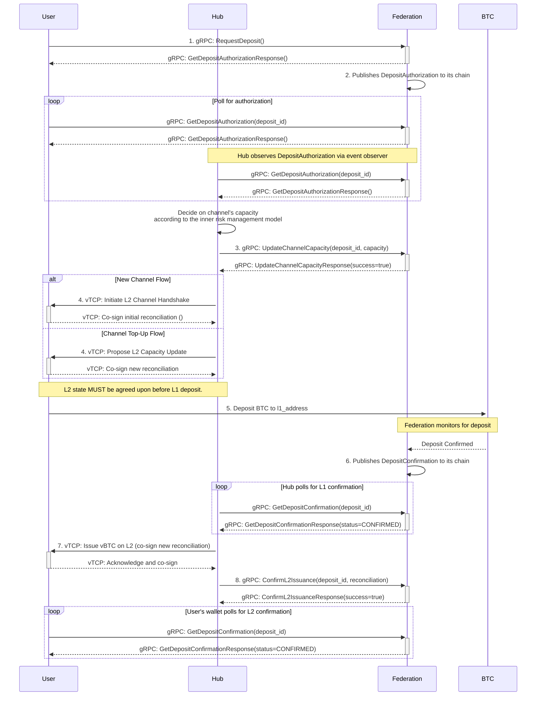
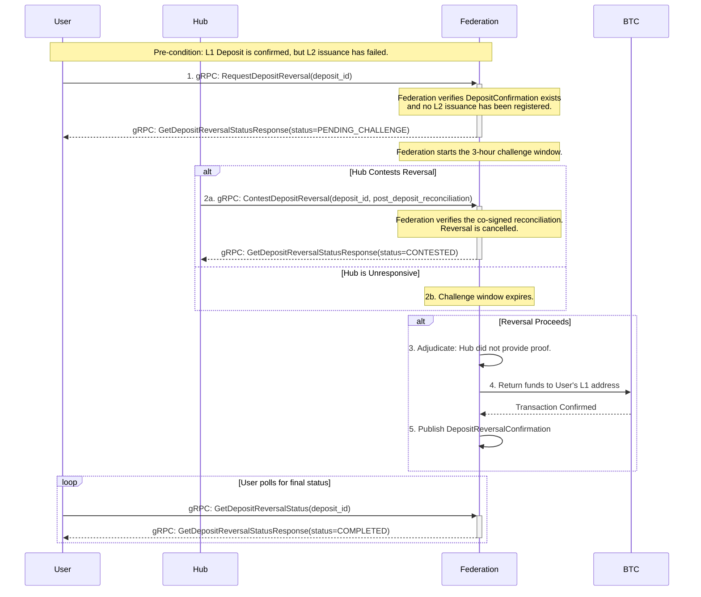

# BTC ⟷ vTCP Custody Protocol - Deposit Flow

_v0.1, 2025-06-30_

# todo
- add a verification mechanism for the federation to prevent a hub from creating more channel obligations than its actual L1 stake.

## 1. Overview

This document provides a detailed technical specification for the **Issuance Process (Flow 1)** of the [BTC ⟷ vTCP Custody Protocol](/architecture/btc-federation/protocols/BTC%20<->%20vTCP%20Custody%20Protocol.md). This process covers both the creation of new channels and the topping-up of existing ones.

All channel lifecycle events and state transitions within the Federation are managed by the [Federation Channels Registry](/architecture/common/entities/federation_channels_registry.md). This document describes the protocol that triggers those state changes.

For a higher-level, human-oriented explanation of the protocol, please see the main [BTC <-> vTCP Custody Protocol document](/architecture/btc-federation/protocols/BTC%20<->%20vTCP%20Custody%20Protocol.md).

### 1.1. Prerequisites

This protocol uses a hybrid identity model. It allows users the flexibility to use ephemeral keys for L1 deposits and does not require them to maintain a persistent, registered identity with the Federation.

- **Hub Registry**: The Federation maintains an authoritative Hub Registry. Addressing is handled by mapping the hash of a Hub's public key to a unique and stable Hub Identifier (`HubID`). Each `HubID` is associated with a single network endpoint (`ip:port`) and a set of one or more public keys. This structure allows a single Hub entity to be addressed via any of its registered keys, providing operational flexibility.
- **Hub Registration**: A Hub must register its public key(s) and network endpoint with the Federation to be discoverable. The Federation assigns a unique `HubID` upon initial registration.
- **User Identifier (`vID`)**: The user provides a `vID`, which is an identifier meaningful to the Hub. The Federation treats this as an opaque string and is not required to register or validate it.
- **User Deposit Key**: The user's L1 public key for a specific deposit is provided ephemerally and proven via the signature on the `DepositRequest`.

### 1.2. New Channels vs. Top-Ups

The deposit protocol distinguishes between two primary operations:
1.  **New Channel Creation**: A user deposits BTC to create a new L2 settlement line with a Hub. This involves generating a new, unique `channel_id`.
2.  **Channel Top-Up**: A user adds more liquidity to an already existing L2 settlement line. This reuses an existing `channel_id`.

The `DepositRequest` message allows the user to specify which action they intend to perform. The subsequent protocol flow varies slightly depending on the choice, particularly regarding the establishment of the L2 channel.

## 2. Protocol Constants

This section defines key constants used throughout the deposit protocol. Implementations should use these values to ensure compatibility.

| Constant           | Default Value | Description                                                                                        |
| ------------------ | :-----------: | -------------------------------------------------------------------------------------------------- |
| `version` |       1       | The version number of this protocol, included in all messages to ensure compatibility between parties. |
| `DEPOSIT_REVERSAL_CHALLENGE_PERIOD_SECONDS` |    259200    | The duration (in seconds) of the challenge window for a deposit reversal (defaulting to 72 hours). |

## 3. Computed Identifier: `deposit_id`

The `deposit_id` is a globally unique identifier for the deposit operation, computed by all parties as:
`deposit_id = BLAKE2b-256(target_vid || nonce)`
This allows the user to reliably poll for the `DepositAuthorization` even if the initial RPC response is lost. 

todo: add more details about the `deposit_id` why this field is needed

## 4. Signature Generation

To ensure message authenticity and integrity, this protocol uses cryptographic signatures. All signatures are generated over a deterministic, canonical representation of the message data.

### 4.1. Canonical Message Representation

Before signing, the relevant message fields are serialized into a single, unambiguous byte string. The general process is as follows:

1.  **Field Order**: Fields are included in the exact order they are specified for signing.
2.  **Integer Types** (`uint16`, `uint64`): Serialized as fixed-size, big-endian unsigned integers. `uint16` is 2 bytes, and `uint64` is 8 bytes.
3.  **String Types** (`string`): Serialized as length-prefixed UTF-8 byte arrays. The length is a 32-bit unsigned integer in big-endian format.
4.  **Bytes Types** (`bytes`): Serialized as length-prefixed byte arrays. The length is a 32-bit unsigned integer in big-endian format.
5.  **Repeated Fields**: Elements are serialized individually according to their type and then concatenated into a single byte string.
6.  **`uint256` Type**: Is serialized as a 4 uint64 segments, big-endian.

### 4.2. Hashing and Signing Algorithm

The serialized payload is then hashed and signed:

1.  **Hashing**: The canonical byte string is hashed using `BLAKE2b-256`.
2.  **Signing**:
    *   **User Signatures**: Users sign the hash using the **ECDSA algorithm with the secp256k1 curve**. The choice of `secp256k1` is deliberate to align with the cryptographic standards of the Bitcoin network. This approach simplifies integration for users and existing Bitcoin wallets, as it leverages the same security model and cryptographic primitives that are foundational to Bitcoin itself. The resulting signature **MUST be in canonical low-S form and DER-encoded**, and include a recovery ID. This allows the Federation to derive the user's public key directly from the signature, proving their control over the deposit address and preventing signature malleability.
    *   **Hub Signatures**: Hubs sign the hash using the **Ed25519 algorithm**. The Hub's public key must be pre-registered with the Federation.

### 4.3. `DepositRequest` Signature

The `user_deposit_key_signature` is computed over fields 2 through 6. The signature payload is the `BLAKE2b-256` hash of the concatenated, serialized fields:

`Serialize(nonce) || Serialize(target_vid) || Serialize(amount_satoshis) || Serialize(channel_id_to_top_up) || Serialize(preferred_hub_ids)`

- `nonce`: `uint64` -> 8 bytes, big-endian.
- `target_vid`: `string` -> 4-byte length + UTF-8 bytes.
- `amount_satoshis`: `uint64` -> 8 bytes, big-endian.
- `channel_id_to_top_up`: `uint64` -> 8 bytes, big-endian.
- `preferred_hub_ids`: `repeated uint64` -> Concatenation of 8-byte big-endian integers.

### 4.4. `UpdateChannelCapacityRequest` Signature

The `hub_signature` is computed over fields 2 through 5. The signature payload is the `BLAKE2b-256` hash of the concatenated, serialized fields:

`Serialize(deposit_id) || Serialize(max_positive_balance) || Serialize(max_negative_balance) || Serialize(initial_balance)`

- `deposit_id`: `string` -> 4-byte length + UTF-8 bytes.
- `max_positive_balance`: `uint256` -> 32 bytes, big-endian.
- `max_negative_balance`: `uint256` -> 32 bytes, big-endian.
- `initial_balance`: `uint256` -> 32 bytes, big-endian.

## 5. Message Structure Definitions

**Note on Protocol Versioning**: All messages include a `version` field. This allows for future protocol upgrades and ensures all parties can verify compatibility.

**Note on `uint256`**: The `uint256` type is used throughout this document for illustrative purposes. Implementations should serialize these values as `bytes` or `string`.


```protobuf
// The initial request from a user to initiate a BTC deposit.
message DepositRequest {
    // The version of the protocol, e.g., 1.
    uint16 version = 1;

    // A client-generated nonce to ensure the uniqueness of the request for this vID.
    uint64 nonce = 2;
    
    // The registered vTCP identifier (`vID`) of the user making the request.
    // The target user's address in vTCP network.
    string target_vid = 3;
    
    // The amount of BTC the user intends to deposit, in satoshis.
    uint64 amount_satoshis = 4;
    
    // OPTIONAL: The ID of an existing channel to top up.
    // If provided, this request becomes a top-up for an existing channel.
    // If omitted, a new channel will be created.
    uint64 channel_id_to_top_up = 5;
    
    // A list of Hub IDs for preferred Hubs.
    // This is REQUIRED for new channels and IGNORED for top-ups.
    // The Federation will attempt to use them in the order provided. 
    // Each Hub ID must be registered in the Hub Registry.
    repeated uint64 preferred_hub_ids = 6;
    
    // A signature over fields 2-6, created with the private key corresponding
    // to the public key of the L1 address that will be used to send the BTC.
    // This proves ownership of the source funds.
    //
    // In a custodial scenario (e.g., a deposit from a Centralized Exchange),
    // this signature would be provided by the CEX from its hot wallet, while the
    // `target_vid` would specify the end-user's L2 destination address.
    // This decouples the L1 fund source from the L2 fund destination.
    bytes user_deposit_key_signature = 7;
}
```

```protobuf
// The authorization published by the Federation, making the deposit details public.
message DepositAuthorization {
    // The version of the protocol, e.g., 1.
    uint16 version = 1;
    
    // The unique identifier for this deposit, computed as BLAKE2b-256(target_vid || nonce).
    string deposit_id = 2;
    
    // The globally unique and immutable identifier for the channel, assigned by the Federation.
    uint64 channel_id = 3;

    // The user's identifier, passed from the DepositRequest.
    string target_vid = 4;

    // The user's public key derived from the signature of the DepositRequest.
    bytes user_deposit_pubkey = 5;

    // The set of public keys of the Hub that will be part of the channel. 
    // This will be picked during the channel establishment process 
    // according to the preferred_hub_ids from the DepositRequest.
    repeated bytes hub_pubkeys = 6 [packed=true];

    // The public keys of the Federation members that form the multisig for the deposit_address_l1.
    // The user's wallet MUST use these keys to deterministically recompute and verify the deposit_address_l1.
    repeated bytes federation_pubkeys = 7 [packed=true];

    // The amount of BTC to be deposited, in satoshis.
    uint64 amount_satoshis = 8;

    // The unique L1 multisig address generated by the Federation for this deposit.
    // This address is deterministically derived from the federation_pubkeys and a predefined
    // Schnorr/FROST multisig script template.
    string deposit_address_l1 = 9;

    // The timestamp after which this authorization expires.
    int64 expiry_timestamp = 10;
}
```

```protobuf
// The final confirmation published by the Federation after the L1 deposit is secure.
message DepositConfirmation {
    // The version of the protocol, e.g., 1.
    uint16 version = 1;

    // The unique identifier for the deposit being confirmed.
    string deposit_id = 2;

    // The globally unique and immutable identifier for the channel, assigned by the Federation.
    uint64 channel_id = 3;

    // The L1 transaction ID of the user's deposit.
    string l1_transaction_id = 4;
}
```

```protobuf
// A generic acknowledgment response used for RPC calls.
message UpdateChannelCapacityResponse {
    // The version of the protocol, e.g., 1.
    uint16 version = 1;

    // The identifier of the request being acknowledged.
    string deposit_id = 2;
    
    // Indicates if the operation was accepted.
    bool success = 3;
    
    // An optional message for errors or additional info.
    string message = 4;
}
```

```protobuf
// A request from a user to poll for the status of their deposit authorization.
message GetDepositAuthorizationRequest {
    // The version of the protocol, e.g., 1.
    uint16 version = 1;

    // The unique computed identifier for the deposit.
    string deposit_id = 2;
}
```

```protobuf
// The response to a poll for deposit authorization, which can indicate a pending,
// completed, or rejected state.
message GetDepositAuthorizationResponse {
    // The version of the protocol, e.g., 1.
    uint16 version = 1;

    // The status of the deposit authorization request.
    enum Status {
        // The authorization is still being processed by the Federation.
        PENDING = 0;
        // The authorization has been successfully published.
        COMPLETED = 1;
        // The authorization request was invalid or rejected.
        REJECTED = 2;
    }
    Status status = 2;

    oneof result {
        // Present when status is COMPLETED.
        DepositAuthorization authorization = 3;
        
        // Present when status is REJECTED.
        string error_message = 4;
    }
}
```

```protobuf
// A request from a Hub to inform the Federation of the final channel capacity.
message UpdateChannelCapacityRequest {
    // The version of the protocol, e.g., 1.
    uint16 version = 1;

    // The unique computed identifier for the deposit.
    string deposit_id = 2;
    
    // The maximum positive balance for the Hub in the channel, in satoshis.
    uint256 max_positive_balance = 3;

    // The maximum negative balance for the Hub in the channel, in satoshis.
    uint256 max_negative_balance = 4;
    
    // The initial balance of the channel, which should be 0.
    uint256 initial_balance = 5;

    // The Hub's signature of the fields above (2-5).
    bytes hub_signature = 6;
}
```

```protobuf
// A request from a Hub to poll for the status of a deposit confirmation.
message GetDepositConfirmationRequest {
    // The version of the protocol, e.g., 1.
    uint16 version = 1;

    // The unique computed identifier for the deposit.
    string deposit_id = 2;
}
```

```protobuf
// The response to a poll for deposit confirmation.
message GetDepositConfirmationResponse {
    // The version of the protocol, e.g., 1.
    uint16 version = 1;

    // The status of the deposit confirmation request.
    enum Status {
        // The Federation has not yet confirmed the L1 deposit.
        PENDING = 0;
        // The deposit has been successfully confirmed.
        CONFIRMED = 1;
        // The deposit expired before funds were received.
        EXPIRED = 2;
        // The deposit was received, but the amount was incorrect.
        AMOUNT_MISMATCH = 3;
        // The deposit was rejected for another reason.
        REJECTED = 4;
    }
    Status status = 2;

    oneof result {
        // Present when status is CONFIRMED.
        DepositConfirmation confirmation = 3;
        
        // Present when status is AMOUNT_MISMATCH.
        DepositAmountMismatch mismatch_details = 4;

        // Present when status is EXPIRED or REJECTED.
        string error_message = 5;
    }
}

// Details about a deposit where the received amount did not match the expected amount.
message DepositAmountMismatch {
    // The unique identifier for the deposit.
    string deposit_id = 1;

    // The amount the user was expected to deposit, in satoshis.
    uint64 expected_amount_satoshis = 2;

    // The amount the user actually deposited, in satoshis.
    uint64 actual_amount_satoshis = 3;
}

// --- Deposit Reversal Messages ---

// A request from a User to initiate the reversal of a deposit.
message RequestDepositReversalRequest {
    // The version of the protocol, e.g., 1.
    uint16 version = 1;

    // The unique identifier of the deposit to be reversed.
    string deposit_id = 2;

    // The destination L1 Bitcoin address where the funds should be returned.
    string l1_destination_address = 3;

    // The signature of the user, proving ownership of the original deposit request.
    // This is a signature over `deposit_id` and `l1_destination_address`.
    bytes user_signature = 4;
}

// A request from a Hub to contest a deposit reversal attempt.
message ContestDepositReversalRequest {
    // The version of the protocol, e.g., 1.
    uint16 version = 1;

    // The unique identifier of the deposit being contested.
    string deposit_id = 2;

    // The last known channel state that was co-signed by both parties.
    // This serves as the baseline for proving the user's activity.
    ChannelReconciliation last_co_signed_state = 3;

    // Optional: A list of valid, signed vTCP transactions that occurred *after*
    // the last_co_signed_state was created. This allows the Hub to prove the
    // most current channel balance if a new consolidated state has not yet been co-signed.
    repeated SignedVTCPTransaction subsequent_transactions = 4;
}

// A request to poll for the status of a deposit reversal.
message GetDepositReversalStatusRequest {
    // The version of the protocol, e.g., 1.
    uint16 version = 1;

    // The unique identifier of the deposit reversal being polled.
    string deposit_id = 2;
}

// The response to a poll for the status of a deposit reversal.
message GetDepositReversalStatusResponse {
    // The version of the protocol, e.g., 1.
    uint16 version = 1;

    // The status of the deposit reversal request.
    enum Status {
        // The reversal request is pending, and the challenge window is open.
        PENDING_CHALLENGE = 0;
        // The reversal has been successfully completed and funds returned to the user.
        COMPLETED = 1;
        // The reversal was successfully contested by the Hub.
        CONTESTED = 2;
        // The reversal request was rejected (e.g., invalid deposit_id).
        REJECTED = 3;
    }
    Status status = 2;

    oneof result {
        // Present when status is COMPLETED.
        DepositReversalConfirmation confirmation = 3;
        
        // Present when status is CONTESTED.
        ContestDepositReversalRequest contest_proof = 4;

        // Present when status is REJECTED.
        string error_message = 5;
    }
}

// The final confirmation published by the Federation after a deposit reversal is complete.
message DepositReversalConfirmation {
    // The version of the protocol, e.g., 1.
    uint16 version = 1;

    // The unique identifier for the deposit reversal.
    string deposit_id = 2;

    // The L1 transaction ID of the reversal payout.
    string l1_transaction_id = 3;
}

// --- L2 Issuance Confirmation ---

// A request from a Hub or User to confirm that L2 issuance is complete.
message ConfirmL2IssuanceRequest {
    // The version of the protocol, e.g., 1.
    uint16 version = 1;

    // The unique identifier of the deposit being confirmed.
    string deposit_id = 2;

    // The co-signed channel reconciliation that proves the L2 funds were issued.
    ChannelReconciliation post_deposit_reconciliation = 3;
}

// The response to a confirmation of L2 issuance.
message ConfirmL2IssuanceResponse {
    // The version of the protocol, e.g., 1.
    uint16 version = 1;

    // Indicates if the confirmation was accepted.
    bool success = 2;

    // An optional message for errors or additional info.
    string message = 3;
}

// --- Mismatched Deposit Refund Messages ---

// A request from a User to get a refund for a deposit with an incorrect amount.
message RequestMismatchedDepositRefundRequest {
    // The version of the protocol, e.g., 1.
    uint16 version = 1;

    // The unique identifier of the deposit.
    string deposit_id = 2;

    // The destination L1 Bitcoin address where the funds should be returned.
    string l1_destination_address = 3;

    // The signature of the user, proving ownership of the original deposit request.
    // This is a signature over `deposit_id` and `l1_destination_address`.
    bytes user_signature = 4;
}

// The response to a mismatched deposit refund request.
message RequestMismatchedDepositRefundResponse {
    // The version of the protocol, e.g., 1.
    uint16 version = 1;

    // The L1 transaction ID of the refund payout.
    // This will be populated once the refund is successfully broadcast.
    string l1_transaction_id = 2;
}


```

## 6. gRPC Service Definitions

```protobuf
// Service run by the Federation to manage the deposit lifecycle.
service FederationService {
    // Called by the User to initiate a new deposit.
    // Returns an initial status, which will be PENDING if the request is valid.
    rpc RequestDeposit(DepositRequest) returns (GetDepositAuthorizationResponse);

    // Called by the User to poll for the final deposit authorization details.
    rpc GetDepositAuthorization(GetDepositAuthorizationRequest) returns (GetDepositAuthorizationResponse);

    // Called by the Hub to report the final channel capacity.
    rpc UpdateChannelCapacity(UpdateChannelCapacityRequest) returns (UpdateChannelCapacityResponse);

    // Called by the Hub to poll for the L1 deposit confirmation.
    rpc GetDepositConfirmation(GetDepositConfirmationRequest) returns (GetDepositConfirmationResponse);

    // --- Deposit Reversal Flow ---

    // Called by the User to initiate a deposit reversal.
    rpc RequestDepositReversal(RequestDepositReversalRequest) returns (GetDepositReversalStatusResponse);

    // Called by the Hub to contest a deposit reversal.
    rpc ContestDepositReversal(ContestDepositReversalRequest) returns (GetDepositReversalStatusResponse);

    // Called by the User or Hub to poll for the status of a deposit reversal.
    rpc GetDepositReversalStatus(GetDepositReversalStatusRequest) returns (GetDepositReversalStatusResponse);

    // --- L2 Issuance Confirmation ---

    // Called by the Hub or User to proactively confirm L2 issuance.
    // This prevents the deposit from being reversed.
    rpc ConfirmL2Issuance(ConfirmL2IssuanceRequest) returns (ConfirmL2IssuanceResponse);

    // --- Mismatched Deposit Refund ---

    // Called by the User to request a refund for a deposit with an incorrect amount.
    rpc RequestMismatchedDepositRefund(RequestMismatchedDepositRefundRequest) returns (RequestMismatchedDepositRefundResponse);
}
```

## 7. Sequence of Actions

### 7.1. Visual Flow



### 7.2. Successful Issuance Flow

**1. User Requests Deposit or Top-Up**
- **Action**: The User sends a `DepositRequest` to the Federation.
    - **For a new channel**: The request omits `channel_id_to_top_up` and includes `preferred_hub_ids`.
    - **For a channel top-up**: The request includes the `channel_id_to_top_up` of the existing channel. The `preferred_hub_ids` field is ignored.
- **gRPC Call**: `FederationService.RequestDeposit(request)`
- **Federation Validation**: The Federation validates the request data and signature.
    - **For a new channel**: It iterates through the `preferred_hub_ids` list to select a valid, registered Hub.
    - **For a top-up**: It additionally verifies that the `channel_id_to_top_up` exists, is in an active state, and is associated with the `target_vid` from the request.
- **Response**: If the request is valid, the Federation immediately returns a `GetDepositAuthorizationResponse` with a `PENDING` status. This indicates that the request was accepted and is being processed. If the request is invalid, it returns a `REJECTED` status with an error message.

**2. Federation Authorizes Deposit and User Polls for Completion**
- **Action**: Following validation, the Federation:
  1.  **For a new channel**, generates a new, globally unique `channel_id`.
  2.  **For a top-up**, uses the existing `channel_id_to_top_up` from the request.
  3.  Constructs a `DepositAuthorization` message containing the appropriate `channel_id`.
  4.  Publishes the `DepositAuthorization` as an event on the Federation chain.
- **Polling**: The User periodically calls `GetDepositAuthorization` with the `deposit_id` to check the status. The Hub can also poll this endpoint.
- **gRPC Call (User/Hub)**: `FederationService.GetDepositAuthorization(GetDepositAuthorizationRequest{deposit_id: "..."})`
- **Response**: The Federation will continue to return a `PENDING` status until the `DepositAuthorization` is published. Once it is available, the call will return a `COMPLETED` status containing the full `DepositAuthorization` payload.

**3. Hub Reports Channel Capacity**
- **Action**: The Hub reports its allocated channel capacity to the Federation. This step is required for both new channels and top-ups, as the Hub must confirm it can support the new liquidity.
- **gRPC Call (Hub)**: `FederationService.UpdateChannelCapacity(...)`

**4. Hub and User Prepare for L1 Deposit**
- **Action**: With authorization confirmed, the Hub and User must co-sign an L2 `ChannelReconciliation` to reflect the pending deposit. **This step is mandatory for both new channels and top-ups and must be completed before the L1 deposit.**
   - **For a new channel**: The Hub and User co-sign the initial `ChannelReconciliation` (`sequence_number = 0`). This establishes the L2 settlement line.
   - **For a top-up**: The Hub and User co-sign a new `ChannelReconciliation` (with an incremented sequence number) that reflects the channel's *anticipated* state after the deposit is confirmed. This serves as a commitment from the Hub to credit the funds.
   - **Security Mandate**: For both scenarios, the `memo` field of the co-signed `ChannelReconciliation` **MUST** contain the `deposit_address_l1` provided in the `DepositAuthorization`. This creates a permanent, auditable link between the L1 deposit and the L2 channel state.

**5. User Deposits BTC on L1**
- **Action**: **Only after the L2 reconciliation in Step 4 is successfully co-signed**, the User broadcasts a Bitcoin transaction, sending the agreed-upon `amount_satoshis` to the `deposit_address_l1`.
- **Implicit Signal**: This L1 transaction is the signal for the Federation to finalize the process.

**6. Federation Confirms Deposit**
- **Action**: The Federation's L1 monitor detects the deposit and publishes a `DepositConfirmation` to its chain. Both the Hub and the User can now poll for this confirmation.

**7. Hub Issues vTCP Tokens and User Verifies**
- **Action (Hub)**: The Hub polls the `GetDepositConfirmation` endpoint. Upon receiving a `CONFIRMED` status, it contacts the User's L2 wallet to issue the vTCP tokens by co-signing a new `ChannelReconciliation` with the updated balances.
- **Action (User)**: The User's initiating application also polls the `GetDepositConfirmation` endpoint. Receiving a `CONFIRMED` status serves as proof that the L1 deposit was successful and the Hub is now obligated to issue the L2 funds. The User's L2 wallet then participates in the reconciliation to receive the funds. This separation allows an initiating application to monitor the deposit status, even if it's a different wallet that manages the L2 channel.

**8. Hub Confirms L2 Issuance with Federation**
- **Action**: After the L2 funds have been successfully issued and the corresponding `ChannelReconciliation` has been co-signed, the Hub (or optionally, the User) submits this reconciliation to the Federation.
- **gRPC Call**: `FederationService.ConfirmL2Issuance(request)`
- **Federation Action**: The Federation validates the `ChannelReconciliation`. As part of this validation, it **MUST** verify that the `memo` field of the submitted reconciliation contains the correct `deposit_address_l1` associated with the `deposit_id`. If valid, it marks the `deposit_id` as **settled**. This action provides definitive proof of issuance and prevents any future attempts to initiate a deposit reversal for this `deposit_id`.
- **Response**: The Federation returns a `ConfirmL2IssuanceResponse` indicating success or failure.

## 8. Failure Handling

### 8.1. Case 1: Invalid Deposit Request
- **Scenario**: A User submits a `DepositRequest` with an invalid signature, an unregistered Hub public key, or other malformed data. For a top-up, this also includes providing a `channel_id` that doesn't exist, is inactive, or is not associated with the user's `vID`.
- **Scenario**: A User submits a `DepositRequest` with a `(vID, nonce)` tuple that has already been processed.
- **Outcome**: The Federation MUST persist the `(vID, nonce)` tuple for every successfully processed `DepositRequest`. Any subsequent `DepositRequest` with an identical `(vID, nonce)` tuple MUST be rejected with a deterministic error indicating a duplicate request. This prevents replay attacks and ensures the uniqueness of each deposit authorization.
- **Outcome**: The Federation's initial validation fails. It immediately returns a `GetDepositAuthorizationResponse` with a `REJECTED` status and a descriptive error message. The process terminates.

### 8.2. Case 2: L2 Channel Reconciliation Fails (Step 4)
- **Scenario**: The User and Hub receive the `DepositAuthorization` but fail to co-sign the required `ChannelReconciliation` before the authorization's `expiry_timestamp`. This applies to both new channels (initial reconciliation) and top-ups (capacity update reconciliation).
- **Outcome**: The `DepositAuthorization` becomes invalid after the expiry. No funds have been moved. The flow is safely abandoned with no penalty.

### 8.3. Case 3: User Abandons Deposit After L2 Channel Creation (Step 5)
- **Scenario**: The L2 channel is successfully created and co-signed, but the User never makes the L1 deposit.
- **Outcome**: The Hub is left with an open, zero-balance channel. To reclaim its resources and formally log the event, the Hub can submit the co-signed, zero-balance `ChannelReconciliation` to the Federation.
- **gRPC Call (Conceptual)**: `FederationService.SubmitAbandonmentProof(reconciliation)`
- **Federation Action**: The Federation verifies the proof and logs the abandonment. This action may impact the User's reputation score within the system.

### 8.4. Case 4: Hub Fails to Issue vTCP Tokens (Step 7)
- **Scenario**: The User successfully deposits BTC on L1, and the Federation publishes the `DepositConfirmation`, but the Hub fails to co-sign the new `ChannelReconciliation` to issue the corresponding vTCP tokens.
- **Outcome**: The User is now in a state of dispute. They have cryptographic proof of a completed L1 deposit (`DepositConfirmation`) and a pre-agreed L2 channel state. The User can use this evidence to initiate the **Deposit Reversal Flow** to reclaim their L1 funds directly from the Federation.

### 8.5. Case 5: Incorrect L1 Deposit Amount
- **Scenario**: The User deposits an amount to the `deposit_address_l1` that is greater or less than the `amount_satoshis` specified in the `DepositAuthorization`.
- **Federation Action**: The Federation's L1 monitor detects the transaction but observes the amount mismatch. It will **not** publish a `DepositConfirmation`. Instead, it will internally flag the `deposit_id` with an `AMOUNT_MISMATCH` status.
- **Outcome**: The deposit process is halted. When the User or Hub polls for the deposit status using `GetDepositConfirmation`, they will receive a response with the `AMOUNT_MISMATCH` status, including details of the expected versus actual amounts.
- **Resolution**: The User must initiate a refund by calling the `RequestMismatchedDepositRefund` RPC endpoint. This is a non-disputable, administrative action. The User provides the `deposit_id` and a destination L1 address. The Federation validates the request and returns the `actual_amount_satoshis` to the user, **less the required L1 transaction fee for the refund transaction.** If the `actual_amount_satoshis` is not sufficient to cover the L1 transaction fee, no refund will be issued, and the funds will be forfeited. The Hub is not involved in this process. The original deposit flow is permanently terminated.

## 9. Deposit Reversal Flow (L1 Deposit Made, L2 Issuance Failed)

This flow is a safety mechanism for users who have successfully deposited L1 funds, but the Hub has failed to issue the corresponding L2 tokens for any reason. It allows the user to reclaim their L1 funds directly from the Federation after a challenge period.

### 9.1. Visual Flow



### 9.2. Sequence of Actions

**1. User Requests Deposit Reversal**
- **Action**: The User, having a `DepositConfirmation` but no L2 funds, initiates a reversal by sending a `RequestDepositReversalRequest` to the Federation. The request includes the `deposit_id` of the failed deposit and a destination L1 address for the refund.
- **gRPC Call**: `FederationService.RequestDepositReversal(request)`
- **Federation Validation**: The Federation performs critical checks:
    1.  It verifies that a `DepositConfirmation` for the given `deposit_id` exists.
    2.  It checks its internal state to ensure the `deposit_id` has not already been marked as **settled** by a successful `ConfirmL2Issuance` call. If it is settled, the request is rejected.
    3.  It validates the `user_signature` to ensure the request is from the original depositor.
- **Response**: If the request is valid, the Federation starts the `DEPOSIT_REVERSAL_CHALLENGE_PERIOD_SECONDS` and returns a `GetDepositReversalStatusResponse` with a `PENDING_CHALLENGE` status.

**2. Hub's Opportunity to Contest**
- **Action**: The Hub is expected to be monitoring the Federation for reversal requests concerning its channels. If the Hub has, in fact, correctly issued the L2 funds, it MUST contest the reversal to prevent a fraudulent reclaim by the user.
- **gRPC Call (Hub)**: `FederationService.ContestDepositReversal(request)`
- **Contest Payload**: The Hub submits a `ContestDepositReversalRequest` containing the `deposit_id`, the `last_co_signed_state`, and any `subsequent_transactions`.
- **Federation Action**:
    -   The Federation calculates the **"effective state"** by applying the `subsequent_transactions` to the `last_co_signed_state`.
    -   It then validates all signatures and confirms that the sequence number of the resulting effective state is greater than the sequence number of the channel at the time of the L1 deposit.
    -   If the proof is valid, the user's claim is invalidated, the reversal is cancelled, and the status becomes `CONTESTED`.
    -   If the Hub does not respond within the challenge window or provides invalid proof, it forfeits the contest.

**3. Federation Finalizes the Reversal**
- **Action**: If the challenge window expires without a valid contest from the Hub, the Federation proceeds with the reversal.
- **Settlement**: The Federation constructs and broadcasts an L1 transaction to return the original `amount_satoshis` (less a transaction fee) to the `l1_destination_address` provided by the user.
- **Confirmation**: Upon confirmation of the L1 transaction, the Federation updates the status of the reversal to `COMPLETED` and makes a `DepositReversalConfirmation` available.
- **Future Enhancement**: In a future version, the L1 transaction fee for the reversal could be charged to the unresponsive Hub's account within the Federation, rather than being deducted from the user's refund.

**4. User Polls for Final Outcome**
- **Action**: The User can poll the `GetDepositReversalStatus` endpoint to monitor the status. They will receive `PENDING_CHALLENGE` during the window, and a final `COMPLETED` or `CONTESTED` status once the process concludes.