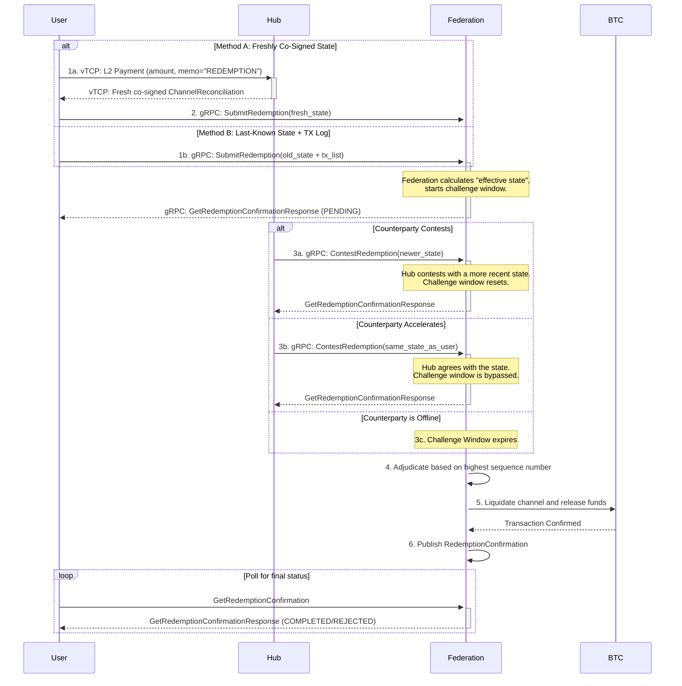

# BTC ⟷ vTCP Custody Protocol - Redemption Flow

_v0.2, 2025-07-07_

## Summary of Changes in v0.2
This version hardens the protocol against several potential attacks based on feedback:
- **Anti-Griefing Logic**: Clarified the contestation mechanism to prevent malicious resetting of the challenge window. A contest is only valid if the submitted state's sequence number is strictly greater than the current highest one in the attempt.
- **DoS Prevention**: Introduced `MAX_SUBSEQUENT_TRANSACTIONS_PER_REQUEST` with a limit of 512 to prevent computational DoS attacks via transaction log spam.
- **Explicit Fee Handling**: Defined that L1 redemption transaction fees are deducted from the final payouts, protecting the Federation from resource drain attacks.
- **Strengthened Replay Protection**: Refined the logic for rejecting duplicate redemption requests to be more precise.

## 1. Overview

This document provides a detailed technical specification for the **Redemption Process (Flow 2 & 3)** of the [BTC ⟷ vTCP Custody Protocol](/architecture/federation/protocols/BTC%20<->%20vTCP%20Custody%20Protocol.md), covering both cooperative and non-cooperative redemption scenarios.

A critical design principle of this protocol is that any valid redemption request, once initiated, will result in the **full and final liquidation of the entire channel balance**. The Federation acts as an arbiter to determine the final, correct state of the channel based on cryptographic proof, but the outcome is always the closure of the channel. This "nuclear option" design ensures clean, unambiguous settlement and removes the complexity of partial withdrawals from the core protocol.

All channel lifecycle events and state transitions within the Federation are managed by the [Federation Channels Registry](/architecture/common/entities/federation_channels_registry.md). This document describes the protocol that triggers those state changes.

For a higher-level, human-oriented explanation of the protocol, please see the main [BTC <-> vTCP Custody Protocol document](/architecture/federation/protocols/BTC%20<->%20vTCP%20Custody%20Protocol.md).

## 2. Protocol Constants

This section defines key constants used throughout the redemption protocol. Implementations should use these values to ensure compatibility.

| Constant                               | Default Value | Description                                                                                                                              |
| -------------------------------------- | :-----------: | ---------------------------------------------------------------------------------------------------------------------------------------- |
| `PROTOCOL_VERSION`                     |       1       | The version number of this protocol, included in all messages to ensure compatibility between parties.                                     |
| `COOPERATIVE_REDEMPTION_MEMO`          | "REDEMPTION"  | The required string in the `memo` field of an L2 payment to the Hub to signal a cooperative redemption request.                              |
| `NON_COOPERATIVE_CHALLENGE_PERIOD_SECONDS` |    259200     | The duration (in seconds) of the challenge window for a non-cooperative redemption (defaulting to 72 hours). This window resets upon a valid contest. |
| `MAX_SUBSEQUENT_TRANSACTIONS_PER_REQUEST` | 512 | The maximum number of transactions allowed in the `subsequent_transactions` list to prevent DoS attacks. |

## 3. Computed Identifier: `reconciliation_hash`

For a cooperative redemption, the `reconciliation_hash` is a globally unique identifier for the operation. It is not generated by the [Federation](/architecture/common/entities/federation_btc.md), but is instead deterministically computed from the `post_redemption_state`. This allows any party involved in the flow (e.g., the User or the Hub) to calculate the identifier as soon as the state is co-signed, making it possible to initiate and track the redemption independently.

The canonical hashing algorithm is defined in the [Settlement Channel Reconciliation entity document](/architecture/common/entities/vtcp_channel_reconciliation.md#canonical-hash-reconciliation_hash) and ensures both parties compute an identical hash.

This approach treats the entire co-signed state as the atomic artifact for the request, providing the strongest guarantee of uniqueness and data integrity. It ensures that the user can always recreate the `reconciliation_hash` to poll for the status of their redemption.

For **non-cooperative redemptions**, the `reconciliation_hash` is omitted.

## 4. Message Structure Definitions

**Note on Protocol Versioning**: All messages include a `protocol_version` field. This allows for future protocol upgrades and ensures all parties can verify compatibility.


```protobuf
// A request from a User to the Federation for a redemption, used for all flows.
message RedemptionRequest {
    // The version of the protocol, e.g., 1, by default.
    uint16 protocol_version = 1;

    // The last known channel state that was co-signed by both parties.
    // This serves as the baseline for the redemption claim.
    ChannelReconciliation last_co_signed_state = 2; // See architecture/common/entities/vtcp_channel_reconciliation.md
    
    // Optional: A list of valid, signed vTCP transactions that occurred *after*
    // the last_co_signed_state was created. This allows a party to prove the
    // most current channel balance if the counterparty is unresponsive and will not
    // co-sign a new, consolidated state.
    // In a fully cooperative flow, this field should be empty.
    // The number of transactions MUST NOT exceed MAX_SUBSEQUENT_TRANSACTIONS_PER_REQUEST.
    repeated SignedVTCPTransaction subsequent_transactions = 3; // Note: SignedVTCPTransaction is a conceptual placeholder for a standard, signed vTCP transfer object.

    // The destination L1 Bitcoin address where the funds should be sent.
    string l1_destination_address = 4;
}
```

```protobuf
// A request from a User to poll for the status of their redemption from the Federation.
message GetRedemptionConfirmationRequest {
    // The version of the protocol, e.g., 1, by default.
    uint16 protocol_version = 1;

    // The unique computed identifier for the redemption.
    string reconciliation_hash = 2;
}

// The response to a GetRedemptionConfirmationRequest, which can indicate either
// a successful redemption or a challenge with a newer state.
message GetRedemptionConfirmationResponse {
    // The version of the protocol, e.g., 1, by default.
    uint16 protocol_version = 1;

    // The status of the redemption request.
    enum Status {
        // The redemption is still being processed.
        PENDING = 0;
        // The redemption has been completed successfully.
        COMPLETED = 1;
        // A newer state has been submitted by the counterparty.
        CHALLENGED = 2;
        // The redemption request was rejected.
        REJECTED = 3;
    }
    Status status = 2;

    oneof result {
        // Present when status is COMPLETED.
        RedemptionConfirmation confirmation = 3;
        
        // Present when status is CHALLENGED.
        ChallengeInfo challenge = 4;
        
        // Present when status is REJECTED.
        string error_message = 5;
    }
}

// Information about a challenge to the redemption request.
message ChallengeInfo {
    // The newer reconciliation submitted by the counterparty.
    ChannelReconciliation new_reconciliation = 1;
    
    // The computed hash of the new_reconciliation state.
    // The polling party should use this hash for subsequent requests to avoid the resolve step.
    string latest_state_hash = 2;

    // The remaining time in the challenge window (in seconds).
    uint64 challenge_window_remaining_seconds = 3;
}
```

```protobuf
// A request from a Hub to contest a non-cooperative redemption attempt.
message ContestRedemptionRequest {
    // The version of the protocol, e.g., 1, by default.
    uint16 protocol_version = 1;

    // The unique identifier of the non-cooperative request being contested.
    string reconciliation_hash = 2;
    // A co-signed channel state with a sequence number strictly greater than
    // the one submitted by the user.
    ChannelReconciliation newer_state = 3;
}
```

```protobuf
// The final confirmation published by the Federation after a redemption is complete.
message RedemptionConfirmation {
    // The version of the protocol, e.g., 1, by default.
    uint16 protocol_version = 1;

    // The unique identifier for the redemption request.
    string reconciliation_hash = 2;
    // The L1 transaction ID of the redemption payout.
    string l1_transaction_id = 3;
    // The Federation's signature over the fields above (2-3).
    bytes federation_signature = 4;
}
```

## 5. gRPC Service Definitions

```protobuf
// Service run by the Federation to manage the redemption lifecycle.
service FederationService {
    // Called by a party (User or Hub) to initiate a redemption.
    // The Federation treats all submissions identically, initiating a challenge period.
    rpc SubmitRedemption(RedemptionRequest) returns (GetRedemptionConfirmationResponse);

    // Called by a party to poll for the final status of a redemption.
    rpc GetRedemptionConfirmation(GetRedemptionConfirmationRequest) returns (GetRedemptionConfirmationResponse);

    // Called by a party to contest a redemption by providing a newer state.
    // This can also be used to "accelerate" a friendly redemption by submitting the same state.
    rpc ContestRedemption(ContestRedemptionRequest) returns (GetRedemptionConfirmationResponse);
}
```

## 6. Unified Redemption Flow

From the Federation's perspective, there is only one redemption flow. It is designed to be maximally secure by assuming any request could be malicious (i.e., an attempt to use an outdated state). Therefore, every redemption request triggers the same internal validation process and challenge window.

The difference lies in how the `RedemptionRequest` payload is constructed by the initiating party, which depends on the counterparty's real-time cooperation.

### 6.1. Visual Flow

This diagram illustrates the single, unified flow, including the two methods of payload construction and the "acceleration" path for rapid, cooperative settlement.



### 6.3. Sequence of Actions

**1. Constructing and Submitting the Redemption Request**
A party wishing to redeem funds constructs and submits a `RedemptionRequest` payload using one of two methods:

-   **Method A: Initiation via Freshly Co-Signed State (Preferred, Low-Traffic)**:
    -   This method is used when the parties are cooperating in real-time. The User and Hub coordinate to create an up-to-date, co-signed `ChannelReconciliation`.
    -   This is typically achieved via a vTCP L2 payment from the User to the Hub with a `memo` of "REDEMPTION", which signals the Hub to participate.
    -   The resulting `RedemptionRequest` contains this new `last_co_signed_state`, and the `subsequent_transactions` field is empty.

-   **Method B: Initiation via Last-Known State and Transaction Log (Fallback, High-Traffic)**:
    -   This method is used when a party cannot get the counterparty to co-sign a new state.
    -   The party submits the last valid `last_co_signed_state` they possess.
    -   They also populate the `subsequent_transactions` field with a list of all valid, signed vTCP transactions that occurred after the base state was signed. This allows them to prove the channel's current state without the counterparty's immediate cooperation.

**2. Federation Processing and Challenge Window**
-   **Action**: Upon receiving a `SubmitRedemption` call, the Federation is agnostic to how the request was formed. It performs the same validation logic for all requests.
-   **Effective State Calculation**: The Federation first checks if the number of transactions in `subsequent_transactions` exceeds `MAX_SUBSEQUENT_TRANSACTIONS_PER_REQUEST`. If it does, the request is rejected immediately. Otherwise, it calculates the **"effective state"** by taking the `last_co_signed_state` and applying every transaction from the `subsequent_transactions` list in order. The resulting state is the basis for the redemption claim.
-   **Validation**: The Federation validates signatures on the base state and all subsequent transactions.
-   **Challenge Window**: If the effective state is valid, the Federation creates a `RedemptionAttempt` record (see Section 8) and opens the **Challenge Window**. It returns a `PENDING` status to the submitter.

**3. Counterparty Response**
The counterparty is expected to be monitoring the Federation. During the challenge window, it has three options:

-   **Contest with a Newer State**: If the counterparty has a state with a strictly higher sequence number than the current "winning" state of the attempt, it calls `ContestRedemption` with the newer state. If valid, the Federation updates its record and resets the challenge window.
-   **Agree and Accelerate**: This is the expected action following a Method A initiation. The Hub sees the user's submission and immediately calls `ContestRedemption` with the **exact same effective state**. The Federation interprets this as explicit, real-time consent, bypasses the remainder of the challenge window, and proceeds directly to adjudication.
-   **Do Nothing**: If the counterparty is offline or does not contest, the challenge window expires.

**4. Federation Adjudicates & Liquidates**
-   **Action**: Once the challenge window is closed (either by expiring or by being accelerated), the Federation makes a final decision based on the valid submitted state with the highest sequence number.
-   **Settlement**: The Federation liquidates the entire channel balance based on the final adjudicated state.
-   **Fee Handling**: The estimated L1 transaction fee for the payout is deducted from the final balances of the User and the Hub, proportional to their share of the redeemed funds. The Federation sends the remaining amounts to the user's L1 address and the Hub's internal account.

**5. Parties Poll for Final Outcome**
-   **Action**: Both parties can poll the `GetRedemptionConfirmation` endpoint using any `reconciliation_hash` involved in the attempt to learn the final outcome (`COMPLETED` or `REJECTED`).

## 7. Failure Handling

### 7.1. Case 1: Invalid Redemption Request
- **Scenario**: A party submits a `RedemptionRequest` with invalid signatures or transactions.
- **Outcome**: The Federation's validation of the "effective state" will fail. It rejects the request immediately with a `REJECTED` status.

### 7.2. Case 2: Transaction Log Too Large
- **Scenario**: A party submits a `RedemptionRequest` where the `subsequent_transactions` list exceeds `MAX_SUBSEQUENT_TRANSACTIONS_PER_REQUEST`.
- **Outcome**: The Federation rejects the request immediately with a `REJECTED` status and an error indicating the transaction limit was exceeded. This prevents DoS attacks.

### 7.3. Case 3: Party Submits Outdated State
- **Scenario**: A party submits a `RedemptionRequest` with an old state, and the counterparty successfully contests it with a newer one.
- **Outcome**: The Federation will adjudicate in favor of the counterparty. The channel will be liquidated based on the newer state. The party that submitted the outdated state may be penalized according to Federation policy.

### 7.4. Case 4: Duplicate Redemption Request
- **Scenario**: A party submits a `RedemptionRequest` for a channel where a state with the same or lower sequence number has already been submitted in a *previous* `SubmitRedemption` call.
- **Outcome**: The Federation MUST maintain a persistent record of the highest sequence number submitted for any given channel (`channel_id`). Any new `SubmitRedemption` request for that channel MUST have an effective state with a strictly higher sequence number. If not, it is rejected as a duplicate or outdated request. This prevents replay attacks and ensures forward progress.

### 7.5. Case 5: Federation L1 Transaction Fails
- **Scenario**: The Federation's L1 redemption transaction fails to broadcast or confirm.
- **Outcome**: The Federation's internal system is responsible for retrying. The `RedemptionConfirmation` will not be made available until the L1 transaction is secure. A polling party would continue to receive a `PENDING` status.

## 8. Federation Redemption State Management

To ensure all redemption flows are handled robustly, transparently, and can be audited, the Federation MUST implement a state management system based on the following principles and data structures.

### 8.1. Core Data Structures

The Federation's state is centered around two internal data structures: the `RedemptionAttempt`, which logs the entire lifecycle of a single redemption, and a global index to resolve any known state hash to its corresponding attempt.

```protobuf
// Internal Federation record to track a single redemption lifecycle.
// This structure is managed internally by the Federation and is not directly exposed.
message RedemptionAttempt {
    // The hash of the first "effective state" submitted.
    // This serves as the permanent, unique ID for this attempt.
    string primary_identifier = 1;

    // The hash of the valid submitted effective state with the highest sequence number.
    // This always points to the current "winning" state.
    string latest_state_hash = 2;

    // A complete, ordered log of all valid effective states submitted for this attempt.
    repeated StateHistoryEntry state_history = 3;

    // The current status of the attempt.
    enum Status {
        PENDING_CHALLENGE = 0; // The challenge window is active.
        COMPLETED = 1;         // Adjudication is complete, funds sent.
        REJECTED = 2;          // The attempt was invalid from the start.
    }
    Status status = 4;

    // The timestamp when the current challenge window expires.
    uint64 challenge_deadline = 5;

    // The user's L1 destination address, captured from the initial request.
    string user_l1_address = 6;

    // The final L1 transaction ID, populated once the status is COMPLETED.
    string l1_transaction_id = 7;
}

// An entry in the state history log for a RedemptionAttempt.
message StateHistoryEntry {
    // The effective reconciliation state that was submitted.
    ChannelReconciliation effective_state = 1;

    // The computed hash of this effective_state.
    string reconciliation_hash = 2;

    // The server timestamp of when this state was accepted.
    uint64 submission_timestamp = 3;
}
```

### 8.2. Hash-to-Attempt Index

To ensure any valid `reconciliation_hash` can be used to find the current state of an attempt, the Federation MUST maintain a central key-value index.

-   **Structure**: A key-value map, `reconciliation_hash_index`.
    -   `key`: A `reconciliation_hash` from any entry in the `state_history` of any attempt.
    -   `value`: The `primary_identifier` of the corresponding `RedemptionAttempt`.
-   **Function**: When a party polls with any known hash, this index immediately resolves it to the correct `RedemptionAttempt` record.

### 8.3. State Management Workflow

#### 1. Initiation (`SubmitRedemption`)

-   The Federation calculates the **"effective state"** from the request's `last_co_signed_state` and `subsequent_transactions`, after validating the transaction count against the limit.
-   It checks against a persistent store of processed channels to ensure the effective state's sequence number is strictly greater than any previously adjudicated state for this channel. If not, the request is rejected.
-   The hash of this effective state becomes the `primary_identifier` for a new `RedemptionAttempt` record.
-   The first `StateHistoryEntry` is created and added to `state_history`.
-   The `latest_state_hash` is set to the `primary_identifier`.
-   An entry is added to the `reconciliation_hash_index`: `(primary_identifier -> primary_identifier)`.
-   The `status` is set to `PENDING_CHALLENGE`, and the `challenge_deadline` is set.

#### 2. Contestation (`ContestRedemption`)

-   A party provides a `reconciliation_hash` to contest. The Federation uses the index to find the `RedemptionAttempt`.
-   The Federation validates the `newer_state`. Its sequence number MUST be strictly greater than the sequence number of the state associated with the current `latest_state_hash`.
-   If the new state is valid and superior:
    -   A new `StateHistoryEntry` is added to the `state_history` log.
    -   The `latest_state_hash` in the `RedemptionAttempt` record is updated to the hash of the `newer_state`.
    -   The `challenge_deadline` is reset.
    -   A new entry is added to the `reconciliation_hash_index`, mapping the new hash to the same `primary_identifier`.
-   If the new state's sequence number is not strictly greater, the contest is rejected. This prevents griefing attacks.

#### 3. Polling (`GetRedemptionConfirmation`)

-   A party polls with a `reconciliation_hash`.
-   The Federation uses the index to find the `RedemptionAttempt` record.
-   It inspects the record:
    -   If `status` is `COMPLETED` or `REJECTED`, it returns that final status.
    -   If `status` is `PENDING_CHALLENGE`, it compares the polling hash with the `latest_state_hash`.
        -   If different, it returns `CHALLENGED` with the latest state details.
        -   If the same, it returns `PENDING`.

#### 4. Adjudication and Completion

-   When the `challenge_deadline` is closed (expires or is accelerated), the Federation uses the state corresponding to the `latest_state_hash` for final liquidation.
-   Upon successful L1 confirmation, the Federation updates the `RedemptionAttempt` `status` to `COMPLETED` and populates the `l1_transaction_id`.
-   The `(channel_id, final_sequence_number)` tuple is persisted to prevent any future redemption attempts on this channel with an equal or lesser sequence number.