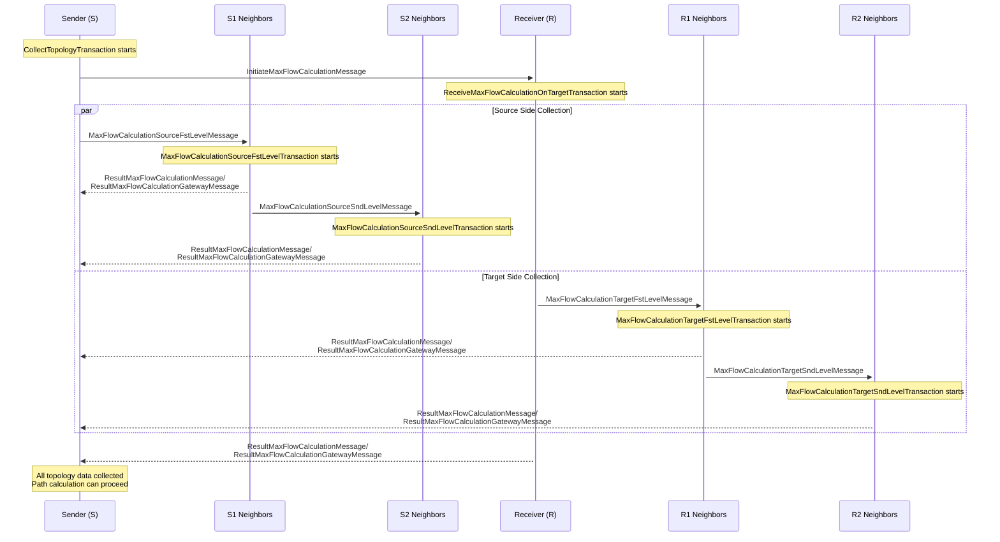

# vTCP Topology Collection Protocol

_v1.0, 2025-08-28_

## 1. Overview

The vTCP Topology Collection Protocol enables nodes in the vTCP network to gather network topology information for optimal payment path calculation. The protocol collects topology data from a 2-level neighborhood around both the payment sender (source) and receiver (target) nodes, allowing for efficient path finding with a maximum path length of 7 nodes (6 hops).

This protocol is implemented as part of the max flow calculation system and is triggered when a node needs to find payment paths to other nodes in the network.

## 2. Core Concepts

### 2.1. Network Structure

The vTCP network is a decentralized network consisting of nodes that maintain direct connections (channels) with other nodes. Each channel can contain multiple trust lines tied to specific assets (equivalents). Trust lines store the current state of relationships between two contractors in a given equivalent, including possible payment flows in both directions.

### 2.2. Topology Collection Scope

The protocol collects topology from:
- **S**: Sender (source) node - initiator of the payment path search
- **S1**: First-level neighbors of S with non-zero outgoing payment flows
- **S2**: Second-level neighbors of S1 with non-zero outgoing payment flows
- **R**: Receiver (target) node - destination of the payment
- **R1**: First-level neighbors of R with non-zero incoming payment flows to R
- **R2**: Second-level neighbors of R1 with non-zero incoming payment flows to R1

### 2.3. Maximum Path Length

The protocol supports paths of maximum length 7 participants (6 hops):
```
S -> S1 -> S2 -> X -> R2 -> R1 -> R
```

Where X is a bridge node that appears in both S2's outgoing topology and R2's incoming topology.

Example of parallel paths and max flow aggregation (from `vtcp_topology_collection.txt`):

```
Nodes and capacities (equivalent 1):
A→B = 500
A→C = 800
B→D = 700
C→D = 400
D→E = 1000

Possible parallel payment from A to E:
- 500 via A → B → D → E
- 400 via A → C → D → E

Maximum total flow from A to E = 900 (500 + 400)
```

### 2.4. Hub/Gateway Nodes

Certain nodes in the network are designated as hubs (also called gateways). These nodes have special properties:
- Hubs form indivisible chains in payment paths
- After a hub H, the path can only continue to another hub or to the receiver R
- Hubs send `ResultMaxFlowCalculationGatewayMessage` instead of `ResultMaxFlowCalculationMessage`

## 3. Protocol Messages

### 3.1. InitiateMaxFlowCalculationMessage

Sent from S to R to initiate the topology collection process.

**Fields:**
- `equivalent`: The asset equivalent for which topology is being collected
- `senderAddresses`: Vector of sender addresses
- `isSenderGateway`: Boolean indicating if sender is a hub/gateway
- `hopsCount`: Maximum number of hops for path calculation

### 3.2. MaxFlowCalculationTargetFstLevelMessage

Sent from R to R1 neighbors to request their topology contribution.

### 3.3. MaxFlowCalculationTargetSndLevelMessage

Sent from R1 to R2 neighbors to request their topology contribution.

### 3.4. MaxFlowCalculationSourceFstLevelMessage

Sent from S to S1 neighbors to request their topology contribution.

### 3.5. MaxFlowCalculationSourceSndLevelMessage

Sent from S1 to S2 neighbors to request their topology contribution.

### 3.6. ResultMaxFlowCalculationMessage

Standard topology response message containing:
- `outgoingFlows`: Vector of pairs (node_address, flow_amount) for outgoing payment flows
- `incomingFlows`: Vector of pairs (node_address, flow_amount) for incoming payment flows

### 3.7. ResultMaxFlowCalculationGatewayMessage

Hub-specific topology response message. Identical to `ResultMaxFlowCalculationMessage` but with different message type to identify the sender as a hub.

## 4. Protocol Flow

### 4.1. Visual Flow Diagram



### 4.2. Message and Transaction Mapping

| **Receiving Node** | **Incoming Message** | **Transaction Started** | **Outgoing Messages** |
|-------------------|---------------------|------------------------|----------------------|
| **R** | `InitiateMaxFlowCalculationMessage` | `ReceiveMaxFlowCalculationOnTargetTransaction` | `MaxFlowCalculationTargetFstLevelMessage` → R1<br/>`ResultMaxFlowCalculationMessage` → S |
| **S1** | `MaxFlowCalculationSourceFstLevelMessage` | `MaxFlowCalculationSourceFstLevelTransaction` | `MaxFlowCalculationSourceSndLevelMessage` → S2<br/>`ResultMaxFlowCalculationMessage` → S |
| **S2** | `MaxFlowCalculationSourceSndLevelMessage` | `MaxFlowCalculationSourceSndLevelTransaction` | `ResultMaxFlowCalculationMessage` → S |
| **R1** | `MaxFlowCalculationTargetFstLevelMessage` | `MaxFlowCalculationTargetFstLevelTransaction` | `MaxFlowCalculationTargetSndLevelMessage` → R2<br/>`ResultMaxFlowCalculationMessage` → S |
| **R2** | `MaxFlowCalculationTargetSndLevelMessage` | `MaxFlowCalculationTargetSndLevelTransaction` | `ResultMaxFlowCalculationMessage` → S |

*Note: Hub nodes send `ResultMaxFlowCalculationGatewayMessage` instead of `ResultMaxFlowCalculationMessage`*

### 4.3. Initiation Phase

1. **S** initiates topology collection by sending `InitiateMaxFlowCalculationMessage` to **R**
2. **S** sends `MaxFlowCalculationSourceFstLevelMessage` to all **S1** neighbors with non-zero outgoing flows
3. **R** receives the initiation message and sends `MaxFlowCalculationTargetFstLevelMessage` to all **R1** neighbors with non-zero incoming flows to R

### 4.2. First Level Collection

1. **S1** nodes receive `MaxFlowCalculationSourceFstLevelMessage` and:
   - Send their topology data to **S** via `ResultMaxFlowCalculationMessage` or `ResultMaxFlowCalculationGatewayMessage`
   - Send `MaxFlowCalculationSourceSndLevelMessage` to their **S2** neighbors (excluding the node from which they received the original message)

2. **R1** nodes receive `MaxFlowCalculationTargetFstLevelMessage` and:
   - Send their topology data to **S** via `ResultMaxFlowCalculationMessage` or `ResultMaxFlowCalculationGatewayMessage`
   - Send `MaxFlowCalculationTargetSndLevelMessage` to their **R2** neighbors (excluding the node from which they received the original message)

### 4.3. Second Level Collection

1. **S2** nodes receive `MaxFlowCalculationSourceSndLevelMessage` and send their topology data to **S**
2. **R2** nodes receive `MaxFlowCalculationTargetSndLevelMessage` and send their topology data to **S**

### 4.4. Topology Data Content

Terminology alignment: "outgoing flow" is a positive capacity from the current node to a neighbor; "incoming flow" is a positive capacity from a neighbor into the current node.

**R (Receiver) sends to S:**
- All non-zero incoming flows into R from its neighbors

**S1 nodes send to S:**
- Incoming payment flow into S1 from the node that sent `MaxFlowCalculationSourceFstLevelMessage`
- All non-zero outgoing payment flows from S1 to its other neighbors

**S2 nodes send to S:**
- Incoming payment flow into S2 from the node that sent `MaxFlowCalculationSourceSndLevelMessage`
- All non-zero outgoing payment flows from S2 to its other neighbors

**R1 nodes send to S:**
- Outgoing payment flow from R1 to the node that sent `MaxFlowCalculationTargetFstLevelMessage`
- All non-zero incoming payment flows into R1 from its other neighbors

**R2 nodes send to S:**
- Outgoing payment flow from R2 to the node that sent `MaxFlowCalculationTargetSndLevelMessage`
- All non-zero incoming payment flows into R2 from its other neighbors

## 5. Hops Count Parameter

The `hopsCount` parameter is set and owned by the initiator S and is propagated to other participants via request messages. It defines the overall depth of topology collection (i.e., the maximum number of hops to be considered) for this run.

Practical mapping in current implementation (depth vs. behavior):
- `hopsCount = 0`: S/R do not send neighbor requests; only direct responses are possible
- `hopsCount = 1`: S1/R1 respond to S but do not fan out further
- `hopsCount = 2..3`: S1/R1 are allowed to fan out to S2/R2 respectively

Note: Although the path model allows up to 6 hops (7 nodes), the collection depth is effectively controlled by the above thresholds. Values greater than 3 are treated as 3 by first-level handlers.

## 6. Hub Behavior

Hubs have special behavior in the protocol:
1. **Hub Detection**: Nodes know whether they are hubs and which of their neighbors are hubs
2. **Message Type**: Hubs send `ResultMaxFlowCalculationGatewayMessage` instead of `ResultMaxFlowCalculationMessage`
3. **Path Constraints**: In the final path calculation, hubs form indivisible chains
4. **Priority**: Hubs are given priority when sending first-level messages

## 7. Implementation Details

### 7.1. Transaction Classes

- `CollectTopologyTransaction`: Main transaction coordinating the topology collection
- `MaxFlowCalculationSourceFstLevelTransaction`: Handles first-level source neighbor requests
- `MaxFlowCalculationSourceSndLevelTransaction`: Handles second-level source neighbor requests
- `MaxFlowCalculationTargetFstLevelTransaction`: Handles first-level target neighbor requests
- `MaxFlowCalculationTargetSndLevelTransaction`: Handles second-level target neighbor requests
- `ReceiveMaxFlowCalculationOnTargetTransaction`: Handles topology collection at the target node

### 7.2. Caching

The protocol includes caching mechanisms to avoid redundant topology collection:
- `TopologyCacheManager`: Manages topology cache
- `MaxFlowCacheManager`: Manages max flow calculation cache

## 8. Security Considerations

1. **Resource Protection**: The protocol limits the scope of topology collection to prevent network flooding
2. **Hub Validation**: Hub status is self-declared but verifiable through message types
3. **Flow Validation**: Only non-zero payment flows are included in topology data
4. **Hop Limitation**: Maximum hop count prevents excessive network traversal

## 9. Error Handling

- **Unreachable Nodes**: If a node doesn't respond, it's excluded from topology
- **Invalid Flows**: Nodes with no outgoing flows don't participate in source-side collection
- **Hub Constraints**: Invalid hub sequences are filtered during path calculation

## 10. Performance Considerations

- **Parallel Collection**: Topology collection from different levels happens in parallel
- **Selective Participation**: Only nodes with relevant payment flows participate
- **Caching**: Repeated requests for the same topology can be served from cache
- **Hub Priority**: Hubs are contacted first to optimize path discovery