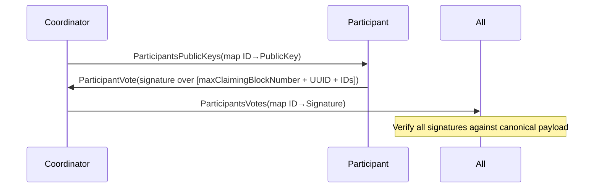

## VTCP Payment Protocol Specification

### Scope
- Regular payment only (no cycle-closing flows).
- Network-wide path discovery details are out of scope except where they impact payment.
- Maximum path length is 7 nodes (6 hops).

### Roles
- **Coordinator (C)**: initiates the payment, builds paths, coordinates reservations, finalizes amounts, orchestrates voting.
- **Intermediate node (I)**: participates on a path, performs and confirms reservations, validates receipts, shares key hash, votes.
- **Receiver (R)**: validates initialization, reservations and receipts, shares key hash, votes.

### Terminology
- **Trust Line (TL)**: bilateral credit line between neighbors.
- **Reservation**: a temporary lock of TL capacity, per-transaction, per-direction.
- **Path**: ordered list of nodes from C to R, length ≤ 7 nodes.
- **ParticipantID (PaymentNodeID)**: per-transaction unique ID; coordinator always has ID 0.
- **Maximal Claiming Block Number**: last federation block number (inclusive) for dispute consideration.
- **Payment Receipt**: signed statement for debt movement on a TL.

### Constants
- **Max path length**: 7 nodes.
- **TTL prolongation response states**: Continue, Finish.

### Message Catalog
- **ReceiverInitPaymentRequestMessage**
  - Fields: transactionUUID, amount, payload (optional metadata), sender addresses.
  - Direction: C → R.
- **ReceiverInitPaymentResponseMessage**
  - Fields: state ∈ {Accepted, Rejected}.
  - Direction: R → C.
- **IntermediateNodeReservationRequestMessage**
  - Purpose: request reservation(s) on a path segment.
  - Fields: vector of (PathID, Amount).
  - Direction: C → I (or to R on direct path).
- **IntermediateNodeReservationResponseMessage**
  - Fields: state and reserved amount details (accept/partial/reject).
  - Direction: I → C (or R → C on direct).
- **CoordinatorReservationRequestMessage**
  - Purpose: request further reservation approval at an intermediate; includes detailed prior reservations of that intermediate node accumulated so far.
  - Fields: detailed vector of (PathID, Amount) for that node (reflecting prior reservations), next node address.
  - Direction: C → I.
- **FinalPathConfigurationMessage**
  - Purpose: inform path intermediates about final amount on a specific path (or zero to drop).
  - Fields: PathID, finalAmount.
  - Direction: C → each I on that path (excluding R).
- **FinalAmountsConfigurationMessage**
  - Purpose: notify each participant of their final per-path reservations and the global context.
  - Fields: vector of (PathID, Amount) for that participant; participants list (PaymentNodeID → address); maximalClaimingBlockNumber; optionally, for neighbors with outgoing reservations from the sender, outgoing payment receipts and (keyNumber, signature) per equivalent.
  - Direction: C → all participants.
- **FinalAmountsConfigurationResponseMessage**
  - Fields: state ∈ {Accepted, Rejected}; if Accepted, includes participant PublicKey.
  - Direction: I/R → C.
- **TransactionPublicKeyHashMessage**
  - Purpose: distribute each participant’s payment signing key hash to others; for neighbors with outgoing reservations, include outgoing receipts and keyNumber/signature.
  - Fields: sender PaymentNodeID, transactionPublicKeyHash; optionally keyNumber and signature for attached receipts.
  - Direction: participant → all other participants (excluding C).
- **ParticipantsPublicKeysMessage**
  - Fields: map of (PaymentNodeID → PublicKey).
  - Direction: C → all participants.
- **ParticipantVoteMessage**
  - Fields: state ∈ {Accepted, Rejected}; if Accepted, signature over canonical voting payload.
  - Direction: participant → C.
- **ParticipantsVotesMessage**
  - Fields: map of (PaymentNodeID → Signature) for the canonical voting payload.
  - Direction: C → all participants.
- **TTLProlongationRequestMessage / TTLProlongationResponseMessage**
  - Response state: Continue or Finish.
  - Directions: participant → C (request), C → participant (response).

### Payment Receipt
- **Structure (target behavior)**:
  - Fields: transactionUUID, amount, auditNumber.
  - Signature: TL private key of the node that sends funds (outgoing at source).
- **Storage (target behavior)**:
  - OutgoingPaymentReceipt: stores key ID (OwnKeys), not hash.
  - IncomingPaymentReceipt: stores contractor key ID (ContractorKeys), not hash.

### Canonical Voting Payload
- **Data to sign (all participants)**:
  - maximalClaimingBlockNumber
  - transactionUUID
  - list of all PaymentNodeID (ordered by PaymentNodeID ascending)
- Lamport signature scheme is used.

### High-level Flow

```mermaid
sequenceDiagram
  participant C as Coordinator
  participant I as Intermediates
  participant R as Receiver

  C->>R: ReceiverInitPaymentRequest(amount, payload?)
  R-->>C: ReceiverInitPaymentResponse(Accepted|Rejected)

  alt Accepted
    loop Per path (≤ 7 nodes)
      C->>I: IntermediateNodeReservationRequest[(PathID, Amount)...]
      I-->>C: IntermediateNodeReservationResponse(accept/partial/reject)
      opt Further approval needed
        C->>I: CoordinatorReservationRequest(detailed prior reservations, next node)
        I-->>C: IntermediateNodeReservationResponse
      end
    end

    C->>I: FinalPathConfiguration(PathID, finalAmount or 0)
    C->>I,R: FinalAmountsConfiguration(per-participant paths, participants list, maxClaimingBlockNumber, receipts where applicable)

    par Each I (and R)
      I->>C: FinalAmountsConfigurationResponse(Accepted with PublicKey | Rejected)
    and For each participant except C
      I->>Participants: TransactionPublicKeyHash(hash; receipts if outgoing)
    end

    C->>All: ParticipantsPublicKeys(map ID→PublicKey)
    par Each participant
      participant P as Participant
      P->>C: ParticipantVote(signature over canonical payload)
    end
    C->>All: ParticipantsVotes(map ID→Signature)
    Note over All: Verify all signatures; payment committed
  else Rejected
    C->>All: TTLProlongationResponse(Finish) as needed
  end
```

### Reservation Phase (per path)

```mermaid
sequenceDiagram
  participant C as Coordinator
  participant I1 as Intermediate k
  participant I2 as Next(k+1)

  C->>I1: IntermediateNodeReservationRequest([(PathID, amountRequested)])
  I1-->>C: IntermediateNodeReservationResponse(accept/partial/reject)

  alt Further node reservation needed
    C->>I1: CoordinatorReservationRequest(
      detailed prior reservations for I1,
      next node = I2
    )
    I1-->>C: IntermediateNodeReservationResponse(accept/partial/reject)
  end

  C->>I1: FinalPathConfiguration(PathID, finalAmount or 0)
```

### Receipts and Key Hash Dissemination

```mermaid
sequenceDiagram
  participant C as Coordinator
  participant I as Intermediate
  participant N as Neighbor with outgoing reserve
  participant All as Other participants

  rect rgba(200,200,255,0.2)
  C->>N: FinalAmountsConfiguration(..., receipts + keyNumber/signature)
  end

  rect rgba(200,255,200,0.2)
  I->>All: TransactionPublicKeyHash(hash)
  opt If I has outgoing reservations to some neighbor
    I->>Neighbor: TransactionPublicKeyHash(hash, receipts + keyNumber/signature)
  end
```

### Voting Phase



### State Machines

- **Coordinator (C)**
  - Initialization → Path reservation loop (per path, with retries on rejections/partials) → FinalPathConfiguration (per-path) → FinalAmountsConfiguration (per-participant) → Collect FinalAmountsConfigurationResponse (PublicKeys) → Broadcast ParticipantsPublicKeys → Collect ParticipantVote → Broadcast ParticipantsVotes → Done.
  - TTL handling: on participant TTLProlongationRequest, respond Continue if transaction alive (or Finish if not).

- **Intermediate (I)**
  - Wait for IntermediateNodeReservationRequest → Try reserve incoming/outgoing on TLs → Respond → On FinalPathConfiguration: mark final path amount (or drop) → On FinalAmountsConfiguration: validate (participants list, own per-path amounts, receipts if applicable) → Send TransactionPublicKeyHash to others (with receipts if outgoing) → Send FinalAmountsConfigurationResponse (Accepted with PublicKey / Rejected) → Receive ParticipantsPublicKeys → Validate (count and hash match to previously received hashes) → Sign canonical payload → Send ParticipantVote → Receive ParticipantsVotes → Verify → Done.

- **Receiver (R)**
  - Validate ReceiverInitPaymentRequest → Respond → Participate in reservation confirmations as needed (direct or via I) → Validate FinalAmountsConfiguration (including receipts if incoming) with invariant: sum of incoming receipts equals requested amount → Publish TransactionPublicKeyHash to other participants → Participate in voting like I.

### Validation Rules
- **Participants list consistency**: includes all nodes with reservations; C has PaymentNodeID=0; IDs unique per transaction.
- **Receipts**:
  - Content: transactionUUID, amount, auditNumber.
  - Signature: TL private key at source (outgoing); verified by contractor at target.
  - Storage: store key ID with receipt (not key hash).
- **FinalAmountsConfiguration**
  - Contains correct per-participant (PathID, Amount) pairs.
  - Contains correct maximalClaimingBlockNumber.
  - For neighbors with outgoing reservations from the sender of the message: include outgoing receipts + (keyNumber, signature).
- **TransactionPublicKeyHashMessage**
  - Properly includes sender’s PaymentNodeID and hash of the public key; where required, attaches outgoing receipts with (keyNumber, signature).
- **ParticipantsPublicKeysMessage**
  - Count must match number of participants.
  - Each PublicKey must hash to previously distributed transactionPublicKeyHash for that participant.
- **Voting**
  - Every signature must verify against canonical payload [maximalClaimingBlockNumber, transactionUUID, ordered list of PaymentNodeID].
  - All participants’ signatures must be present in ParticipantsVotesMessage.

### TTL and Liveness
- Any participant may send TTLProlongationRequest to C if awaiting critical messages.
- C replies:
  - **Continue**: transaction alive; participant keeps waiting.
  - **Finish**: transaction should terminate and rollback local state.
- Timeouts:
  - Reasonable bounded waits per stage (implementation-specific); after timeout, rollback and/or try alternate paths as applicable.

### Error Handling
- **Reservation rejections/partials**:
  - C may attempt alternate paths and rebalance reservations.
- **Invalid receipts**:
  - Immediate rejection with FinalAmountsConfigurationResponse(Rejected).
- **Public key mismatches (hash vs full key)**:
  - Participant rejects voting and sends ParticipantVote(Rejected).
- **Missing votes**:
  - C may rebroadcast ParticipantsPublicKeys to non-responders; after bounded retries, fail.

### Data Persistence
- For each TL:
  - **OutgoingPaymentReceipt**: (auditNumber, transactionUUID, ownKeyId, amount, signature).
  - **IncomingPaymentReceipt**: (auditNumber, transactionUUID, contractorKeyId, amount, contractorSignature).
- For the payment transaction:
  - Serialized transaction and participants’ votes are stored to support dispute and claiming within maximalClaimingBlockNumber.

### Security Considerations
- One-time keys and Lamport signatures for payment-level signing.
- Receipts are atomic TL-level commitments, bound to auditNumber.
- Participants’ voting binds the entire participant set and claiming window.
- Payload in ReceiverInitPaymentRequestMessage is optional metadata and must not affect security invariants.

### Appendix: Invariants
- Sum of incoming receipts at R equals requested amount.
- No TL capacity used by other transactions once reserved, until commit or release.
- ParticipantsPublicKeys must match previously shared key hashes.
- All participants must vote (sign the same canonical payload) before commit.
