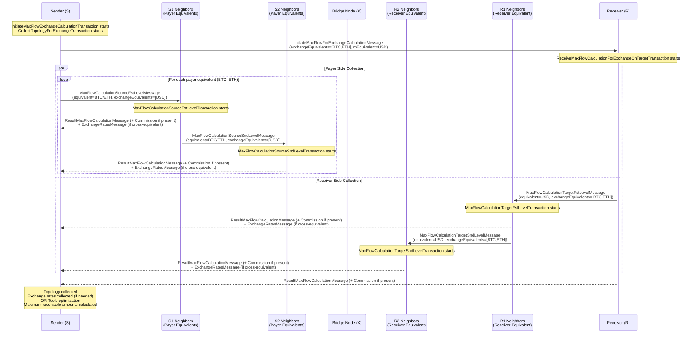

# vTCP Topology Collection Protocol

_v2.0, 2025-08-29_

## TL;DR

**What it does:** Collects network topology and exchange rate data to find optimal payment paths in the vTCP network.

**Key Features:**
- Supports both same-equivalent (USD→USD) and cross-equivalent (BTC→USD) payments
- Collects topology from 2-level neighborhood around sender and receiver
- Maximum path length: 7 nodes (6 hops)
- Uses OR-Tools for optimal path calculation with exchange rate integration
- Hub/gateway nodes get special treatment for path optimization

**Payment Flow:**
```
Sender → S1 → S2 → Exchange/Bridge → R2 → R1 → Receiver
│←──── Payer Side ────→│←─────── Receiver Side ───────→│
```

**Message Types:**
- Initiation: `InitiateMaxFlowForExchangeCalculationMessage`
- Topology requests: `MaxFlowCalculation{Source/Target}{Fst/Snd}LevelMessage`
- Responses: `ResultMaxFlowCalculationMessage` (+ optional Commission) + `ExchangeRatesMessage` (when needed)

## 1. Overview

The vTCP Topology Collection Protocol enables nodes in the vTCP network to gather topology information and exchange rates for optimal payment path calculation. This protocol supports both same-equivalent and cross-equivalent payments where the sender pays in one or more equivalents while the receiver accepts funds in a specific equivalent, utilizing exchange-capable nodes as bridges between different asset types when needed.

The protocol collects topology data from a 2-level neighborhood around both the payment sender (in payer equivalents) and receiver (in receiver equivalent), along with exchange rate information from exchange-capable nodes, enabling efficient path finding with maximum path length of 7 nodes (6 hops).

This protocol is implemented as part of the max flow calculation system and is triggered when a node needs to find payment paths to other nodes in the network.

## 2. Core Concepts

### 2.1. Network Structure

The vTCP network is a decentralized network consisting of nodes that maintain direct connections (channels) with other nodes. Each channel can contain multiple trust lines tied to specific assets (equivalents). Trust lines store the current state of relationships between two contractors in a given equivalent, including possible payment flows in both directions.

### 2.2. Payment Framework

The protocol supports flexible payment scenarios:
- **Payer Equivalents**: Assets/currencies in which the sender can make payments (`exchangeEquivalents`)
- **Receiver Equivalent**: Asset/currency in which the receiver wants to receive funds (`mEquivalent`)
- **Exchange Nodes**: Nodes capable of converting between different equivalents using exchange rates (used when payer and receiver equivalents differ)
- **Bridge Nodes (X)**: Exchange-capable nodes that connect the payer and receiver sides of the network
- **Same-Equivalent Payments**: When payer equivalent matches receiver equivalent, no currency conversion is needed

### 2.3. Topology Collection Scope

The protocol collects topology and exchange rates from:
- **S**: Sender (source) node - initiator of the payment path search
- **S1**: First-level neighbors of S with non-zero outgoing payment flows in payer equivalents
- **S2**: Second-level neighbors of S1 with non-zero outgoing payment flows in payer equivalents
- **X**: Bridge/exchange node - performs currency conversion when payer and receiver equivalents differ (optional if equivalents match)
- **R2**: Second-level neighbors of R1 with non-zero incoming payment flows to R1 in receiver equivalent
- **R1**: First-level neighbors of R with non-zero incoming payment flows to R in receiver equivalent
- **R**: Receiver (target) node - destination accepting funds in receiver equivalent

### 2.4. Maximum Path Length and Hop Distribution

The protocol supports paths of maximum length 7 participants (6 hops) with the following distribution:
```
S -> S1 -> S2 -> X -> R2 -> R1 -> R
│←─── Payer Side ────→│←─── Receiver Side ────→│
│    (up to 3 hops)   │   (up to 3 hops)      │
```

**Path Distribution:**
- **Payer Side**: Up to 3 hops from sender to bridge node
- **Bridge Node (X)**: 1 node performing currency conversion (when needed) or acting as bridge
- **Receiver Side**: Up to 3 hops from bridge node to receiver

**Example payment paths:**

Cross-equivalent payments (payer and receiver equivalents differ):
```
Payer equivalents: [BTC, ETH]  →  Exchange  →  Receiver equivalent: USD

Path 1: S(BTC) → S1(BTC) → X(BTC→USD) → R1(USD) → R(USD)
Path 2: S(ETH) → S1(ETH) → S2(ETH) → X(ETH→USD) → R2(USD) → R1(USD) → R(USD)
```

Same-equivalent payments (payer equivalent matches receiver equivalent):
```
Payer equivalent: [USD] = Receiver equivalent: USD

Path: S(USD) → S1(USD) → S2(USD) → X(USD) → R2(USD) → R1(USD) → R(USD)
```

In same-equivalent scenarios, node X acts as a regular network bridge without currency conversion.

### 2.5. Hub/Gateway Nodes

Certain nodes in the network are designated as hubs (also called gateways). These nodes have special properties:
- Hubs form indivisible chains in payment paths
- After a hub H, the path can only continue to another hub or to the receiver R
- Hubs send `ResultMaxFlowCalculationGatewayMessage` instead of `ResultMaxFlowCalculationMessage`

### 2.6. Unified Node Identification

To enable cross-equivalent operations, the protocol uses unified contractor identification:
- **ContractorsManager**: Maintains global `mParticipantsAddresses` mapping for all equivalents
- **Unified IDs**: Same node receives consistent ID across all equivalents
- **Exchange Rate Correlation**: Enables matching exchange rates with topology data

## 3. Protocol Messages

### 3.1. Exchange-Specific Messages

#### InitiateMaxFlowForExchangeCalculationMessage

Sent from S to R to initiate the cross-equivalent topology collection process.

**Fields:**
- `equivalent`: The receiver's target equivalent (`mEquivalent`)
- `senderAddresses`: Vector of sender addresses
- `isSenderGateway`: Boolean indicating if sender is a hub/gateway
- `hopsCount`: Maximum number of hops for path calculation
- `exchangeEquivalents`: Vector of payer's available payment equivalents

#### ExchangeRatesMessage

Message containing exchange rate information from exchange-capable nodes.

**Fields:**
- `equivalent`: The equivalent context for the exchange rates
- `senderAddresses`: Vector of sender addresses (inherited from SenderMessage)
- `exchangeRates`: Vector of ExchangeRate objects containing:
  - `equivalentFrom`: Source equivalent for exchange
  - `equivalentTo`: Target equivalent for exchange
  - `exchangeRate`: Exchange rate value
  - `exchangeRateShift`: Decimal shift for rate precision
  - `expiresAt`: TTL expiration timestamp
  - `minExchangeAmount`: Minimum amount for exchange
  - `maxExchangeAmount`: Maximum amount for exchange

### 3.2. Enhanced Existing Messages

All existing max flow calculation messages are enhanced with exchange support:

#### MaxFlowCalculationSourceFstLevelMessage (Enhanced)
#### MaxFlowCalculationSourceSndLevelMessage (Enhanced)
#### MaxFlowCalculationTargetFstLevelMessage (Enhanced)
#### MaxFlowCalculationTargetSndLevelMessage (Enhanced)

**Additional Field:**
- `exchangeEquivalents`: Vector of equivalents for cross-equivalent operations
  - Empty vector maintains backward compatibility for single-equivalent operations
  - Contains receiver equivalent when sent from payer side
  - Contains payer equivalents when sent from receiver side

### 3.3. Standard Topology Response Messages

#### ResultMaxFlowCalculationMessage

Standard topology response message containing:
- `outgoingFlows`: Vector of pairs (node_address, flow_amount) for outgoing payment flows
- `incomingFlows`: Vector of pairs (node_address, flow_amount) for incoming payment flows

#### ResultMaxFlowCalculationGatewayMessage

Hub-specific topology response message. Identical to `ResultMaxFlowCalculationMessage` but with different message type to identify the sender as a hub.

## 4. Protocol Flow

### 4.1. Visual Flow Diagram



**Special Cases:**

**Same-Equivalent Payment (payer equivalent = receiver equivalent):**
- Exchange rate messages are not sent (empty `exchangeEquivalents` behavior)
- All topology collection occurs in the same equivalent
- No currency conversion needed at bridge node X

### 4.2. Message and Transaction Mapping

| **Receiving Node** | **Incoming Message** | **Transaction Started** | **Outgoing Messages** |
|-------------------|---------------------|------------------------|----------------------|
| **R** | `InitiateMaxFlowForExchangeCalculationMessage` | `ReceiveMaxFlowCalculationForExchangeOnTargetTransaction` | `MaxFlowCalculationTargetFstLevelMessage` → R1<br/>`ResultMaxFlowCalculationMessage` (+ Commission if present) → S |
| **S1** | `MaxFlowCalculationSourceFstLevelMessage`<br/>(per payer equivalent) | `MaxFlowCalculationSourceFstLevelTransaction` | `MaxFlowCalculationSourceSndLevelMessage` → S2<br/>`ResultMaxFlowCalculationMessage` (+ Commission if present) → S<br/>`ExchangeRatesMessage` → S |
| **S2** | `MaxFlowCalculationSourceSndLevelMessage` | `MaxFlowCalculationSourceSndLevelTransaction` | `ResultMaxFlowCalculationMessage` (+ Commission if present) → S<br/>`ExchangeRatesMessage` → S |
| **R1** | `MaxFlowCalculationTargetFstLevelMessage` | `MaxFlowCalculationTargetFstLevelTransaction` | `MaxFlowCalculationTargetSndLevelMessage` → R2<br/>`ResultMaxFlowCalculationMessage` (+ Commission if present) → S<br/>`ExchangeRatesMessage` → S |
| **R2** | `MaxFlowCalculationTargetSndLevelMessage` | `MaxFlowCalculationTargetSndLevelTransaction` | `ResultMaxFlowCalculationMessage` (+ Commission if present) → S<br/>`ExchangeRatesMessage` → S |

### 4.3. Initiation Phase

1. **S** initiates topology collection by sending `InitiateMaxFlowForExchangeCalculationMessage` to **R**
2. **S** sends `MaxFlowCalculationSourceFstLevelMessage` to all **S1** neighbors with non-zero outgoing flows **for each payer equivalent**
3. **R** receives the initiation message and sends `MaxFlowCalculationTargetFstLevelMessage` to all **R1** neighbors with non-zero incoming flows to R **in the receiver equivalent**

### 4.4. Payer Side Collection

1. **For each payer equivalent** in `exchangeEquivalents`, **S** sends separate `MaxFlowCalculationSourceFstLevelMessage` with:
   - `equivalent = exchangeEquivalents[i]` (current payer equivalent)
   - `exchangeEquivalents = [mEquivalent]` (receiver equivalent as single element)

2. **S1** nodes in each payer equivalent receive messages and:
   - Send topology data for their equivalent to **S**
   - If payer and receiver equivalents differ: Search local exchange rates for pairs `mEquivalent/exchangeEquivalents[i]` and send via `ExchangeRatesMessage`
   - Fan out to **S2** neighbors with preserved exchange equivalent information

3. **S2** nodes in each payer equivalent:
   - Send topology data for their equivalent to **S**
   - If payer and receiver equivalents differ: Search and send exchange rates for `mEquivalent/exchangeEquivalents[i]` pairs

### 4.5. Receiver Side Collection

1. **R** sends `MaxFlowCalculationTargetFstLevelMessage` to **R1** neighbors with:
   - `equivalent = mEquivalent` (receiver equivalent)
   - `exchangeEquivalents = [all payer equivalents]` (full list from sender)

2. **R1** nodes receive messages and:
   - Send topology data for receiver equivalent to **S**
   - If payer and receiver equivalents differ: Search local exchange rates for pairs `exchangeEquivalents[i]/mEquivalent` and send via `ExchangeRatesMessage`
   - Fan out to **R2** neighbors with preserved exchange equivalent information

3. **R2** nodes:
   - Send topology data for receiver equivalent to **S**
   - If payer and receiver equivalents differ: Search and send exchange rates for `exchangeEquivalents[i]/mEquivalent` pairs

### 4.6. Topology Data Content

**R (Receiver) sends to S:**
- All non-zero incoming flows into R from its neighbors in `mEquivalent`

- Optional `Commission` for `mEquivalent` if configured

**S1 nodes (per payer equivalent) send to S:**
- Incoming payment flow into S1 from S in the current payer equivalent
- All non-zero outgoing payment flows from S1 to other neighbors in the same payer equivalent
- If payer and receiver equivalents differ: Exchange rates for `mEquivalent/current_payer_equivalent`

- Optional `Commission` for the current payer equivalent if configured

**S2 nodes (per payer equivalent) send to S:**
- Incoming payment flow into S2 from S1 in the current payer equivalent
- All non-zero outgoing payment flows from S2 to other neighbors in the same payer equivalent
- If payer and receiver equivalents differ: Exchange rates for `mEquivalent/current_payer_equivalent`

- Optional `Commission` for the current payer equivalent if configured

**R1 nodes send to S:**
- Outgoing payment flow from R1 to R in `mEquivalent`
- All non-zero incoming payment flows into R1 from other neighbors in `mEquivalent`
- If payer and receiver equivalents differ: Exchange rates for `payer_equivalent[i]/mEquivalent`

- Optional `Commission` for `mEquivalent` if configured

**R2 nodes send to S:**
- Outgoing payment flow from R2 to R1 in `mEquivalent`
- All non-zero incoming payment flows into R2 from other neighbors in `mEquivalent`
- If payer and receiver equivalents differ: Exchange rates for `payer_equivalent[i]/mEquivalent`

- Optional `Commission` for `mEquivalent` if configured

## 5. Exchange Rate Management

### 5.1. Exchange Rate Collection

Exchange-capable nodes provide exchange rate information through `ExchangeRatesMessage` when cross-equivalent payments are involved:
- **Source-side nodes (S1, S2)**: Provide rates for `mEquivalent/exchangeEquivalents[i]` when equivalents differ
- **Target-side nodes (R1, R2)**: Provide rates for `exchangeEquivalents[i]/mEquivalent` when equivalents differ  
- **Same-equivalent payments**: No exchange rate messages sent when payer and receiver equivalents match
- **TTL Management**: Exchange rates include expiration timestamps
- **Capacity Limits**: Min/max exchange amounts define feasible exchange ranges

### 5.2. External Exchange Rate Storage

**ExchangeRatesManager Enhancement:**
- `mExternalExchangeRates`: Map storing network-sourced exchange rates
  - Key: `pair<SerializedEquivalent, SerializedEquivalent>` (from, to)
  - Value: `vector<pair<ContractorID, ExchangeRate>>` (node ID and rate)
- **TTL Cleanup**: Automated expiration and cleanup of stale rates
- **Unified ID Integration**: Uses ContractorsManager for consistent node identification

### 5.3. Exchange Rate Message Processing

**TailManager Enhancement:**
- `mExchangeRatesTail`: Dedicated queue for `ExchangeRatesMessage` processing
- **Message Routing**: `IncomingRemoteNode::tryCollectNextPacket()` routes exchange messages
- **Processing**: `BaseCollectTopologyForExchangeTransaction::fillRates()` processes exchange data

## 5a. Commission Management

### 5a.1. Definition and Configuration
- Each node may define fixed per-transit commissions per equivalent in `conf.json`.
- Commission is a fixed fee (`uint64 amount`) independent of payment size.

### 5a.2. Message Inclusion
- `ResultMaxFlowCalculationMessage` and `ResultMaxFlowCalculationGatewayMessage` include optional `Commission` for the message `equivalent` when present on the sending node.
- Only the Source/Target Fst/Snd Level transactions attach commissions.

### 5a.3. Payer-Side Storage and TTL
- The payer (S) stores received commissions in `TopologyTrustLinesManager` as map `<ContractorID, SerializedEquivalent> -> <Commission, expiredAt>`.
- Store only when `amount > 0`. On insert/update set `expiredAt = now() + 300s`.
- TTL cleanup mirrors `ExchangeRatesManager`’s approach for removing expired entries.

### 5a.4. Application in Path Calculation
- When constructing feasible paths and computing effective amounts, subtract the sum of fixed commissions along the path (clamped at zero when cumulative commissions exceed the path flow).
- OR-Tools optimization must factor in these fixed deductions in the objective and feasibility constraints.

## 6. Hops Count Parameter

The `hopsCount` parameter controls the maximum path length distributed across payer and receiver sides:
- **Total Hops**: Maximum 6 hops (7 nodes including exchange node)
- **Payer Side**: Up to 3 hops (S → S1 → S2 → X)
- **Exchange**: 1 node (X) for currency conversion
- **Receiver Side**: Up to 3 hops (X → R2 → R1 → R)

**Parameter Effects:**
- `hopsCount = 1`: Direct exchange only (S → X → R)
- `hopsCount = 3`: Limited topology collection (up to 1 level on each side)
- `hopsCount = 6`: Full topology collection (up to 3 levels on each side)

## 7. Hub Behavior

Hubs have special behavior in the exchange protocol:
1. **Hub Detection**: Nodes know whether they are hubs and which neighbors are hubs
2. **Message Type**: Hubs send `ResultMaxFlowCalculationGatewayMessage`
3. **Path Constraints**: Hubs form indivisible chains in path calculation
4. **Exchange Capability**: Hubs can act as exchange nodes between equivalents
5. **Priority Processing**: Hubs are contacted first for optimal path discovery

## 8. OR-Tools Integration for Maximum Flow Calculation

### 8.1. Linear Programming Optimization

After topology and exchange rate collection, the sender uses OR-Tools for optimization:

**Objective Function:**
```
Maximize: Σ(flow_path_i × effective_exchange_rate_i)
```

**Key Components:**
- **Path Enumeration**: Pre-compute all feasible cross-equivalent paths
- **Exchange Rate Integration**: Apply exchange rates to calculate effective path values
- **Capacity Constraints**: Respect trust line limits and exchange capacity bounds
- **Multi-Equivalent Balancing**: Balance outflows across payer equivalents

### 8.2. Path-Based Linear Programming Model

**Implementation Strategy:**
1. **Path Discovery**: Enumerate all feasible paths from payer equivalents to receiver equivalent
2. **LP Variable Creation**: One variable per path with capacity constraints
3. **Objective Optimization**: Maximize total received amount in receiver equivalent
4. **Solution Extraction**: Direct path-to-flow mapping without decomposition

**Path Format:**
```
Path Example: S(BTC) → S1(BTC) → X(BTC→USD, rate=45000) → R1(USD) → R(USD)
LP Variable: flow_path_btc_to_usd_via_x = 0.5 BTC
Objective Contribution: 0.5 * 45000 = 22500 USD
```

### 8.3. Result Storage and Analysis

**Maximum Flow Results:**
- `mMaxFlows`: Map of ContractorID → maximum receivable amount in `mEquivalent`
- **Optimal Path Information**: Detailed path data for analytics and monitoring
- **Path Efficiency Metrics**: Exchange rate effectiveness per path

## 9. Protocol Behavior Summary

The protocol efficiently handles both payment scenarios within a unified framework:

**Cross-Equivalent Payments (when payer and receiver equivalents differ):**
- Payer side: Collects topology in multiple payer equivalents
- Receiver side: Collects topology in single receiver equivalent  
- Exchange rates collected via `ExchangeRatesMessage`
- OR-Tools linear programming optimization with exchange rates
- Result: Maximum receivable amount after currency conversions

**Same-Equivalent Payments (when payer equivalent matches receiver equivalent):**
- Both sides collect topology in the same equivalent
- No exchange rate collection (empty `exchangeEquivalents` vectors)
- OR-Tools optimization simplifies to standard max flow calculation
- Result: Maximum flow amount in the shared equivalent

**Unified Features:**
- Same path structure: S → S1 → S2 → X → R2 → R1 → R (X acts as bridge or exchange node)
- All messages support `exchangeEquivalents` field for flexibility
- Unified cross-equivalent node identification
- Hub/gateway support for both scenarios
- Consistent security and performance characteristics

### 9.1. Parallel Flow Example

Example of parallel paths and max flow aggregation:

```
Nodes and capacities (BTC equivalent):
Sender→Node1 = 0.5 BTC
Sender→Node2 = 0.8 BTC  
Node1→Exchange = 0.7 BTC
Node2→Exchange = 0.4 BTC
Exchange(BTC→USD, rate=45000)→Receiver = 1000 USD capacity

Possible parallel payment from Sender to Receiver:
- 0.5 BTC via Sender → Node1 → Exchange → Receiver = 22,500 USD
- 0.4 BTC via Sender → Node2 → Exchange → Receiver = 18,000 USD

Maximum total received = 40,500 USD (0.9 BTC × 45,000 rate)
```

## 10. Security Considerations

1. **Exchange Rate Validation**: Rates are accepted without cryptographic validation (explicitly out of scope)
2. **Resource Protection**: Limited scope prevents network flooding
3. **Hub Validation**: Hub status self-declared through message types
4. **Flow Validation**: Only non-zero flows participate in calculations
5. **TTL Enforcement**: Automatic cleanup of expired exchange rates
6. **Capacity Limits**: Exchange min/max amounts prevent oversized operations

## 11. Error Handling

- **Unreachable Nodes**: Missing nodes excluded from path calculations
- **Invalid Exchange Rates**: Expired or malformed rates ignored
- **OR-Tools Failures**: Graceful fallback with error reporting
- **Hub Constraint Violations**: Invalid hub sequences filtered
- **Insufficient Liquidity**: Zero flow results for infeasible requests

## 12. Performance Considerations

- **Parallel Collection**: Multi-equivalent topology gathering runs concurrently
- **Selective Participation**: Only nodes with relevant flows and rates participate
- **Exchange Rate Caching**: TTL-based storage reduces repeated rate requests
- **Path Optimization**: OR-Tools provides mathematically optimal solutions
- **Memory Management**: Automatic cleanup of expired data structures

## 13. Protocol Constants

- **Maximum Exchange Equivalents**: 5 equivalents per request (configurable limit)
- **Exchange Rate TTL**: Configurable expiration for network-sourced rates
- **Path Length Limit**: 7 nodes maximum (6 hops)
- **Hop Distribution**: 3 hops payer side + 1 exchange + 3 hops receiver side

## 14. Future Enhancements

The protocol provides foundation for advanced features:
- **Dynamic Exchange Rate Discovery**: Real-time rate updates during topology collection
- **Multi-Hop Exchange Chains**: Complex exchange sequences across multiple nodes
- **Exchange Rate Validation**: Cryptographic verification of rate authenticity
- **Path Analytics**: Historical path performance and efficiency analysis
- **Liquidity Optimization**: Dynamic path selection based on current network conditions

---

**Note:** This protocol supersedes the legacy single-equivalent topology collection protocol. The legacy protocol has been archived to `archive/topology-collection-protocol.md` for reference. All new implementations should use this unified protocol which supports both same-equivalent and cross-equivalent payment scenarios.

## 15. Implementation Details

### 15.1. Transaction Classes

**Exchange-Specific Transactions:**
- `InitiateMaxFlowExchangeCalculationTransaction`: Main coordinator for cross-equivalent flow calculation
- `CollectTopologyForExchangeTransaction`: Collects multi-equivalent topology and exchange rates
- `BaseCollectTopologyForExchangeTransaction`: Base class for exchange-aware topology collection
- `ReceiveMaxFlowCalculationForExchangeOnTargetTransaction`: Target-side message handler

**Legacy Single-Equivalent Transactions (still supported):**
- `CollectTopologyTransaction`: Main transaction coordinating the topology collection
- `MaxFlowCalculationSourceFstLevelTransaction`: Handles first-level source neighbor requests (enhanced with exchange rate sending)
- `MaxFlowCalculationSourceSndLevelTransaction`: Handles second-level source neighbor requests (enhanced with exchange rate sending)
- `MaxFlowCalculationTargetFstLevelTransaction`: Handles first-level target neighbor requests (enhanced with exchange rate sending)
- `MaxFlowCalculationTargetSndLevelTransaction`: Handles second-level target neighbor requests (enhanced with exchange rate sending)
- `ReceiveMaxFlowCalculationOnTargetTransaction`: Handles topology collection at the target node

### 15.2. Data Architecture

**ContractorsManager (Enhanced):**
- Unified `mParticipantsAddresses` for cross-equivalent node identification
- Global `mHigherFreeID` for consistent ID assignment
- Cross-equivalent topology correlation support

**EquivalentsSubsystemsRouter:**
- Per-equivalent manager access (TrustLinesManager, TopologyTrustLinesManager, etc.)
- Unified interface for multi-equivalent operations
- Centralized equivalent subsystem coordination

**TailManager Enhancement:**
- `mExchangeRatesTail`: Dedicated queue for `ExchangeRatesMessage` processing
- **Message Routing**: `IncomingRemoteNode::tryCollectNextPacket()` routes exchange messages
- **Processing**: `BaseCollectTopologyForExchangeTransaction::fillRates()` processes exchange data

### 15.3. Caching Mechanisms

The protocol includes caching mechanisms to avoid redundant topology collection:
- `TopologyCacheManager`: Manages topology cache
- `MaxFlowCacheManager`: Manages max flow calculation cache
- **Exchange Rate Caching**: TTL-based storage reduces repeated rate requests
- **Memory Management**: Automatic cleanup of expired data structures

### 15.4. Legacy Protocol Compatibility

**When payer equivalent matches receiver equivalent:**
- Empty `exchangeEquivalents` vector in messages maintains same-equivalent behavior
- No exchange rate collection or processing occurs
- Topology collection happens in single equivalent
- OR-Tools optimization simplifies to standard max flow calculation
- All existing single-equivalent functionality preserved within the unified protocol

This unified protocol enables the vTCP network to support both traditional same-equivalent payments and sophisticated cross-equivalent payments while maintaining the distributed architecture and security properties of the system.
