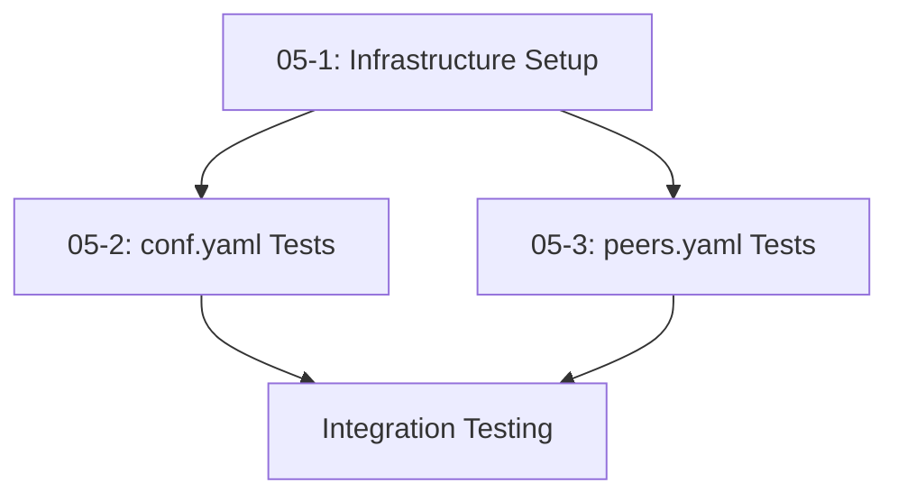

# Task List for PRD 05: Configuration File Testing

## Overview
This document lists all tasks for implementing comprehensive configuration file testing for BTC Federation nodes, including validation of `conf.yaml` and `peers.yaml` files. All tasks must use existing methods from cluster.go and node.go to ensure consistency and code reuse.

## Required Infrastructure Integration
All tasks must leverage existing testsuite infrastructure:

**From cluster.go:**
- `NewCluster()` - Create cluster instance for test management
- `RunConfigValidation()` - Run configuration validation containers
- `CheckNodeLogContains()` - Validate log messages for test scenarios
- `ExecInContainer()` - Execute commands within test containers
- `Cleanup()` - Proper cleanup of test resources

**From node.go:**
- `NewNode()` - Create node instances with test configurations
- `GetEnvironmentVariables()` - Generate environment variables for container execution
- `GetLabels()` - Apply consistent labeling for test containers

**Extension Requirements:**
When existing methods are insufficient, extend functionality by adding new methods while maintaining compatibility with existing patterns.

## Task List

### Task 05-1: Test Infrastructure Setup
**File**: [05-1-test-infrastructure-setup.md](05-1-test-infrastructure-setup.md)
**Priority**: High
**Estimated Effort**: 0.5 days

Create the basic infrastructure for configuration file testing including directory structure, utility functions, and Docker integration patterns. Must use existing cluster.go and node.go methods and extend them as needed.

### Task 05-2: conf.yaml Validation Tests
**File**: [05-2-conf-yaml-validation-tests.md](05-2-conf-yaml-validation-tests.md)
**Priority**: High
**Estimated Effort**: 2 days

Implement comprehensive test suite for conf.yaml validation covering all 20 test scenarios including missing files, invalid formats, malformed YAML, and configuration validation errors with proper exit code verification. Must use cluster.RunConfigValidation and node.NewNode methods.

### Task 05-3: peers.yaml Validation Tests
**File**: [05-3-peers-yaml-validation-tests.md](05-3-peers-yaml-validation-tests.md)
**Priority**: High
**Estimated Effort**: 0.5 days

Implement test suite for peers.yaml validation covering all 3 test scenarios including missing files, empty files, and standalone mode operation with log message validation using existing cluster.CheckNodeLogContains method.

## Task Dependencies

## Total Estimated Effort
- **Total**: 3 days
- **Critical Path**: 05-1 → 05-2/05-3 → Integration Testing

## Success Criteria
- All 23 test cases (20 for conf.yaml + 3 for peers.yaml) are implemented and passing
- Test execution completes within 5 minutes
- Tests are properly integrated with existing test infrastructure using cluster methods
- 100% success rate for valid configurations (exit code 0)
- 100% success rate for invalid configurations (exit code 1)
- Standalone mode message validation works correctly using CheckNodeLogContains 